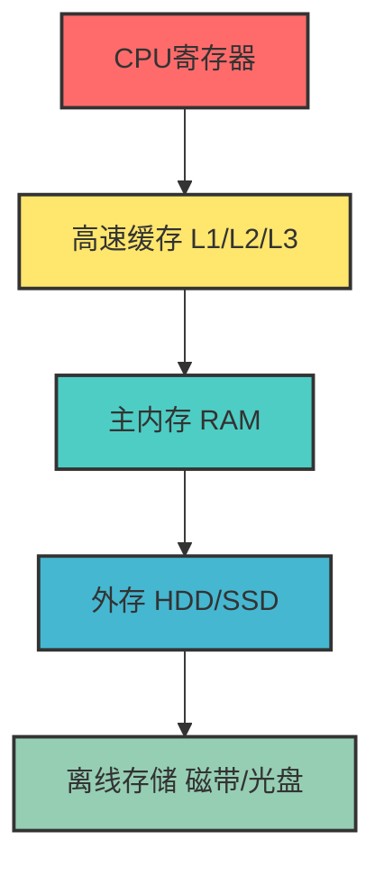
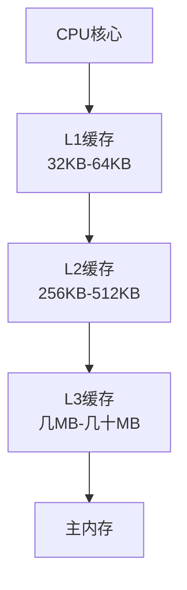

# 2.2 存储器系统

> [!abstract] 核心问题
> 计算机为什么需要多层次的存储系统？不同类型的存储器各有什么特点？

## 一、存储系统层次结构

### 1. 存储层次的设计原则

**设计目标**：用少量高速存储和大量低速存储组合，获得接近高速存储的性能和接近低速存储的容量。

### 2. 存储层次对比

| 层次 | 速度 | 容量 | 成本 | 特点 |
|-----|------|------|------|-----|
| **寄存器** | 最快（纳秒级） | 最小（几十KB） | 最高 | CPU内部，临时存储 |
| **高速缓存** | 很快（纳秒级） | 较小（几MB到几十MB） | 较高 | 位于CPU和内存之间 |
| **主内存** | 较快（微秒级） | 较大（几GB到几十GB） | 中等 | 程序运行时的主要存储空间 |
| **外存** | 较慢（毫秒级） | 很大（几百GB到几TB） | 较低 | 长期存储数据和程序 |
| **离线存储** | 最慢（秒级） | 极大（无限扩展） | 最低 | 归档备份 |

## 二、主存储器（内存）

### 1. RAM（随机存取存储器）

**随机存取存储器（Random Access Memory）**是计算机运行时的主要存储空间：

| 类型 | 特点 | 应用 |
|-----|------|-----|
| **SRAM（静态RAM）** | 速度快、功耗高、价格贵 | 高速缓存 |
| **DRAM（动态RAM）** | 速度较慢、功耗低、价格便宜 | 主内存 |

**DRAM的分类**：
- **SDRAM**：同步动态RAM，与CPU时钟同步
- **DDR SDRAM**：双倍数据速率SDRAM，传输速率更高
- **DDR2/DDR3/DDR4/DDR5**：DDR的升级版本，性能逐步提升

### 2. ROM（只读存储器）

**只读存储器（Read-Only Memory）**存储固定不变的数据：

| 类型 | 特点 | 应用 |
|-----|------|-----|
| **ROM** | 只读、断电不丢失数据 | 存储BIOS程序 |
| **PROM** | 可编程ROM，只能编程一次 | 专用设备 |
| **EPROM** | 可擦除可编程ROM，紫外线擦除 | 早期固件 |
| **EEPROM** | 电可擦除可编程ROM | BIOS设置、存储配置 |
| **Flash Memory** | 大容量EEPROM | U盘、固态硬盘 |

### 3. 内存性能指标

| 指标 | 说明 |
|-----|------|
| **容量** | 内存能存储的数据量，常见4GB/8GB/16GB/32GB |
| **频率** | 内存的工作频率，如DDR4-3200表示3200MHz |
| **带宽** | 内存的数据传输速率，与频率和位宽有关 |
| **时序** | 内存响应时间，用CL值表示，如CL16 |

## 三、高速缓存

### 1. 缓存原理

**局部性原理**：程序访问的数据和指令往往集中在一小片区域内

- **时间局部性**：刚访问过的数据很可能再次被访问
- **空间局部性**：访问某个地址的数据时，附近地址的数据也很可能被访问

### 2. 缓存层次

| 缓存级别 | 位置 | 容量 | 速度 |
|---------|------|------|------|
| **L1** | CPU核心内部 | 最小 | 最快 |
| **L2** | CPU核心内部 | 中等 | 较快 |
| **L3** | CPU芯片上，多个核心共享 | 最大 | 较慢 |

### 3. 缓存命中率

**命中率**：CPU访问数据时在缓存中找到的概率

- 命中率越高，系统性能越好
- 现代CPU的L1缓存命中率通常在90%以上
- 缓存失效时需要从内存读取数据，会产生延迟

## 四、外存储器

### 1. 硬盘（HDD）

**硬盘驱动器（Hard Disk Drive）**使用磁介质存储数据：

| 部件 | 功能 |
|-----|------|
| **盘片** | 存储数据的圆形磁盘，表面有磁性涂层 |
| **磁头** | 读写数据的装置，悬浮在盘片表面 |
| **主轴** | 带动盘片旋转，转速通常为7200rpm或10000rpm |
| **马达** | 驱动磁头臂移动，定位到指定磁道 |

**性能指标**：
- **容量**：TB级别，如1TB、2TB、4TB
- **转速**：7200rpm或10000rpm
- **缓存**：32MB或64MB
- **接口**：SATA、SAS

### 2. 固态硬盘（SSD）

**固态硬盘（Solid-State Drive）**使用闪存芯片存储数据：

| 特点 | HDD | SSD |
|-----|-----|-----|
| **存储介质** | 磁性盘片 | 闪存芯片 |
| **机械部件** | 有（磁头、主轴） | 无 |
| **读写速度** | 较慢（100MB/s-200MB/s） | 很快（500MB/s以上） |
| **功耗** | 较高 | 较低 |
| **噪音** | 有 | 无 |
| **可靠性** | 较低（怕震动） | 较高 |
| **价格** | 较低 | 较高 |

**SSD接口**：
- **SATA**：与HDD兼容，速度受限
- **NVMe**：高速接口，性能大幅提升
- **M.2**：外形小巧，可直接安装在主板上

### 3. 其他外存

| 类型 | 特点 | 应用 |
|-----|------|-----|
| **U盘** | 便携、容量适中 | 数据传输、备份 |
| **SD卡** | 体积小、常用于移动设备 | 相机、手机存储 |
| **光盘** | 只读或可写，容量有限 | 软件分发、影音存储 |
| **磁带** | 大容量、顺序访问 | 数据归档、备份 |

## 五、易错点提示

> [!warning] 常见误区
> - **"内存越大，计算机运行越快"**：内存需要与CPU性能和软件需求匹配。对于日常办公，8GB内存通常足够。
> - **"SSD一定比HDD好"**：SSD速度更快、更可靠，但价格更高。选择时需要权衡性能和成本。
> - **"缓存只是临时存储，不重要"**：缓存对CPU性能影响很大，现代CPU的三级缓存是重要的性能指标。
> - **"内存中的数据断电后还能保留"**：RAM是易失性存储器，断电后数据会丢失。需要长期保存的数据应存储在外存中。

## 六、示例与练习

### 示例

**例1**：分析计算机启动过程中的存储层次使用

**解析**：
1. 开机时，CPU从ROM中读取BIOS程序
2. BIOS检查硬件并初始化
3. 从外存（HDD/SSD）读取操作系统到内存
4. 操作系统加载应用程序到内存
5. CPU从内存读取指令和数据，同时使用缓存提高访问速度

### 练习题

1. 计算机存储系统分为哪几个层次？各层次的特点是什么？
2. RAM和ROM有什么区别？各自的用途是什么？
3. 什么是高速缓存？缓存的工作原理是什么？
4. HDD和SSD有什么区别？如何选择适合自己的存储设备？

**导航**：上一节 [[2.1 中央处理器 CPU]] · [[MOC - 大学计算机基础A|返回课程地图]] · 下一节 [[2.3 输入输出设备]]