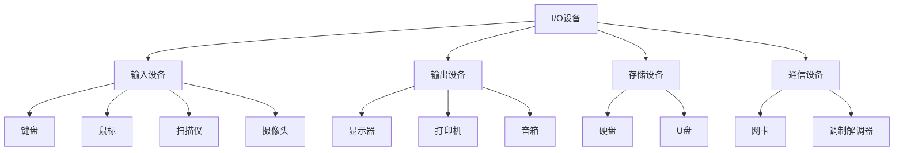

# 2.3 输入输出设备

> [!abstract] 核心问题
> 输入输出设备如何实现人机交互？常见的I/O设备有哪些类型？

## 一、I/O设备概述

**输入输出设备（Input/Output Devices）**是计算机与外部环境交互的桥梁，负责将外部信息输入计算机，并将计算机处理结果输出。

### 1. I/O设备的作用

| 功能 | 说明 |
|-----|------|
| **信息输入** | 将用户操作、数据、图像、声音等转换为计算机能处理的形式 |
| **信息输出** | 将计算机处理结果转换为用户能理解的形式 |
| **数据存储** | 作为外存设备存储数据 |
| **通信** | 与其他计算机或设备进行数据交换 |

### 2. I/O设备分类

## 二、输入设备

### 1. 键盘（Keyboard）

**键盘**是最常用的输入设备，用于输入文字和命令：

| 按键类型 | 功能 |
|---------|------|
| **字母键** | 输入英文字母 |
| **数字键** | 输入数字 |
| **功能键** | F1-F12，执行特定功能 |
| **控制键** | Ctrl、Alt、Shift，组合使用 |
| **方向键** | 上、下、左、右，移动光标 |
| **小键盘** | 数字输入，方便数据录入 |

**常见键盘布局**：
- **QWERTY布局**：最常见的键盘布局
- **DVORAK布局**：更高效的键盘布局，减少手指移动

### 2. 鼠标（Mouse）

**鼠标**是图形用户界面（GUI）的主要输入设备：

| 类型 | 特点 |
|-----|------|
| **机械式鼠标** | 使用滚球检测移动，精度较低 |
| **光电式鼠标** | 使用光学传感器，精度高 |
| **无线鼠标** | 通过蓝牙或无线信号连接，使用方便 |
| **触控板** | 集成在笔记本电脑上，用手指滑动操作 |

**基本操作**：
- **左键单击**：选择对象
- **左键双击**：打开文件或程序
- **右键单击**：显示上下文菜单
- **滚轮滚动**：上下翻页

### 3. 其他输入设备

| 设备 | 功能 | 应用场景 |
|-----|------|---------|
| **扫描仪** | 将纸质文档或图片转换为数字图像 | 文档数字化、照片扫描 |
| **摄像头** | 捕捉视频和图像 | 视频通话、监控、人脸识别 |
| **麦克风** | 将声音转换为数字信号 | 语音输入、录音 |
| **触摸屏** | 直接用手指或触控笔操作 | 手机、平板电脑、自助终端 |
| **手写板** | 手写输入和绘图 | 绘画、签名、笔记 |
| **游戏控制器** | 游戏操作 | 电子游戏 |
| **传感器** | 采集物理数据 | 温度、湿度、压力监测 |

## 三、输出设备

### 1. 显示器（Monitor）

**显示器**是最常用的输出设备，用于显示文字和图像：

**类型**：
| 类型 | 技术 | 特点 |
|-----|------|-----|
| **CRT显示器** | 阴极射线管 | 笨重、耗电、已淘汰 |
| **LCD显示器** | 液晶显示 | 轻薄、节能、常见 |
| **LED显示器** | 发光二极管 | 亮度高、色彩好 |
| **OLED显示器** | 有机发光二极管 | 自发光、对比度高、响应快 |

**性能指标**：
| 指标 | 说明 |
|-----|------|
| **分辨率** | 屏幕显示的像素数量，如1920×1080、2560×1440 |
| **刷新率** | 每秒刷新的次数，单位Hz，如60Hz、144Hz |
| **响应时间** | 像素切换颜色的时间，单位ms，越小越好 |
| **色域** | 能显示的颜色范围，如sRGB、NTSC |

### 2. 打印机（Printer）

**打印机**用于将电子文档输出到纸质介质：

| 类型 | 技术 | 特点 | 应用 |
|-----|------|-----|-----|
| **喷墨打印机** | 喷射墨滴 | 价格低、彩色效果好 | 家庭、小型办公 |
| **激光打印机** | 激光成像 | 速度快、打印质量高 | 办公、商业 |
| **针式打印机** | 针击打色带 | 可打印多联纸 | 票据打印 |
| **3D打印机** | 逐层堆积材料 | 打印三维物体 | 原型制作、个性化制造 |

### 3. 其他输出设备

| 设备 | 功能 | 应用场景 |
|-----|------|---------|
| **音箱/耳机** | 将数字音频转换为声音 | 音乐播放、视频音频输出 |
| **投影仪** | 将图像投射到大屏幕 | 演示、家庭影院 |
| **绘图仪** | 绘制大幅图纸 | 工程设计、地图绘制 |

## 四、I/O接口

### 1. 接口的作用

**I/O接口**是计算机与外部设备连接的桥梁，负责数据传输和通信控制。

### 2. 常见接口标准

| 接口 | 特点 | 适用设备 |
|-----|------|---------|
| **USB** | 通用串行总线，支持热插拔 | 键盘、鼠标、U盘、移动硬盘 |
| **HDMI** | 高清多媒体接口，传输音视频 | 显示器、电视、投影仪 |
| **DisplayPort** | 高清显示接口，支持高分辨率 | 显示器 |
| **VGA** | 模拟视频接口，已逐渐淘汰 | 旧显示器 |
| **DVI** | 数字视频接口 | 显示器 |
| **SATA** | 串行ATA接口，连接存储设备 | 硬盘、光驱 |
| **PCIe** | 高速扩展接口 | 显卡、网卡、SSD |
| **Thunderbolt** | 高速接口，支持多种协议 | 外接显卡、高速存储 |
| **蓝牙** | 无线短距离通信 | 鼠标、键盘、耳机 |
| **WiFi** | 无线局域网通信 | 网络连接 |

### 3. USB标准演进

| 标准 | 最大传输速率 | 特点 |
|-----|-------------|------|
| **USB 1.1** | 12 Mbps | 早期标准，速度慢 |
| **USB 2.0** | 480 Mbps | 广泛使用，速度适中 |
| **USB 3.0** | 5 Gbps | 高速传输，向下兼容 |
| **USB 3.1** | 10 Gbps | 更快的传输速率 |
| **USB 3.2** | 20 Gbps | 双通道传输 |
| **USB4** | 40 Gbps | 最新标准，支持多种协议 |

## 五、人机交互技术

### 1. 传统交互方式

- **键盘鼠标交互**：最常见的交互方式
- **命令行界面**：通过输入命令操作计算机
- **图形用户界面**：通过图标、窗口、菜单操作计算机

### 2. 新兴交互方式

| 技术 | 说明 | 应用 |
|-----|------|-----|
| **触摸屏交互** | 直接用手指操作屏幕 | 手机、平板 |
| **语音交互** | 通过语音命令操作 | 智能音箱、语音助手 |
| **手势交互** | 通过手势控制 | 体感游戏、VR/AR |
| **眼动追踪** | 通过眼睛移动控制 | 辅助设备、游戏 |
| **脑机接口** | 通过脑电波控制 | 医疗康复、科研 |

## 六、易错点提示

> [!warning] 常见误区
> - **"显示器越大，显示效果越好"**：显示器的显示效果主要取决于分辨率、色域和色准，尺寸大不等于效果好。
> - **"USB接口都一样"**：不同版本的USB接口传输速度差异很大，USB 3.0比USB 2.0快10倍以上。
> - **"打印机只用于打印文档"**：现代打印机可以打印照片、标签、3D模型等多种内容。
> - **"触摸屏只能用手指操作"**：触摸屏可以用手指、触控笔等多种方式操作，触控笔通常支持更高精度。

## 七、示例与练习

### 示例

**例1**：分析使用触摸屏手机的交互流程

**解析**：
1. 用户用手指点击屏幕上的应用图标（输入）
2. 触摸屏将触摸位置转换为坐标数据
3. 手机处理器处理输入数据
4. 显示器显示应用界面（输出）
5. 用户通过滑动、点击等手势操作应用

### 练习题

1. 常见的输入设备有哪些？各有什么用途？
2. 显示器的主要性能指标有哪些？如何选择适合自己的显示器？
3. USB接口有哪些版本？它们的传输速率有什么区别？
4. 新兴的人机交互技术有哪些？它们的发展趋势是什么？

**导航**：上一节 [[2.2 存储器系统]] · [[MOC - 大学计算机基础A|返回课程地图]] · 下一节 [[2.4 总线与主板]]