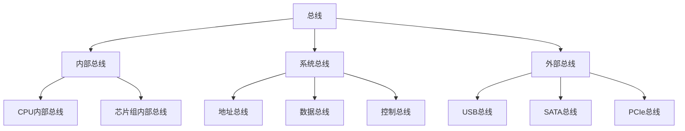
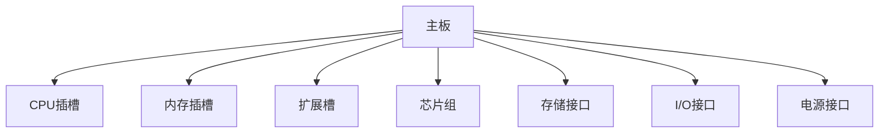

# 2.4 总线与主板

> [!abstract] 核心问题
> 总线如何连接计算机各部件？主板的结构和作用是什么？

## 一、总线概述

**总线（Bus）**是计算机各部件之间传输数据、地址和控制信号的公共通道。

### 1. 总线的作用

| 功能 | 说明 |
|-----|------|
| **数据传输** | 在CPU、内存、外设之间传输数据 |
| **地址传输** | 传输内存单元或I/O设备的地址 |
| **控制传输** | 传输控制信号，协调各部件工作 |

### 2. 总线的分类

### 3. 系统总线的组成

| 总线类型 | 功能 | 特点 |
|---------|------|-----|
| **地址总线（AB）** | 传输内存或I/O设备的地址 | 单向传输，宽度决定寻址范围 |
| **数据总线（DB）** | 传输数据 | 双向传输，宽度决定数据传输量 |
| **控制总线（CB）** | 传输控制信号 | 协调各部件的操作时序 |

**总线宽度与寻址范围**：
- 地址总线宽度为n位时，可寻址2ⁿ个内存单元
- 32位地址总线可寻址4GB内存（2³² = 4,294,967,296字节）
- 64位地址总线理论上可寻址16EB内存

## 二、主板结构

### 1. 主板的作用

**主板（Motherboard）**是计算机的核心电路板，连接所有硬件组件并提供通信通道。

### 2. 主板主要组件

| 组件 | 功能 |
|-----|------|
| **CPU插槽** | 安装CPU，提供CPU与主板的电气连接 |
| **内存插槽** | 安装内存条，通常为DDR类型 |
| **扩展槽** | 安装显卡、声卡、网卡等扩展卡 |
| **芯片组** | 管理总线，协调各部件通信 |
| **存储接口** | 连接硬盘、光驱等存储设备 |
| **I/O接口** | 连接键盘、鼠标、显示器等外部设备 |
| **电源接口** | 连接电源，为主板和各组件供电 |

### 3. 芯片组

**芯片组（Chipset）**是主板的核心控制芯片，分为北桥和南桥：

| 芯片 | 功能 |
|-----|------|
| **北桥芯片** | 高速连接CPU、内存和显卡，负责高速数据传输 |
| **南桥芯片** | 连接低速设备，如硬盘、USB接口、PCI设备等 |

> [!note] 现代芯片组
> 随着技术发展，北桥芯片的功能已逐渐集成到CPU中，南桥芯片成为主要的控制芯片。

### 4. 主板版型

| 版型 | 尺寸 | 特点 |
|-----|------|-----|
| **ATX** | 标准版型，305mm×244mm | 扩展性强，适合台式机 |
| **Micro-ATX** | 小型版型，244mm×244mm | 体积小，适合紧凑型机箱 |
| **Mini-ITX** | 迷你版型，170mm×170mm | 最小版型，适合HTPC和小型设备 |

## 三、常见总线标准

### 1. PCI总线

**PCI（Peripheral Component Interconnect）**是早期的扩展总线标准：

| 特性 | 说明 |
|-----|------|
| **带宽** | 32位/64位，最高133MB/s |
| **用途** | 连接显卡、声卡、网卡等扩展卡 |
| **现状** | 已被PCIe取代 |

### 2. PCIe总线

**PCIe（PCI Express）**是目前主流的高速扩展总线：

| 特性 | 说明 |
|-----|------|
| **带宽** | 单通道最高8GT/s，多通道可叠加 |
| **版本** | PCIe 1.0/2.0/3.0/4.0/5.0 |
| **用途** | 显卡、高速存储、网卡等 |
| **优势** | 点对点连接，带宽高，支持热插拔 |

**PCIe版本对比**：

| 版本 | 单通道带宽 | 16通道带宽 |
|-----|-----------|-----------|
| PCIe 1.0 | 250 MB/s | 4 GB/s |
| PCIe 2.0 | 500 MB/s | 8 GB/s |
| PCIe 3.0 | 1 GB/s | 16 GB/s |
| PCIe 4.0 | 2 GB/s | 32 GB/s |
| PCIe 5.0 | 4 GB/s | 64 GB/s |

### 3. SATA总线

**SATA（Serial AT Attachment）**是连接存储设备的总线标准：

| 特性 | 说明 |
|-----|------|
| **版本** | SATA I/II/III |
| **带宽** | 1.5 Gbps / 3 Gbps / 6 Gbps |
| **用途** | 硬盘、光驱、SSD |
| **优势** | 串行传输，抗干扰能力强，支持热插拔 |

### 4. USB总线

**USB（Universal Serial Bus）**是通用的外部设备连接标准：

| 版本 | 带宽 | 特点 |
|-----|------|-----|
| USB 1.1 | 12 Mbps | 早期标准 |
| USB 2.0 | 480 Mbps | 广泛使用 |
| USB 3.0 | 5 Gbps | 高速传输 |
| USB 3.1 | 10 Gbps | 更快速度 |
| USB4 | 40 Gbps | 最新标准 |

### 5. 内存总线

**内存总线**连接CPU和内存：

| 类型 | 特点 |
|-----|------|
| **DDR** | 双倍数据速率，同步DRAM |
| **DDR2** | 更高频率，更低功耗 |
| **DDR3** | 进一步提升性能 |
| **DDR4** | 目前主流，性能优异 |
| **DDR5** | 最新标准，更高带宽 |

## 四、总线性能指标

### 1. 带宽

**带宽**是总线每秒能传输的数据量：

- 计算公式：带宽 = 总线频率 × 总线宽度 / 8
- 单位：MB/s 或 GB/s

### 2. 延迟

**延迟**是数据从发送到接收所需的时间：

- 单位：纳秒（ns）
- 延迟越低，响应速度越快

### 3. 总线仲裁

**总线仲裁**是解决多个设备同时请求总线使用权的机制：

| 仲裁方式 | 说明 |
|---------|------|
| **集中式仲裁** | 由专门的仲裁器决定哪个设备使用总线 |
| **分布式仲裁** | 各设备自行协商总线使用权 |

## 五、易错点提示

> [!warning] 常见误区
> - **"总线只是简单的连接线"**：总线不仅是物理连接，还包含复杂的通信协议和控制机制。
> - **"PCIe通道数越多越好"**：PCIe通道数需要与CPU和主板支持的数量匹配，过多通道无法使用。
> - **"内存频率越高，性能越好"**：内存性能还取决于时序、容量和带宽，需要综合考虑。
> - **"主板越贵越好"**：主板的选择应根据CPU、内存和扩展需求，并非越贵越好。

## 六、示例与练习

### 示例

**例1**：分析PCIe 3.0 x16的带宽

**解析**：
- PCIe 3.0单通道带宽：1 GB/s
- x16表示16个通道
- 总带宽 = 1 GB/s × 16 = 16 GB/s

### 练习题

1. 总线分为哪几类？各有什么功能？
2. 主板由哪些主要组件组成？各组件的作用是什么？
3. PCIe总线与PCI总线相比有哪些优势？
4. 如何计算总线的带宽？举例说明。

**导航**：上一节 [[2.3 输入输出设备]] · [[MOC - 大学计算机基础A|返回课程地图]] · 下一章 [[3.1 软件的概念与分类]]