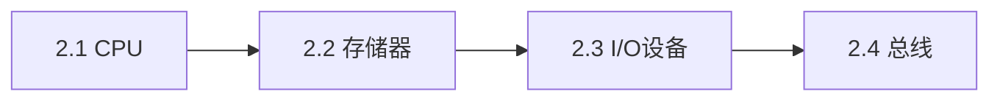

# 第2章：计算机硬件系统

> [!abstract] 章节定位
> 本章深入介绍计算机硬件的各个组成部分，包括CPU、存储器、输入输出设备和总线系统，理解计算机硬件的工作原理。

## 知识点导航

- [[2.1 中央处理器 CPU]]：CPU结构、指令执行、多核技术
- [[2.2 存储器系统]]：内存层次、RAM与ROM、高速缓存
- [[2.3 输入输出设备]]：常见I/O设备、接口标准、人机交互
- [[2.4 总线与主板]]：系统总线、接口总线、主板架构

## 本章重点

| 知识点 | 核心内容 | 掌握程度 |
|-------|---------|---------|
| 2.1 CPU | CPU结构、指令执行 | 理解 |
| 2.2 存储器 | 内存层次、RAM/ROM | 掌握 |
| 2.3 I/O设备 | 常见设备、接口标准 | 理解 |
| 2.4 总线 | 系统总线、主板架构 | 理解 |

## 学习路径

