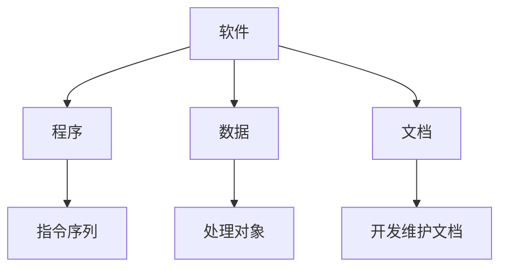
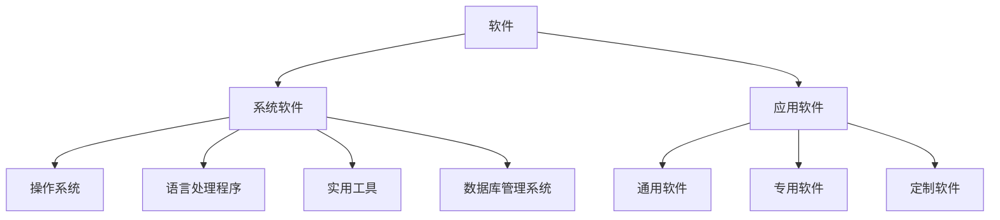
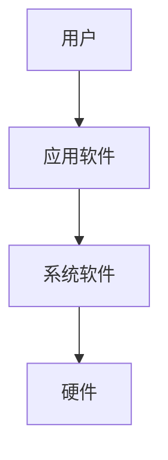

# 3.1 软件的概念与分类

> [!abstract] 核心问题
> 什么是软件？系统软件和应用软件有什么区别？

## 一、软件的概念

### 1. 软件定义

**软件（Software）**是指计算机系统中的程序、数据和相关文档的集合。

| 组成部分 | 说明 |
|---------|------|
| **程序** | 指令的有序集合，告诉计算机做什么 |
| **数据** | 程序处理的对象和结果 |
| **文档** | 描述程序的设计、使用和维护 |

### 2. 软件的特点

| 特点 | 说明 |
|-----|------|
| **无形性** | 软件是逻辑实体，没有物理形态 |
| **易复制** | 软件可以轻易复制，传播成本低 |
| **无磨损** | 软件不会因为使用而磨损 |
| **依赖性** | 软件依赖硬件运行 |
| **可维护** | 软件可以被修改和更新 |

## 二、软件分类

### 1. 按功能分类

### 2. 系统软件

**系统软件（System Software）**是管理计算机资源、为应用程序提供运行环境的软件：

| 类型 | 功能 | 示例 |
|-----|------|-----|
| **操作系统** | 管理硬件资源，提供用户界面 | Windows、Linux、macOS |
| **语言处理程序** | 将高级语言转换为机器语言 | 编译器、解释器、汇编器 |
| **实用工具** | 辅助系统维护和管理 | 杀毒软件、备份工具、文件管理 |
| **数据库管理系统** | 管理和存储数据 | MySQL、Oracle、SQL Server |
| **设备驱动** | 使操作系统与硬件通信 | 显卡驱动、声卡驱动、网卡驱动 |

### 3. 应用软件

**应用软件（Application Software）**是为满足特定用户需求而开发的软件：

| 类型 | 功能 | 示例 |
|-----|------|-----|
| **办公软件** | 文字处理、电子表格、演示文稿 | Microsoft Office、WPS |
| **浏览器** | 访问互联网 | Chrome、Firefox、Edge |
| **多媒体软件** | 图像处理、音频视频播放 | Photoshop、VLC、Premiere |
| **游戏软件** | 娱乐游戏 | 英雄联盟、魔兽世界 |
| **行业软件** | 特定行业应用 | CAD、MATLAB、财务软件 |
| **教育软件** | 辅助教学和学习 | 在线学习平台、教育游戏 |

## 三、系统软件与应用软件的关系

### 1. 层次关系

### 2. 核心区别

| 对比项 | 系统软件 | 应用软件 |
|-------|---------|---------|
| **目标** | 管理系统资源，提供运行环境 | 满足特定用户需求 |
| **用户** | 计算机系统和开发者 | 终端用户 |
| **通用性** | 通用，适用于多种应用 | 专用，针对特定任务 |
| **依赖关系** | 不依赖应用软件 | 依赖系统软件 |
| **示例** | Windows、Linux、编译器 | Word、Excel、游戏 |

### 3. 协同工作示例

**使用Word编辑文档的流程**：
1. 用户启动Word（应用软件）
2. Word请求操作系统（系统软件）分配内存
3. 操作系统与硬件交互，加载Word程序
4. 用户输入文字，Word处理数据
5. 操作系统管理文件保存到硬盘

## 四、软件发展历程

### 1. 程序设计阶段（1940-1950）

- 机器语言和汇编语言
- 程序规模小，无统一规范
- 主要用于科学计算

### 2. 软件危机阶段（1960-1970）

- 软件规模增大，复杂性增加
- 开发效率低，维护困难
- 出现"软件危机"

### 3. 软件工程阶段（1970至今）

- 引入工程化方法开发软件
- 软件生命周期管理
- 软件开发工具和方法不断演进

### 4. 现代软件发展趋势

| 趋势 | 说明 |
|-----|------|
| **云计算** | 软件作为服务，按需使用 |
| **移动应用** | 针对移动设备开发的软件 |
| **开源软件** | 源代码开放，社区协作开发 |
| **人工智能** | 智能软件，自主学习和决策 |
| **低代码/无代码** | 降低软件开发门槛 |

## 五、软件版权与许可

### 1. 软件版权

**软件版权**是对软件作品的法律保护，包括：
- 复制权
- 发行权
- 修改权
- 署名权

### 2. 软件许可类型

| 许可类型 | 说明 | 示例 |
|---------|------|-----|
| **商业软件** | 付费购买，受版权保护 | Microsoft Office |
| **共享软件** | 先试用后购买 | WinRAR |
| **免费软件** | 免费使用，但版权归作者所有 | Adobe Reader |
| **开源软件** | 源代码开放，可自由修改和分发 | Linux、Apache |

### 3. 开源许可证

| 许可证 | 特点 |
|-------|------|
| **GPL** | 强Copyleft，衍生作品必须开源 |
| **MIT** | 宽松许可，几乎无限制 |
| **Apache** | 宽松许可，包含专利授权 |
| **BSD** | 宽松许可，允许商业使用 |

## 六、易错点提示

> [!warning] 常见误区
> - **"软件就是程序"**：软件不仅包含程序，还包括数据和文档。
> - **"操作系统是硬件的一部分"**：操作系统是系统软件，不是硬件。
> - **"开源软件就是免费软件"**：开源软件强调源代码开放，不一定免费；免费软件强调使用免费，不一定开源。
> - **"应用软件可以直接在硬件上运行"**：应用软件必须通过操作系统才能在硬件上运行。

## 七、示例与练习

### 示例

**例1**：判断下列软件属于系统软件还是应用软件

- Windows 10：系统软件（操作系统）
- Microsoft Word：应用软件（办公软件）
- MySQL：系统软件（数据库管理系统）
- Photoshop：应用软件（图像处理软件）
- Python解释器：系统软件（语言处理程序）

### 练习题

1. 软件由哪些部分组成？各部分的作用是什么？
2. 系统软件和应用软件有什么区别？各举三个例子。
3. 简述软件发展的主要阶段。
4. 开源软件和商业软件各有什么优缺点？

**导航**：上一章 [[2.4 总线与主板]] · [[MOC - 大学计算机基础A|返回课程地图]] · 下一节 [[3.2 操作系统基础]]