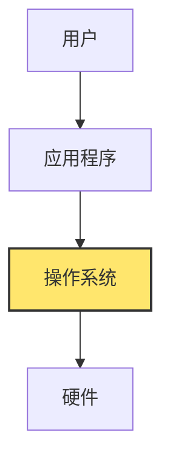
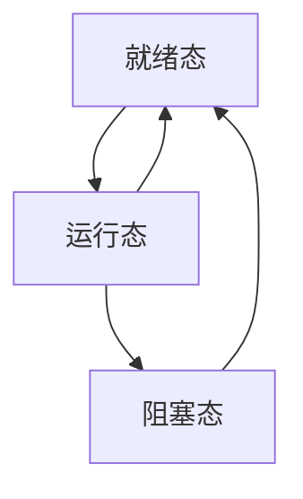
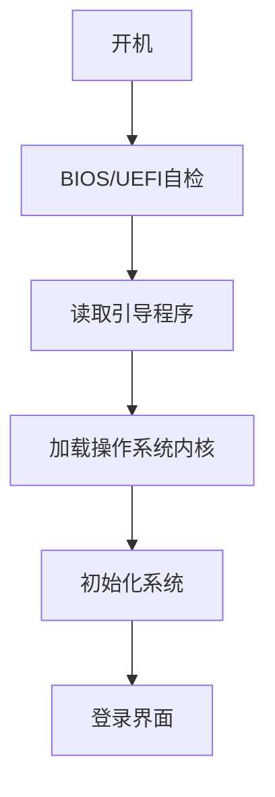

# 3.2 操作系统基础

> [!abstract] 核心问题
> 操作系统的主要功能是什么？常见的操作系统有哪些类型？

## 一、操作系统概述

**操作系统（Operating System, OS）**是管理计算机硬件和软件资源、为用户和应用程序提供接口的系统软件。

### 1. 操作系统的地位

### 2. 操作系统的目标

| 目标 | 说明 |
|-----|------|
| **方便性** | 为用户提供友好的操作界面 |
| **有效性** | 高效管理和利用系统资源 |
| **可扩展性** | 支持新硬件和新功能 |
| **开放性** | 遵循标准，支持兼容 |

## 二、操作系统的主要功能

### 1. 进程管理

**进程（Process）**是程序在计算机中的一次执行过程：

| 功能 | 说明 |
|-----|------|
| **进程创建与销毁** | 创建新进程，结束不再需要的进程 |
| **进程调度** | 决定哪个进程获得CPU执行 |
| **进程同步** | 协调多个进程的执行顺序 |
| **进程通信** | 进程之间交换数据 |

**进程状态**：

| 状态 | 说明 |
|-----|------|
| **就绪态** | 进程已准备好，等待CPU调度 |
| **运行态** | 进程正在CPU上执行 |
| **阻塞态** | 进程等待某个事件（如I/O完成） |

### 2. 内存管理

**内存管理**负责分配和管理计算机的内存资源：

| 功能 | 说明 |
|-----|------|
| **内存分配** | 为进程分配内存空间 |
| **内存回收** | 回收不再使用的内存 |
| **内存保护** | 防止进程访问其他进程的内存 |
| **虚拟内存** | 将外存作为内存的扩展 |

**内存管理方式**：

| 方式 | 说明 |
|-----|------|
| **分区管理** | 将内存划分为多个分区 |
| **分页管理** | 将内存和程序分为固定大小的页 |
| **分段管理** | 将程序分为逻辑段 |
| **段页式管理** | 结合分段和分页 |

### 3. 文件管理

**文件系统**负责管理计算机中的文件：

| 功能 | 说明 |
|-----|------|
| **文件创建与删除** | 创建新文件，删除不需要的文件 |
| **文件读写** | 读取和写入文件内容 |
| **文件存储** | 管理文件在磁盘上的存储位置 |
| **文件保护** | 设置文件访问权限 |

**文件系统类型**：

| 类型 | 特点 | 应用 |
|-----|------|-----|
| **FAT32** | 兼容性好，支持最大4GB文件 | Windows旧版本 |
| **NTFS** | 安全性高，支持大文件 | Windows |
| **ext4** | 性能优异，Linux默认 | Linux |
| **APFS** | 苹果文件系统 | macOS |

### 4. 设备管理

**设备管理**负责管理计算机的输入输出设备：

| 功能 | 说明 |
|-----|------|
| **设备驱动** | 加载和管理设备驱动程序 |
| **设备分配** | 为进程分配设备 |
| **设备控制** | 控制设备的操作 |
| **缓冲管理** | 使用缓冲区提高I/O效率 |

**I/O控制方式**：

| 方式 | 说明 |
|-----|------|
| **程序查询** | CPU不断查询设备状态 |
| **中断驱动** | 设备完成后通知CPU |
| **DMA** | 直接内存访问，减少CPU干预 |
| **通道** | 专用处理器控制I/O |

### 5. 用户管理

**用户管理**负责管理计算机的用户账户：

| 功能 | 说明 |
|-----|------|
| **用户账户创建** | 创建新用户账户 |
| **权限管理** | 设置用户访问权限 |
| **身份认证** | 验证用户身份 |
| **安全审计** | 记录用户操作 |

## 三、操作系统分类

### 1. 按用户数量分类

| 类型 | 说明 | 示例 |
|-----|------|-----|
| **单用户操作系统** | 同一时间只有一个用户使用 | Windows、macOS |
| **多用户操作系统** | 多个用户同时使用 | Linux、UNIX |

### 2. 按任务数量分类

| 类型 | 说明 | 示例 |
|-----|------|-----|
| **单任务操作系统** | 同一时间只能运行一个程序 | DOS |
| **多任务操作系统** | 同时运行多个程序 | Windows、Linux |

### 3. 按运行环境分类

| 类型 | 说明 | 示例 |
|-----|------|-----|
| **桌面操作系统** | 用于个人计算机 | Windows、macOS、Linux |
| **服务器操作系统** | 用于服务器 | Windows Server、Linux Server |
| **移动操作系统** | 用于移动设备 | iOS、Android |
| **嵌入式操作系统** | 用于嵌入式设备 | Android、RTOS |

### 4. 按技术特点分类

| 类型 | 说明 | 示例 |
|-----|------|-----|
| **分时操作系统** | 多个用户分时使用CPU | Linux、UNIX |
| **实时操作系统** | 实时响应，保证时间要求 | VxWorks、RTOS |
| **批处理操作系统** | 批量处理任务 | 大型机系统 |

## 四、主流操作系统

### 1. Windows

**Windows**是微软开发的操作系统：

| 版本 | 特点 |
|-----|------|
| **Windows 7** | 经典界面，稳定性好 |
| **Windows 10** | 现代界面，功能丰富 |
| **Windows 11** | 全新设计，性能优化 |

**优点**：
- 用户友好，界面直观
- 软件兼容性好
- 游戏支持优秀

**缺点**：
- 价格较高
- 安全性需要加强

### 2. macOS

**macOS**是苹果公司开发的操作系统：

**优点**：
- 设计精美，用户体验好
- 安全性高
- 与苹果硬件完美配合

**缺点**：
- 价格昂贵
- 软件兼容性有限

### 3. Linux

**Linux**是开源操作系统：

**优点**：
- 免费开源
- 高度可定制
- 稳定性和安全性好
- 适合服务器

**缺点**：
- 学习曲线较陡
- 部分软件兼容性差

**常见发行版**：
- Ubuntu
- Fedora
- CentOS
- Debian

### 4. 移动操作系统

**iOS**：苹果公司开发，用于iPhone和iPad
**Android**：谷歌开发，开源，用于各种移动设备

## 五、操作系统的启动过程

### 1. 引导过程

### 2. 启动步骤

| 步骤 | 说明 |
|-----|------|
| **BIOS/UEFI自检** | 检查硬件是否正常 |
| **读取引导程序** | 从硬盘读取引导程序 |
| **加载内核** | 将操作系统内核加载到内存 |
| **初始化系统** | 初始化设备驱动和系统服务 |
| **用户登录** | 显示登录界面，等待用户登录 |

## 六、易错点提示

> [!warning] 常见误区
> - **"操作系统只是提供图形界面"**：操作系统的核心功能是管理资源，图形界面只是其中一部分。
> - **"多任务就是多个程序同时执行"**：实际上是CPU在多个程序之间快速切换，看起来像同时执行。
> - **"Linux只是一个操作系统"**：Linux是内核，发行版才是完整的操作系统。
> - **"操作系统可以直接访问硬件"**：现代操作系统通过设备驱动程序与硬件交互，不直接访问硬件。

## 七、示例与练习

### 示例

**例1**：分析Windows任务管理器中的进程信息

**解析**：
- 进程列表显示当前运行的所有进程
- CPU使用率表示各进程占用CPU的比例
- 内存使用率表示各进程占用内存的大小
- 通过任务管理器可以结束无响应的进程

### 练习题

1. 操作系统的主要功能有哪些？各功能的作用是什么？
2. 进程有哪些状态？状态之间如何转换？
3. 常见的操作系统有哪些？各有什么特点？
4. 简述操作系统的启动过程。

**导航**：上一节 [[3.1 软件的概念与分类]] · [[MOC - 大学计算机基础A|返回课程地图]] · 下一节 [[3.3 程序设计语言]]