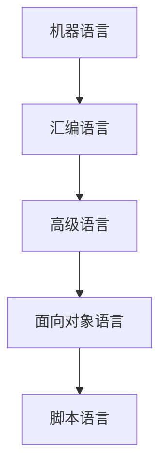
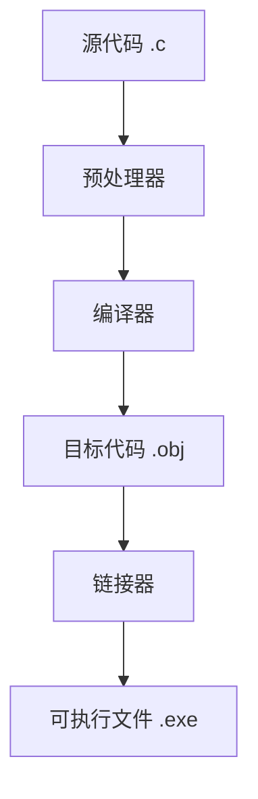
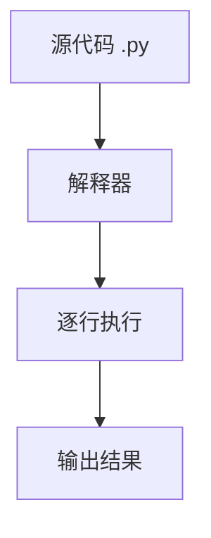

# 3.3 程序设计语言

> [!abstract] 核心问题
> 程序设计语言有哪些类型？编译和解释的区别是什么？

## 一、程序设计语言概述

**程序设计语言（Programming Language）**是用于编写计算机程序的人工语言，是人与计算机沟通的桥梁。

### 1. 语言的发展历程



### 2. 语言分类

| 层次 | 语言类型 | 特点 | 示例 |
|-----|---------|------|-----|
| **低级语言** | 机器语言 | 直接用二进制编码，计算机可直接执行 | 01010101 |
| | 汇编语言 | 用助记符代替二进制指令 | ADD、MOV |
| **高级语言** | 结构化语言 | 接近自然语言，可读性强 | C、Pascal |
| | 面向对象语言 | 支持封装、继承、多态 | Java、C++、Python |
| | 脚本语言 | 解释执行，动态类型 | JavaScript、Python |

## 二、低级语言

### 1. 机器语言

**机器语言（Machine Language）**是计算机能直接执行的语言：

| 特点 | 说明 |
|-----|------|
| **二进制编码** | 用0和1表示指令和数据 |
| **与硬件相关** | 不同CPU有不同的机器语言 |
| **执行效率高** | 无需翻译，直接执行 |
| **可读性差** | 难以理解和编写 |

**示例**：
```
10110100 00000101  ; 将5加载到寄存器
10110101 00000011  ; 将3加载到寄存器
00000101           ; 加法运算
11110100           ; 保存结果
```

### 2. 汇编语言

**汇编语言（Assembly Language）**用助记符代替二进制指令：

| 特点 | 说明 |
|-----|------|
| **助记符** | 用英文单词或缩写表示指令 |
| **与硬件相关** | 仍与特定CPU架构相关 |
| **需要汇编器** | 通过汇编器转换为机器语言 |
| **比机器语言易读** | 可读性优于机器语言 |

**示例**：
```asm
MOV AL, 5    ; 将5加载到AL寄存器
MOV BL, 3    ; 将3加载到BL寄存器
ADD AL, BL   ; AL = AL + BL
MOV [RESULT], AL  ; 保存结果
```

## 三、高级语言

### 1. 高级语言的特点

| 特点 | 说明 |
|-----|------|
| **接近自然语言** | 语法类似人类语言，易于理解 |
| **与硬件无关** | 同一种语言可在不同计算机上运行 |
| **需要翻译** | 必须通过编译器或解释器转换 |
| **开发效率高** | 代码量少，开发周期短 |

### 2. 编译型语言

**编译型语言**通过编译器一次性转换为机器语言：

| 特点 | 说明 |
|-----|------|
| **编译过程** | 源代码 → 目标代码 → 可执行文件 |
| **执行方式** | 编译后可直接运行，无需再次编译 |
| **执行效率** | 较高，运行速度快 |
| **调试难度** | 编译时发现错误，调试相对困难 |

**示例语言**：C、C++、Java、Go

**编译过程**：



### 3. 解释型语言

**解释型语言**通过解释器逐行执行：

| 特点 | 说明 |
|-----|------|
| **解释过程** | 源代码 → 解释器 → 逐行执行 |
| **执行方式** | 每次运行都需要解释器 |
| **执行效率** | 较低，运行速度慢 |
| **调试难度** | 运行时发现错误，调试相对容易 |

**示例语言**：Python、JavaScript、PHP、Ruby

**解释过程**：



### 4. 编译与解释的对比

| 对比项 | 编译型语言 | 解释型语言 |
|-------|-----------|-----------|
| **执行速度** | 快 | 慢 |
| **跨平台性** | 需要重新编译 | 一次编写，到处运行 |
| **调试** | 编译时发现错误 | 运行时发现错误 |
| **内存占用** | 较小 | 较大 |
| **适用场景** | 系统编程、高性能计算 | 脚本、Web开发、快速原型 |

## 四、面向对象语言

### 1. 面向对象的基本概念

| 概念 | 说明 |
|-----|------|
| **类（Class）** | 对象的模板，定义属性和方法 |
| **对象（Object）** | 类的实例，包含数据和行为 |
| **封装（Encapsulation）** | 将数据和方法绑定在一起，隐藏内部细节 |
| **继承（Inheritance）** | 子类继承父类的属性和方法 |
| **多态（Polymorphism）** | 同一接口有不同的实现方式 |

### 2. 主流面向对象语言

| 语言 | 特点 | 应用 |
|-----|------|-----|
| **Java** | 跨平台、面向对象、强类型 | 企业级应用、Android开发 |
| **C++** | 高效、面向对象、兼容C | 系统编程、游戏开发 |
| **C#** | 微软开发、.NET框架、现代语法 | Windows应用、游戏开发 |
| **Python** | 简洁、动态类型、丰富库 | 数据分析、人工智能 |
| **JavaScript** | 脚本语言、Web开发、事件驱动 | 前端开发、全栈开发 |

## 五、脚本语言

### 1. 脚本语言特点

| 特点 | 说明 |
|-----|------|
| **解释执行** | 无需编译，直接解释执行 |
| **动态类型** | 变量类型在运行时确定 |
| **弱类型** | 类型转换自动进行 |
| **简洁语法** | 代码量少，开发快速 |

### 2. 常见脚本语言

| 语言 | 用途 |
|-----|------|
| **Python** | 通用脚本、数据分析、AI |
| **JavaScript** | Web前端、Node.js后端 |
| **PHP** | Web后端开发 |
| **Ruby** | Web开发、自动化脚本 |
| **Shell** | 系统管理、自动化脚本 |

## 六、语言选择指南

### 1. 选择因素

| 因素 | 说明 |
|-----|------|
| **项目类型** | 系统编程、Web开发、数据分析等 |
| **性能要求** | 是否需要高性能计算 |
| **开发效率** | 项目周期和团队熟悉度 |
| **跨平台性** | 是否需要在多个平台运行 |
| **生态系统** | 可用库和工具的丰富程度 |

### 2. 常见应用场景推荐

| 场景 | 推荐语言 |
|-----|---------|
| **系统编程** | C、C++、Rust |
| **Web前端** | JavaScript、TypeScript |
| **Web后端** | Python、Java、Node.js |
| **数据分析** | Python、R |
| **人工智能** | Python |
| **移动开发** | Java（Android）、Swift（iOS） |
| **游戏开发** | C++、C#、Python |

## 七、易错点提示

> [!warning] 常见误区
> - **"低级语言比高级语言强大"**：高级语言功能更丰富，开发效率更高，只是执行效率略低。
> - **"编译型语言一定比解释型语言快"**：现代解释器和JIT编译器优化后，性能差距已缩小。
> - **"面向对象语言只能编写面向对象程序"**：大多数面向对象语言也支持面向过程编程。
> - **"脚本语言不适合大型项目"**：Python和JavaScript已被广泛用于大型项目开发。

## 八、示例与练习

### 示例

**例1**：用不同语言实现"Hello, World!"

**C语言**：
```c
#include <stdio.h>
int main() {
    printf("Hello, World!\n");
    return 0;
}
```

**Python**：
```python
print("Hello, World!")
```

**Java**：
```java
public class HelloWorld {
    public static void main(String[] args) {
        System.out.println("Hello, World!");
    }
}
```

### 练习题

1. 程序设计语言分为哪几类？各有什么特点？
2. 编译型语言和解释型语言有什么区别？各举三个例子。
3. 面向对象的基本概念有哪些？各概念的含义是什么？
4. 如何选择适合项目的程序设计语言？

**导航**：上一节 [[3.2 操作系统基础]] · [[MOC - 大学计算机基础A|返回课程地图]] · 下一节 [[3.4 办公软件应用]]