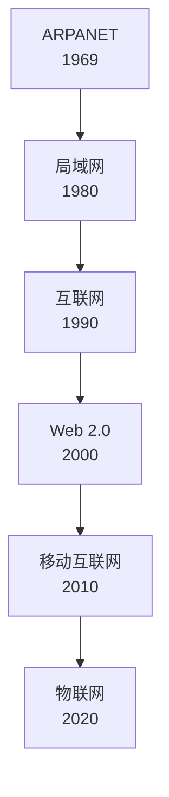
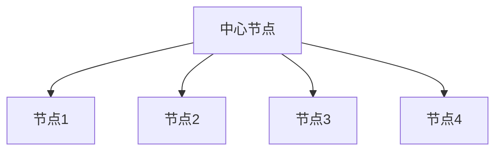
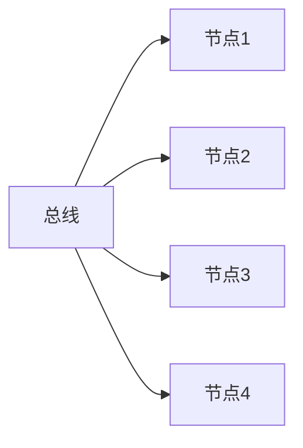
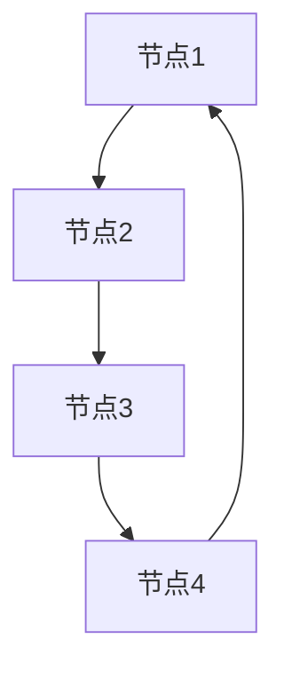
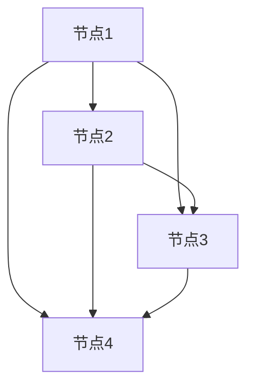

# 4.1 网络的基本概念

> [!abstract] 核心问题
> 什么是计算机网络？网络有哪些分类方式和拓扑结构？

## 一、计算机网络概述

### 1. 网络定义

**计算机网络（Computer Network）**是将地理位置不同的计算机、终端设备通过通信线路连接起来，实现资源共享和信息交换的系统。

### 2. 网络的作用

| 作用 | 说明 |
|-----|------|
| **资源共享** | 共享硬件、软件和数据资源 |
| **信息交换** | 快速传递信息和数据 |
| **分布式处理** | 将任务分配到多个计算机处理 |
| **提高可靠性** | 冗余备份，提高系统可靠性 |
| **负载均衡** | 均衡网络负载，提高性能 |

### 3. 网络的发展历程

## 二、网络分类

### 1. 按覆盖范围分类

| 类型 | 覆盖范围 | 特点 | 示例 |
|-----|---------|------|-----|
| **局域网（LAN）** | 较小地理范围，如校园、企业 | 速度快、延迟低、成本低 | 校园网、企业内网 |
| **城域网（MAN）** | 城市范围 | 覆盖广、连接多个LAN | 城市宽带网 |
| **广域网（WAN）** | 较大地理范围，跨城市、国家 | 覆盖广、速度较慢 | Internet |

### 2. 按拓扑结构分类

| 类型 | 结构 | 特点 |
|-----|------|-----|
| **星型拓扑** | 所有节点连接到中心节点 | 易于维护，中心节点故障影响整个网络 |
| **总线型拓扑** | 所有节点连接到一条总线 | 简单，总线故障影响整个网络 |
| **环型拓扑** | 节点形成闭合环路 | 数据单向传输，一个节点故障影响整个网络 |
| **网状拓扑** | 节点之间有多条连接 | 可靠性高，成本高 |
| **树形拓扑** | 层次化结构 | 易于扩展，根节点故障影响整个网络 |

### 3. 按传输介质分类

| 类型 | 介质 | 特点 |
|-----|------|-----|
| **有线网络** | 双绞线、光纤、同轴电缆 | 速度快、可靠性高 |
| **无线网络** | 无线电波、微波、红外线 | 灵活、方便移动 |

### 4. 按使用性质分类

| 类型 | 说明 |
|-----|------|
| **公用网络** | 公共服务，如Internet |
| **专用网络** | 特定组织使用，如企业内网 |

## 三、网络拓扑结构

### 1. 星型拓扑

**优点**：
- 易于维护和管理
- 单个节点故障不影响其他节点
- 易于扩展

**缺点**：
- 中心节点故障会导致整个网络瘫痪
- 布线成本较高

### 2. 总线型拓扑

**优点**：
- 结构简单
- 布线成本低
- 易于扩展

**缺点**：
- 总线故障会影响整个网络
- 传输效率随节点增加而降低

### 3. 环型拓扑

**优点**：
- 结构简单
- 数据传输稳定

**缺点**：
- 一个节点故障会影响整个网络
- 扩展困难

### 4. 网状拓扑

**优点**：
- 可靠性高，多条路径可选
- 故障容错能力强

**缺点**：
- 成本高
- 管理复杂

## 四、网络硬件设备

### 1. 传输介质

| 介质 | 特点 | 应用 |
|-----|------|-----|
| **双绞线** | 成本低、易于安装 | 局域网 |
| **光纤** | 速度快、抗干扰能力强 | 高速网络、长距离传输 |
| **同轴电缆** | 抗干扰能力强 | 有线电视、早期网络 |
| **无线** | 灵活、方便移动 | 无线网络 |

### 2. 网络设备

| 设备 | 功能 |
|-----|------|
| **网卡（NIC）** | 计算机连接网络的接口 |
| **集线器（Hub）** | 连接多个设备，共享带宽 |
| **交换机（Switch）** | 连接多个设备，独享带宽 |
| **路由器（Router）** | 连接不同网络，转发数据包 |
| **调制解调器（Modem）** | 将数字信号转换为模拟信号 |
| **网关（Gateway）** | 连接不同协议的网络 |

### 3. 集线器与交换机的区别

| 对比项 | 集线器 | 交换机 |
|-------|--------|--------|
| **工作方式** | 广播发送，共享带宽 | 点对点发送，独享带宽 |
| **冲突域** | 所有端口在同一冲突域 | 每个端口独立冲突域 |
| **带宽** | 所有端口共享总带宽 | 每个端口独享带宽 |
| **性能** | 较低 | 较高 |

## 五、网络协议概述

### 1. 协议定义

**网络协议（Network Protocol）**是计算机之间通信的规则和标准。

### 2. 协议三要素

| 要素 | 说明 |
|-----|------|
| **语法** | 数据格式和结构 |
| **语义** | 数据含义和控制信息 |
| **时序** | 通信顺序和同步 |

### 3. 协议层次

网络协议采用层次化设计，每层负责特定功能：

| 层次 | 功能 |
|-----|------|
| **物理层** | 传输比特流 |
| **数据链路层** | 帧的传输 |
| **网络层** | 数据包路由 |
| **传输层** | 端到端传输 |
| **应用层** | 应用程序通信 |

## 六、易错点提示

> [!warning] 常见误区
> - **"网络就是互联网"**：互联网是网络的一种，网络还包括局域网、城域网等。
> - **"交换机和路由器功能相同"**：交换机用于局域网内部连接，路由器用于连接不同网络。
> - **"无线网络比有线网络好"**：无线网络灵活但速度和稳定性不如有线网络。
> - **"拓扑结构只影响网络布局"**：拓扑结构还影响网络性能、可靠性和扩展性。

## 七、示例与练习

### 示例

**例1**：分析校园网的拓扑结构

**解析**：
- 校园网通常采用星型拓扑结构
- 中心节点是核心交换机
- 各教学楼、宿舍楼的交换机连接到核心交换机
- 每个楼层的交换机连接到楼内交换机

### 练习题

1. 计算机网络的定义和作用是什么？
2. 网络按覆盖范围分为哪几类？各有什么特点？
3. 常见的网络拓扑结构有哪些？各有什么优缺点？
4. 集线器和交换机有什么区别？

**导航**：上一章 [[3.4 办公软件应用]] · [[MOC - 大学计算机基础A|返回课程地图]] · 下一节 [[4.2 网络协议与层次]]