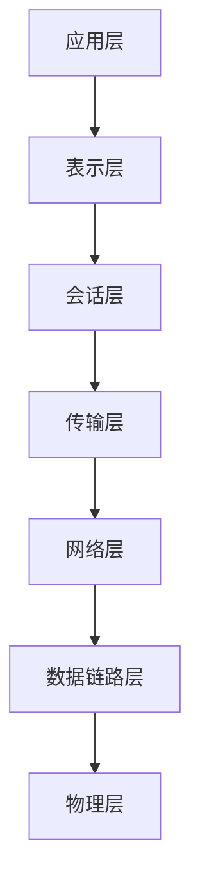
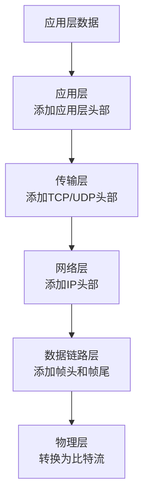
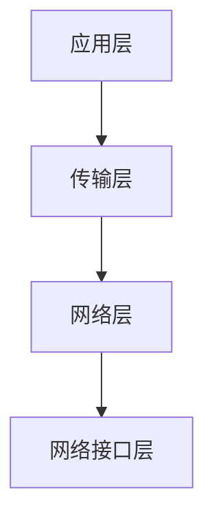
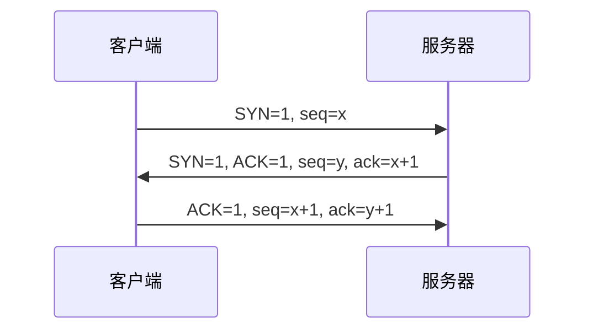
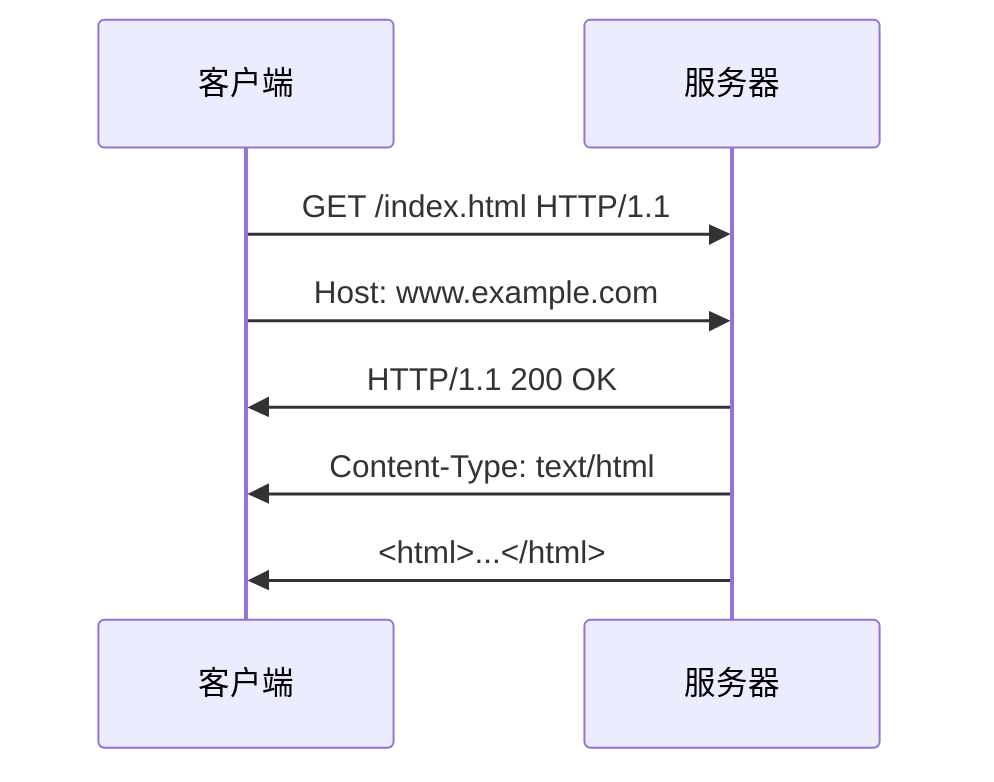
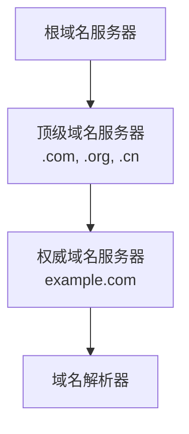

# 4.2 网络协议与层次

> [!abstract] 核心问题
> OSI模型和TCP/IP协议族各分为哪几层？每层的功能是什么？

## 一、网络协议层次模型

### 1. OSI七层模型

**OSI（Open Systems Interconnection）**模型是国际标准化组织制定的网络协议层次模型：

### 2. OSI各层功能

| 层次 | 名称 | 功能 | 关键协议 |
|-----|------|------|---------|
| **7** | 应用层 | 为应用程序提供网络服务 | HTTP、FTP、SMTP、DNS |
| **6** | 表示层 | 数据格式转换和加密 | SSL/TLS、JPEG、MPEG |
| **5** | 会话层 | 建立和管理通信会话 | RPC、NetBIOS |
| **4** | 传输层 | 端到端数据传输 | TCP、UDP |
| **3** | 网络层 | 数据包路由和转发 | IP、ICMP、ARP |
| **2** | 数据链路层 | 帧的传输和差错检测 | Ethernet、Wi-Fi、PPP |
| **1** | 物理层 | 比特流传输 | 双绞线、光纤、无线电 |

### 3. 数据封装过程

**封装过程**：数据从应用层向下传递，每层添加本层头部信息，最终转换为比特流在物理介质上传输。

## 二、TCP/IP协议族

### 1. TCP/IP四层模型

**TCP/IP（Transmission Control Protocol/Internet Protocol）**是互联网的核心协议：

### 2. TCP/IP与OSI的对应关系

| TCP/IP层次 | OSI层次 | 功能 |
|-----------|---------|------|
| **应用层** | 应用层、表示层、会话层 | 应用程序通信 |
| **传输层** | 传输层 | 端到端传输 |
| **网络层** | 网络层 | 路由和转发 |
| **网络接口层** | 数据链路层、物理层 | 帧传输和比特流 |

### 3. 网络层协议

**IP协议（Internet Protocol）**：

| 功能 | 说明 |
|-----|------|
| **寻址** | 为每个设备分配唯一的IP地址 |
| **路由** | 选择数据包传输路径 |
| **分片** | 将大数据包分割为小数据包 |

**IP地址格式**：
- IPv4：32位二进制，点分十进制表示，如192.168.1.1
- IPv6：128位二进制，冒号分隔十六进制表示

**ICMP协议（Internet Control Message Protocol）**：
- 网络控制消息协议
- 用于诊断网络故障
- ping命令基于ICMP

### 4. 传输层协议

**TCP协议（Transmission Control Protocol）**：

| 特点 | 说明 |
|-----|------|
| **面向连接** | 建立连接后才传输数据 |
| **可靠传输** | 确认、重传、流量控制 |
| **有序传输** | 保证数据顺序 |
| **面向字节流** | 无边界的字节序列 |

**TCP三次握手**：

**UDP协议（User Datagram Protocol）**：

| 特点 | 说明 |
|-----|------|
| **无连接** | 直接发送数据，无需建立连接 |
| **不可靠传输** | 不保证数据到达和顺序 |
| **面向报文** | 每个报文独立 |
| **速度快** | 开销小，适合实时应用 |

**TCP与UDP对比**：

| 对比项 | TCP | UDP |
|-------|-----|-----|
| **连接** | 面向连接 | 无连接 |
| **可靠性** | 可靠 | 不可靠 |
| **顺序** | 保证顺序 | 不保证 |
| **速度** | 较慢 | 较快 |
| **开销** | 较大 | 较小 |
| **适用场景** | 文件传输、网页浏览 | 视频、语音、游戏 |

### 5. 应用层协议

| 协议 | 功能 | 端口号 |
|-----|------|-------|
| **HTTP** | 超文本传输协议 | 80 |
| **HTTPS** | 安全超文本传输协议 | 443 |
| **FTP** | 文件传输协议 | 21 |
| **SMTP** | 简单邮件传输协议 | 25 |
| **POP3** | 邮局协议版本3 | 110 |
| **IMAP** | 互联网邮件访问协议 | 143 |
| **DNS** | 域名系统 | 53 |
| **SSH** | 安全外壳协议 | 22 |
| **Telnet** | 远程终端协议 | 23 |

## 三、HTTP协议

### 1. HTTP工作原理

**HTTP（Hypertext Transfer Protocol）**是Web的基础协议：

### 2. HTTP请求方法

| 方法 | 功能 |
|-----|------|
| **GET** | 获取资源 |
| **POST** | 提交数据 |
| **PUT** | 更新资源 |
| **DELETE** | 删除资源 |
| **HEAD** | 获取资源头部 |

### 3. HTTP状态码

| 状态码 | 含义 |
|-------|------|
| **200** | 请求成功 |
| **301** | 永久重定向 |
| **302** | 临时重定向 |
| **400** | 请求错误 |
| **401** | 未授权 |
| **403** | 禁止访问 |
| **404** | 资源未找到 |
| **500** | 服务器错误 |

### 4. HTTPS

**HTTPS（HTTP Secure）**是加密的HTTP协议：

| 特点 | 说明 |
|-----|------|
| **加密传输** | 使用SSL/TLS加密数据 |
| **身份验证** | 验证服务器身份 |
| **完整性** | 防止数据篡改 |

## 四、域名系统DNS

### 1. DNS作用

**DNS（Domain Name System）**将域名转换为IP地址：

| 功能 | 说明 |
|-----|------|
| **域名解析** | 将www.example.com转换为IP地址 |
| **反向解析** | 将IP地址转换为域名 |
| **负载均衡** | 将请求分发到多个服务器 |

### 2. DNS层次结构

### 3. DNS查询过程

| 步骤 | 说明 |
|-----|------|
| **本地查询** | 查询本地DNS缓存 |
| **递归查询** | 向本地DNS服务器查询 |
| **迭代查询** | DNS服务器逐级查询 |
| **返回结果** | 返回IP地址 |

## 五、易错点提示

> [!warning] 常见误区
> - **"OSI模型就是TCP/IP"**：OSI是理论模型，TCP/IP是实际协议，两者对应但不等同。
> - **"TCP一定比UDP好"**：TCP可靠但速度慢，UDP速度快但不可靠，应根据应用场景选择。
> - **"HTTPS就是HTTP加SSL"**：HTTPS使用SSL/TLS加密，但还包括身份验证和完整性保护。
> - **"DNS只是域名转IP"**：DNS还支持负载均衡、邮件路由等功能。

## 六、示例与练习

### 示例

**例1**：分析访问www.baidu.com的完整过程

**解析**：
1. 浏览器向DNS服务器查询www.baidu.com的IP地址
2. DNS服务器返回百度服务器的IP地址
3. 浏览器向百度服务器发送HTTP请求
4. 百度服务器返回HTML页面
5. 浏览器渲染页面并显示

### 练习题

1. OSI模型分为哪几层？每层的功能是什么？
2. TCP和UDP有什么区别？各适合什么场景？
3. HTTP请求方法有哪些？各方法的用途是什么？
4. DNS的作用是什么？域名解析的过程是怎样的？

**导航**：上一节 [[4.1 网络的基本概念]] · [[MOC - 大学计算机基础A|返回课程地图]] · 下一节 [[4.3 Internet基础]]