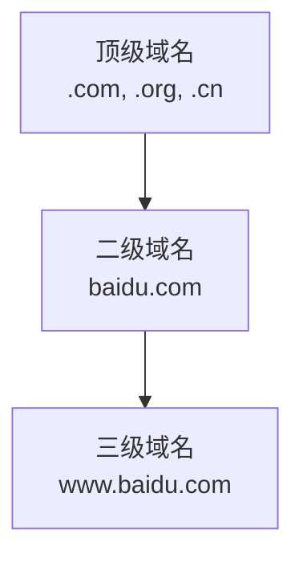
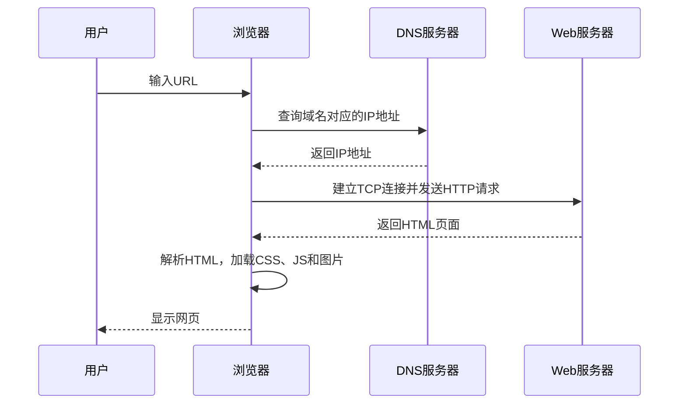

# 4.3 Internet基础

> [!abstract] 核心问题
> Internet是什么？IP地址和域名如何工作？浏览器如何访问网页？

## 一、Internet概述

### 1. Internet定义

**Internet**是全球最大的计算机网络，连接了世界各地的计算机和设备。

### 2. Internet发展历程

| 阶段 | 时间 | 事件 |
|-----|------|-----|
| **ARPANET** | 1969年 | 美国国防部建立ARPANET |
| **TCP/IP** | 1983年 | ARPANET采用TCP/IP协议 |
| **NSFNET** | 1986年 | 美国国家科学基金会建立NSFNET |
| **万维网** | 1991年 | 伯纳斯-李发明万维网 |
| **商业化** | 1995年 | Internet商业化 |
| **Web 2.0** | 2000年 | 用户参与和互动 |
| **移动互联网** | 2010年 | 智能手机普及 |

### 3. Internet特点

| 特点 | 说明 |
|-----|------|
| **全球性** | 覆盖全球几乎所有国家 |
| **开放性** | 任何人都可以接入 |
| **互联性** | 各种网络相互连接 |
| **共享性** | 资源共享和信息交流 |
| **多样性** | 包含各种类型的信息 |

## 二、IP地址

### 1. IP地址定义

**IP地址（Internet Protocol Address）**是Internet上每个设备的唯一标识。

### 2. IPv4地址

**IPv4（Internet Protocol Version 4）**使用32位二进制表示：

| 格式 | 示例 |
|-----|------|
| **二进制** | 11000000 10101000 00000001 00000001 |
| **点分十进制** | 192.168.1.1 |

**IP地址结构**：
- **网络号**：标识网络
- **主机号**：标识主机

### 3. IP地址分类

| 类别 | 范围 | 网络号位数 | 用途 |
|-----|------|-----------|------|
| **A类** | 1.0.0.0 ~ 126.255.255.255 | 8位 | 大型网络 |
| **B类** | 128.0.0.0 ~ 191.255.255.255 | 16位 | 中型网络 |
| **C类** | 192.0.0.0 ~ 223.255.255.255 | 24位 | 小型网络 |
| **D类** | 224.0.0.0 ~ 239.255.255.255 | - | 多播 |
| **E类** | 240.0.0.0 ~ 255.255.255.255 | - | 保留 |

### 4. 特殊IP地址

| 地址 | 用途 |
|-----|------|
| **0.0.0.0** | 表示任何地址 |
| **127.0.0.1** | 回环地址，本地测试 |
| **169.254.x.x** | 自动私有IP地址 |
| **255.255.255.255** | 广播地址 |

### 5. 子网掩码

**子网掩码（Subnet Mask）**用于区分网络号和主机号：

| 默认子网掩码 | 类别 |
|-------------|------|
| **255.0.0.0** | A类 |
| **255.255.0.0** | B类 |
| **255.255.255.0** | C类 |

**示例**：
- IP地址：192.168.1.100
- 子网掩码：255.255.255.0
- 网络地址：192.168.1.0
- 主机地址：0.0.0.100

### 6. IPv6地址

**IPv6（Internet Protocol Version 6）**使用128位二进制表示：

| 格式 | 示例 |
|-----|------|
| **十六进制** | 2001:0db8:85a3:0000:0000:8a2e:0370:7334 |
| **压缩格式** | 2001:db8:85a3::8a2e:370:7334 |

**IPv6特点**：
- 地址空间大，可提供足够多的IP地址
- 支持自动配置
- 内置安全机制

## 三、域名系统

### 1. 域名定义

**域名（Domain Name）**是IP地址的友好名称：

| 域名 | IP地址 |
|-----|--------|
| www.baidu.com | 220.181.38.148 |
| www.google.com | 172.217.160.142 |

### 2. 域名层次结构

**域名组成**：
- **顶级域名（TLD）**：最右边的部分，如.com、.org、.cn
- **二级域名**：组织名称，如baidu
- **三级域名**：服务器名称，如www

### 3. 顶级域名分类

| 类型 | 示例 | 说明 |
|-----|------|-----|
| **通用顶级域名** | .com、.org、.net | 商业、组织、网络 |
| **国家顶级域名** | .cn、.us、.jp | 中国、美国、日本 |
| **新通用顶级域名** | .xyz、.top、.club | 新兴域名 |

## 四、URL与浏览器

### 1. URL定义

**URL（Uniform Resource Locator）**是Web资源的地址：

| 组成部分 | 示例 | 说明 |
|---------|------|-----|
| **协议** | https:// | 访问协议 |
| **域名** | www.example.com | 服务器地址 |
| **端口** | :443 | 服务端口，默认可省略 |
| **路径** | /docs/index.html | 文件路径 |
| **查询参数** | ?id=1&name=test | 传递给服务器的参数 |
| **片段** | #section1 | 页面内锚点 |

### 2. 浏览器工作原理

**浏览器**是访问Web资源的客户端程序：

### 3. 常见浏览器

| 浏览器 | 厂商 | 特点 |
|-------|------|-----|
| **Chrome** | Google | 速度快，扩展丰富 |
| **Firefox** | Mozilla | 开源，隐私保护好 |
| **Edge** | Microsoft | 与Windows集成 |
| **Safari** | Apple | 与macOS/iOS集成 |
| **Opera** | Opera Software | 内置VPN |

## 五、Internet接入方式

### 1. 有线接入

| 方式 | 特点 | 速度 |
|-----|------|-----|
| **ADSL** | 利用电话线 | 几Mbps |
| **光纤** | 利用光纤 | 几十Mbps到几百Mbps |
| **电缆调制解调器** | 利用有线电视线 | 几十Mbps |

### 2. 无线接入

| 方式 | 特点 | 速度 |
|-----|------|-----|
| **Wi-Fi** | 无线局域网 | 几十Mbps到几百Mbps |
| **移动网络** | 3G/4G/5G | 几Mbps到几十Mbps |
| **卫星互联网** | 通过卫星 | 几十Mbps |

## 六、易错点提示

> [!warning] 常见误区
> - **"IP地址永远不变"**：大多数家庭用户使用动态IP地址，每次联网可能变化。
> - **"域名和IP地址一一对应"**：一个域名可以对应多个IP地址（负载均衡），一个IP地址也可以对应多个域名（虚拟主机）。
> - **"IPv6已经完全取代IPv4"**：IPv6正在逐步推广，但IPv4仍然广泛使用。
> - **"浏览器只负责显示网页"**：浏览器还负责解析HTML/CSS/JS、处理网络请求、管理缓存等。

## 七、示例与练习

### 示例

**例1**：分析IP地址192.168.1.100的类别和子网

**解析**：
- 第一个字节是192，属于C类地址
- 默认子网掩码是255.255.255.0
- 网络地址：192.168.1.0
- 主机地址：0.0.0.100

### 练习题

1. Internet的发展历程是怎样的？
2. IPv4地址分为哪几类？各有什么特点？
3. 域名系统的作用是什么？域名层次结构是怎样的？
4. URL由哪些部分组成？各部分的含义是什么？

**导航**：上一节 [[4.2 网络协议与层次]] · [[MOC - 大学计算机基础A|返回课程地图]] · 下一节 [[4.4 网络安全初步]]