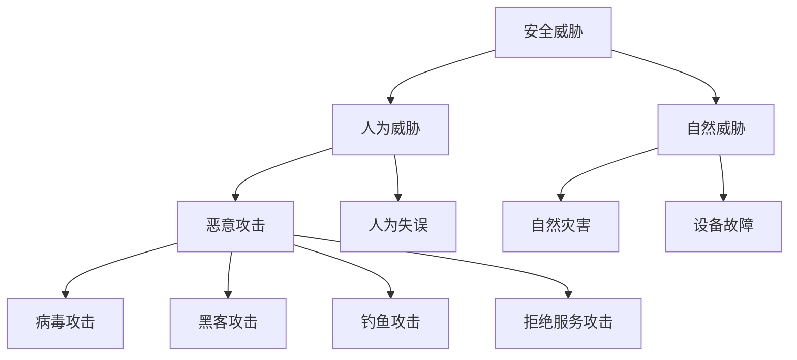

# 4.4 网络安全初步

> [!abstract] 核心问题
> 网络安全面临哪些威胁？如何保护计算机和数据安全？

## 一、网络安全概述

### 1. 安全定义

**网络安全（Network Security）**是保护网络系统中的硬件、软件和数据不受破坏、泄露或滥用。

### 2. 安全目标

| 目标 | 说明 |
|-----|------|
| **保密性（Confidentiality）** | 防止未授权访问 |
| **完整性（Integrity）** | 防止数据篡改 |
| **可用性（Availability）** | 确保系统正常运行 |
| **可控性（Controllability）** | 控制信息传播范围 |
| **不可否认性（Non-repudiation）** | 防止抵赖行为 |

### 3. 安全威胁分类

## 二、常见安全威胁

### 1. 恶意软件

**恶意软件（Malware）**是故意设计用来破坏计算机系统的软件：

| 类型 | 说明 | 示例 |
|-----|------|-----|
| **病毒（Virus）** | 依附于其他程序，自我复制 | 熊猫烧香、CIH |
| **蠕虫（Worm）** | 独立程序，通过网络传播 | 冲击波、震荡波 |
| **木马（Trojan）** | 伪装成合法程序，窃取信息 | 灰鸽子、网银木马 |
| **间谍软件（Spyware）** | 收集用户信息 | 广告软件、键盘记录器 |
| **勒索软件（Ransomware）** | 加密用户数据，勒索赎金 | WannaCry、NotPetya |

### 2. 黑客攻击

**黑客攻击（Hacking）**是未经授权访问计算机系统：

| 类型 | 说明 |
|-----|------|
| **口令破解** | 尝试猜测或暴力破解密码 |
| **SQL注入** | 通过SQL语句注入攻击数据库 |
| **跨站脚本（XSS）** | 在网页中注入恶意脚本 |
| **跨站请求伪造（CSRF）** | 伪造用户请求 |
| **中间人攻击** | 拦截和篡改通信数据 |

### 3. 社会工程攻击

**社会工程（Social Engineering）**是通过欺骗手段获取信息：

| 类型 | 说明 |
|-----|------|
| **钓鱼攻击** | 伪装成可信机构，骗取信息 |
| ** pretexting** | 编造借口获取信息 |
| ** baiting** | 提供诱饵（如U盘）引诱用户 |
| ** tailgating** | 跟随他人进入受限区域 |

### 4. 拒绝服务攻击

**拒绝服务攻击（DoS/DDoS）**是使系统无法正常服务：

| 类型 | 说明 |
|-----|------|
| **DoS（Denial of Service）** | 单源攻击，消耗系统资源 |
| **DDoS（Distributed DoS）** | 多源攻击，威力更大 |

## 三、安全防护措施

### 1. 访问控制

| 措施 | 说明 |
|-----|------|
| **用户认证** | 验证用户身份（密码、指纹、双因素认证） |
| **权限管理** | 基于角色分配访问权限 |
| **访问日志** | 记录用户访问行为 |

### 2. 加密技术

| 类型 | 说明 | 应用 |
|-----|------|-----|
| **对称加密** | 加密和解密使用相同密钥 | AES、DES |
| **非对称加密** | 加密和解密使用不同密钥 | RSA、ECC |
| **哈希函数** | 将任意长度数据转换为固定长度 | MD5、SHA-256 |
| **数字签名** | 验证数据完整性和身份 | 证书签名 |

### 3. 防火墙

**防火墙（Firewall）**是网络安全的第一道防线：

| 类型 | 说明 |
|-----|------|
| **网络防火墙** | 过滤网络流量 |
| **主机防火墙** | 保护单台计算机 |
| **软件防火墙** | 软件实现的防火墙 |
| **硬件防火墙** | 专用硬件设备 |

**防火墙规则**：
- 默认拒绝所有流量
- 允许必要的服务
- 记录异常流量

### 4. 入侵检测与防御

| 类型 | 说明 |
|-----|------|
| **IDS（入侵检测系统）** | 检测入侵行为，发出警报 |
| **IPS（入侵防御系统）** | 检测并阻止入侵行为 |

### 5. 安全意识

| 措施 | 说明 |
|-----|------|
| **强密码** | 使用复杂密码，定期更换 |
| **软件更新** | 及时更新操作系统和软件 |
| **邮件安全** | 不打开可疑邮件和附件 |
| **备份数据** | 定期备份重要数据 |
| **安全教育** | 提高安全意识，识别钓鱼攻击 |

## 四、安全协议

### 1. HTTPS

**HTTPS（HTTP Secure）**是加密的HTTP协议：

| 特点 | 说明 |
|-----|------|
| **数据加密** | 使用SSL/TLS加密传输数据 |
| **身份验证** | 通过证书验证服务器身份 |
| **完整性保护** | 防止数据被篡改 |

### 2. SSH

**SSH（Secure Shell）**是安全的远程登录协议：

| 特点 | 说明 |
|-----|------|
| **加密传输** | 所有数据加密传输 |
| **身份验证** | 支持密码和密钥认证 |
| **端口转发** | 安全地转发网络流量 |

### 3. VPN

**VPN（Virtual Private Network）**是虚拟专用网络：

| 特点 | 说明 |
|-----|------|
| **加密隧道** | 在公共网络上建立加密连接 |
| **远程访问** | 安全地访问内部网络 |
| **匿名上网** | 隐藏真实IP地址 |

## 五、安全策略

### 1. 安全策略定义

**安全策略（Security Policy）**是组织制定的安全规则和措施。

### 2. 安全策略要素

| 要素 | 说明 |
|-----|------|
| **策略目标** | 明确安全目标和范围 |
| **责任划分** | 明确各部门和人员的责任 |
| **访问控制** | 规定访问权限和流程 |
| **应急响应** | 制定安全事件处理流程 |
| **审计日志** | 记录和审查安全事件 |

### 3. 安全策略实施

| 步骤 | 说明 |
|-----|------|
| **风险评估** | 识别安全威胁和漏洞 |
| **策略制定** | 制定安全策略和措施 |
| **实施部署** | 部署安全设备和软件 |
| **培训教育** | 培训员工安全意识 |
| **监控审计** | 监控和审查安全状态 |

## 六、易错点提示

> [!warning] 常见误区
> - **"安装杀毒软件就安全了"**：杀毒软件只是安全防护的一部分，还需要其他安全措施。
> - **"强密码就是复杂密码"**：强密码不仅要复杂，还要足够长（至少12位）。
> - **"HTTPS网站一定安全"**：HTTPS只保证传输安全，不保证网站内容安全。
> - **"防火墙可以防所有攻击"**：防火墙无法防止内部攻击和社会工程攻击。

## 七、示例与练习

### 示例

**例1**：分析钓鱼邮件的特征

**解析**：
- 发件人地址可疑
- 邮件内容紧急，要求立即操作
- 包含可疑链接
- 要求提供个人信息（密码、银行卡号等）
- 拼写错误和格式混乱

### 练习题

1. 网络安全的目标是什么？
2. 常见的恶意软件有哪些类型？各有什么特点？
3. 网络安全防护措施有哪些？各措施的作用是什么？
4. 如何提高安全意识？举例说明。

**导航**：上一节 [[4.3 Internet基础]] · [[MOC - 大学计算机基础A|返回课程地图]] · 下一章 [[5.1 多媒体概念]]