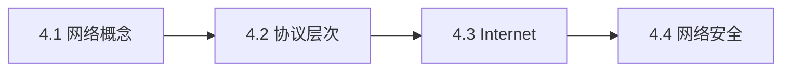

# 第4章：计算机网络基础

> [!abstract] 章节定位
> 本章介绍计算机网络的基本概念、协议层次、Internet基础和网络安全初步，建立对计算机网络的基本认知。

## 知识点导航

- [[4.1 网络的基本概念]]：网络定义、分类、拓扑结构
- [[4.2 网络协议与层次]]：OSI模型、TCP/IP协议族、HTTP协议
- [[4.3 Internet基础]]：IP地址、域名系统、URL与浏览器
- [[4.4 网络安全初步]]：常见威胁、防护措施、加密基础

## 本章重点

| 知识点 | 核心内容 | 掌握程度 |
|-------|---------|---------|
| 4.1 网络概念 | 定义、分类、拓扑 | 理解 |
| 4.2 协议层次 | OSI、TCP/IP、HTTP | 掌握 |
| 4.3 Internet | IP地址、DNS、URL | 掌握 |
| 4.4 网络安全 | 威胁、防护、加密基础 | 理解 |

## 学习路径

