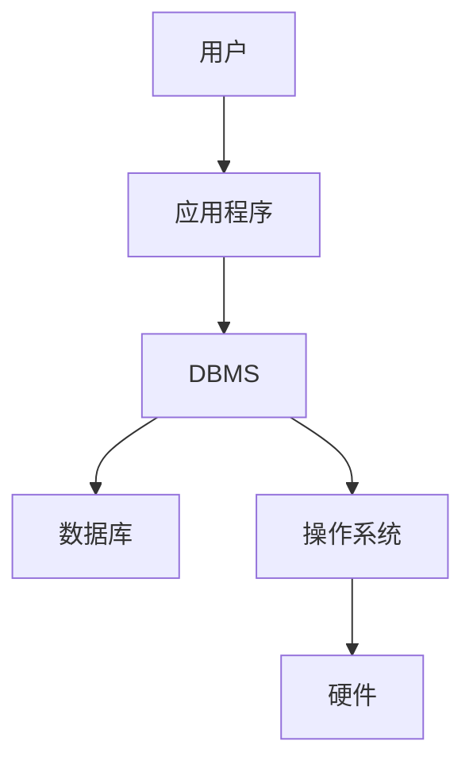

# 6.1 数据库概念

> [!abstract] 核心问题
> 什么是数据库？数据库系统由哪些部分组成？

## 一、数据管理发展历程

### 1. 人工管理阶段（1950年代前）

| 特点 | 说明 |
|-----|------|
| **数据与程序绑定** | 数据由程序管理，程序之间数据不共享 |
| **无统一管理** | 没有专门的数据管理软件 |
| **数据冗余** | 相同数据重复存储 |
| **数据不一致** | 数据修改时容易出现不一致 |

### 2. 文件系统阶段（1950-1960年代）

| 特点 | 说明 |
|-----|------|
| **数据以文件形式存储** | 使用文件系统管理数据 |
| **数据与程序分离** | 数据文件独立于程序 |
| **文件共享** | 多个程序可以访问同一文件 |
| **仍有冗余** | 不同文件中仍可能有重复数据 |

### 3. 数据库系统阶段（1960年代至今）

| 特点 | 说明 |
|-----|------|
| **数据集中管理** | 由数据库管理系统统一管理 |
| **数据共享** | 多个用户和程序共享数据 |
| **数据独立性** | 数据与程序相互独立 |
| **减少冗余** | 通过关系模型减少数据冗余 |
| **数据完整性** | 保证数据的正确性和一致性 |

## 二、数据库定义

### 1. 数据库（Database）

**数据库（Database, DB）**是长期存储在计算机内的、有组织的、可共享的数据集合。

### 2. 数据库管理系统（DBMS）

**数据库管理系统（Database Management System, DBMS）**是管理数据库的软件：

| 功能 | 说明 |
|-----|------|
| **数据定义** | 定义数据库结构 |
| **数据操纵** | 插入、删除、更新、查询数据 |
| **数据控制** | 控制数据访问权限 |
| **数据维护** | 数据备份、恢复、优化 |

### 3. 数据库系统（DBS）

**数据库系统（Database System, DBS）**是数据库、数据库管理系统和应用程序的总称：

## 三、数据库系统组成

### 1. 硬件

| 组件 | 说明 |
|-----|------|
| **存储设备** | 存储数据库和日志 |
| **服务器** | 运行数据库管理系统 |
| **网络设备** | 连接客户端和服务器 |

### 2. 软件

| 组件 | 说明 |
|-----|------|
| **数据库管理系统** | 核心软件 |
| **操作系统** | 基础软件 |
| **应用程序** | 用户使用的软件 |
| **开发工具** | 数据库开发和管理工具 |

### 3. 数据

| 类型 | 说明 |
|-----|------|
| **元数据** | 描述数据库结构的数据 |
| **用户数据** | 用户存储和管理的数据 |
| **日志数据** | 记录数据库操作的日志 |

### 4. 用户

| 用户类型 | 说明 |
|---------|------|
| **数据库管理员（DBA）** | 负责数据库管理和维护 |
| **应用程序员** | 开发数据库应用程序 |
| **普通用户** | 使用数据库应用程序 |

## 四、数据库特点

### 1. 数据共享

| 优点 | 说明 |
|-----|------|
| **减少冗余** | 数据只存储一次 |
| **一致性** | 数据修改后所有用户看到相同结果 |
| **提高效率** | 避免重复录入 |

### 2. 数据独立性

| 类型 | 说明 |
|-----|------|
| **物理独立性** | 数据存储方式改变不影响应用程序 |
| **逻辑独立性** | 数据逻辑结构改变不影响应用程序 |

### 3. 数据完整性

| 约束 | 说明 |
|-----|------|
| **实体完整性** | 主键不能为空 |
| **参照完整性** | 外键必须引用存在的值 |
| **用户定义完整性** | 用户自定义的约束条件 |

### 4. 数据安全性

| 措施 | 说明 |
|-----|------|
| **用户认证** | 验证用户身份 |
| **权限管理** | 控制用户访问权限 |
| **数据加密** | 加密敏感数据 |
| **审计日志** | 记录用户操作 |

### 5. 并发控制

| 问题 | 说明 |
|-----|------|
| **脏读** | 读取未提交的数据 |
| **不可重复读** | 同一事务中两次读取数据不一致 |
| **幻读** | 同一事务中两次查询结果不一致 |

**解决方案**：
- **锁机制**：对数据加锁，防止并发修改
- **事务隔离**：设置事务隔离级别

## 五、数据库分类

### 1. 按数据模型分类

| 类型 | 说明 | 示例 |
|-----|------|-----|
| **层次数据库** | 树形结构 | IMS |
| **网状数据库** | 网状结构 | DBTG |
| **关系数据库** | 表格结构 | MySQL、Oracle |
| **面向对象数据库** | 对象结构 | ObjectDB |
| **NoSQL数据库** | 非关系型 | MongoDB、Redis |

### 2. 按使用范围分类

| 类型 | 说明 |
|-----|------|
| **个人数据库** | 单用户使用 | Access |
| **企业数据库** | 多用户使用 | Oracle、SQL Server |
| **分布式数据库** | 分布在多个地点 | MySQL Cluster |

### 3. 按部署方式分类

| 类型 | 说明 |
|-----|------|
| **本地数据库** | 部署在本地 | SQLite |
| **云端数据库** | 部署在云端 | AWS RDS、阿里云RDS |

## 六、主流数据库管理系统

### 1. 关系数据库

| DBMS | 特点 | 应用 |
|-----|------|-----|
| **MySQL** | 开源、轻量、性能好 | Web应用、中小企业 |
| **Oracle** | 功能强大、稳定可靠 | 大型企业、金融 |
| **SQL Server** | 微软出品、集成.NET | Windows平台 |
| **PostgreSQL** | 开源、功能丰富 | 企业级应用 |
| **SQLite** | 嵌入式、零配置 | 移动应用、小型应用 |

### 2. NoSQL数据库

| DBMS | 类型 | 特点 | 应用 |
|-----|------|-----|-----|
| **MongoDB** | 文档数据库 | 灵活的文档结构 | Web应用、大数据 |
| **Redis** | 键值数据库 | 内存存储、高速读写 | 缓存、会话管理 |
| **Cassandra** | 列族数据库 | 分布式、高可用 | 大数据、实时分析 |
| **Neo4j** | 图数据库 | 图形数据模型 | 社交网络、推荐系统 |

## 七、易错点提示

> [!warning] 常见误区
> - **"数据库就是数据文件"**：数据库不仅包含数据文件，还包括索引、日志、元数据等。
> - **"DBMS就是数据库"**：DBMS是管理数据库的软件，数据库是存储数据的集合。
> - **"关系数据库已经过时"**：关系数据库仍然是主流，适合大多数业务场景。
> - **"NoSQL比关系数据库好"**：NoSQL适合特定场景，不能替代关系数据库。

## 八、示例与练习

### 示例

**例1**：分析学生管理系统的数据库需求

**解析**：
- 数据：学生信息、课程信息、成绩信息
- 用户：管理员、教师、学生
- 功能：查询学生信息、录入成绩、统计分析
- 约束：学生ID唯一、成绩在0-100之间

### 练习题

1. 数据管理经历了哪些阶段？各阶段的特点是什么？
2. 数据库系统由哪些部分组成？各部分的作用是什么？
3. 数据库有哪些特点？各特点的含义是什么？
4. 主流的数据库管理系统有哪些？各有什么特点？

**导航**：上一章 [[5.3 视频技术]] · [[MOC - 大学计算机基础A|返回课程地图]] · 下一节 [[6.2 数据模型]]