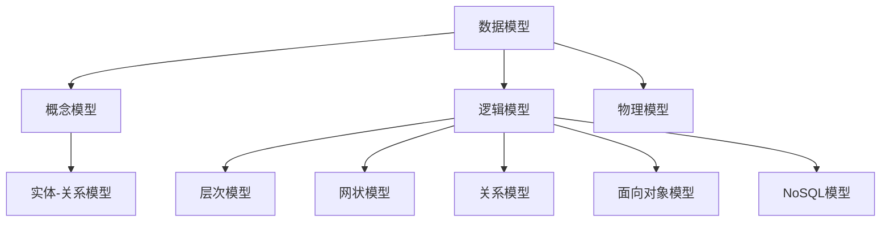
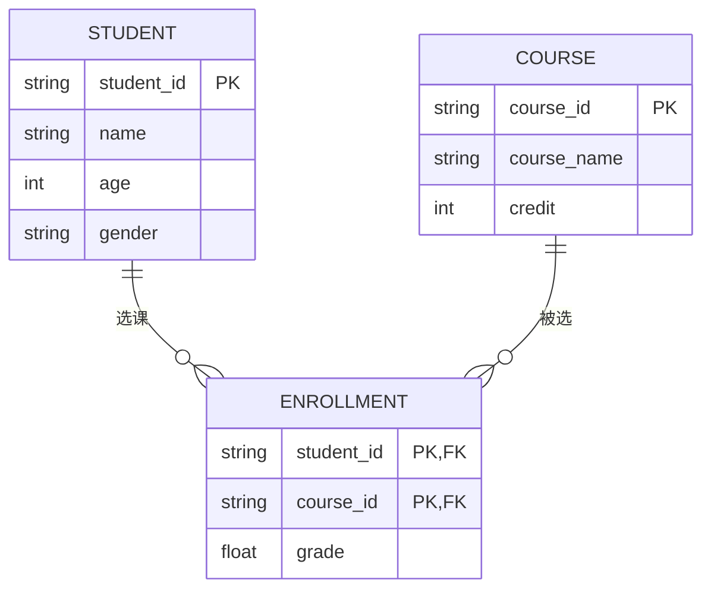
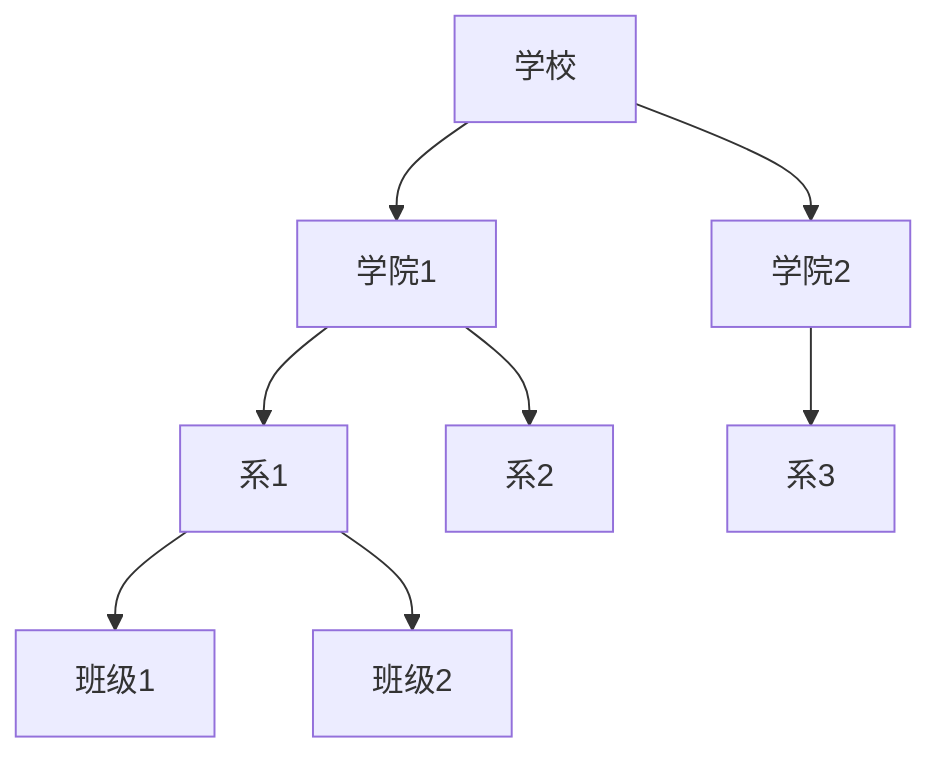
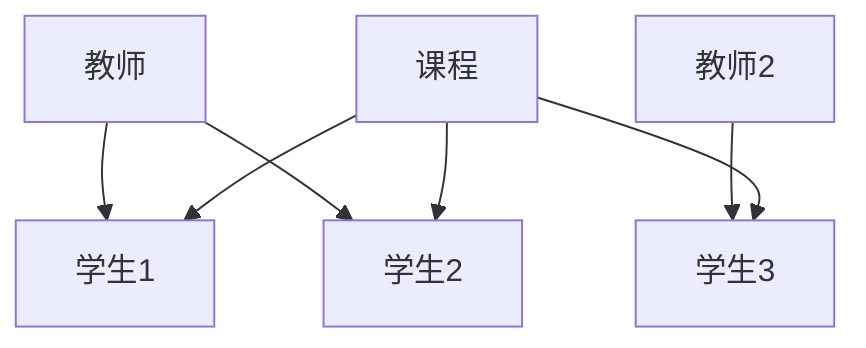

# 6.2 数据模型

> [!abstract] 核心问题
> 常见的数据模型有哪些？关系模型的基本概念是什么？

## 一、数据模型概述

### 1. 数据模型定义

**数据模型（Data Model）**是描述数据结构、关系和约束的抽象表示。

### 2. 数据模型组成要素

| 要素 | 说明 |
|-----|------|
| **数据结构** | 数据的组织方式 |
| **数据操作** | 对数据的操作（查询、插入、删除、更新） |
| **完整性约束** | 数据必须满足的条件 |

### 3. 数据模型分类

## 二、概念模型

### 1. 实体-关系模型（E-R模型）

**E-R模型（Entity-Relationship Model）**是描述概念级数据的模型：

| 概念 | 说明 | 示例 |
|-----|------|-----|
| **实体（Entity）** | 现实世界中的事物 | 学生、课程、教师 |
| **属性（Attribute）** | 实体的特征 | 学生ID、姓名、年龄 |
| **关系（Relationship）** | 实体之间的联系 | 学生选课、教师授课 |

### 2. 实体类型

| 类型 | 说明 |
|-----|------|
| **强实体** | 不依赖其他实体而存在 | 学生 |
| **弱实体** | 依赖其他实体而存在 | 成绩单 |

### 3. 关系类型

| 类型 | 说明 | 示例 |
|-----|------|-----|
| **一对一（1:1）** | 一个实体对应另一个实体 | 学生-学生证 |
| **一对多（1:N）** | 一个实体对应多个实体 | 班级-学生 |
| **多对多（M:N）** | 多个实体对应多个实体 | 学生-课程 |

### 4. E-R图

**E-R图**是E-R模型的图形表示：

## 三、层次模型

### 1. 层次模型结构

**层次模型**是树形结构，每个节点有且仅有一个父节点：

### 2. 层次模型特点

| 优点 | 说明 |
|-----|------|
| **结构清晰** | 树形结构，易于理解 |
| **查询效率高** | 从根节点开始，路径明确 |

| 缺点 | 说明 |
|-----|------|
| **缺乏灵活性** | 只能表示1:N关系 |
| **数据冗余** | 多对多关系需要重复存储 |

## 四、网状模型

### 1. 网状模型结构

**网状模型**是网状结构，节点可以有多个父节点：

### 2. 网状模型特点

| 优点 | 说明 |
|-----|------|
| **灵活性高** | 可以表示复杂关系 |
| **查询效率较高** | 直接访问 |

| 缺点 | 说明 |
|-----|------|
| **结构复杂** | 难以理解和维护 |
| **实现困难** | 需要复杂的导航 |

## 五、关系模型

### 1. 关系模型结构

**关系模型**是表格结构，用关系（表）表示数据：

| 概念 | 说明 | 示例 |
|-----|------|-----|
| **关系（Relation）** | 二维表 | 学生表、课程表 |
| **元组（Tuple）** | 表中的行 | 一条学生记录 |
| **属性（Attribute）** | 表中的列 | 学号、姓名 |
| **域（Domain）** | 属性的取值范围 | 姓名：字符串 |
| **键（Key）** | 唯一标识元组的属性 | 学号 |

### 2. 关系的性质

| 性质 | 说明 |
|-----|------|
| **列是同质的** | 同一列的数据类型相同 |
| **列顺序无关** | 列的顺序可以任意交换 |
| **行顺序无关** | 行的顺序可以任意交换 |
| **行不重复** | 没有完全相同的两行 |
| **每个属性值是原子的** | 不可再分 |

### 3. 键的类型

| 类型 | 说明 |
|-----|------|
| **主键（Primary Key）** | 唯一标识表中记录的键 |
| **外键（Foreign Key）** | 引用其他表主键的键 |
| **候选键（Candidate Key）** | 可以作为主键的键 |
| **复合键（Composite Key）** | 由多个属性组成的键 |

### 4. 关系完整性

| 约束 | 说明 |
|-----|------|
| **实体完整性** | 主键不能为空且唯一 |
| **参照完整性** | 外键必须引用存在的值 |
| **用户定义完整性** | 用户自定义的约束 |

### 5. 关系运算

| 运算 | 说明 |
|-----|------|
| **选择（Selection）** | 选择满足条件的行 |
| **投影（Projection）** | 选择指定的列 |
| **连接（Join）** | 合并两个表 |
| **并（Union）** | 合并两个表的行 |
| **差（Difference）** | 找出两个表的差异 |
| **交（Intersection）** | 找出两个表的交集 |

### 6. 关系规范化

**规范化**是消除数据冗余和异常的过程：

| 范式 | 说明 |
|-----|------|
| **第一范式（1NF）** | 属性不可再分 |
| **第二范式（2NF）** | 消除部分函数依赖 |
| **第三范式（3NF）** | 消除传递函数依赖 |
| **BCNF** | 消除主属性对候选键的部分依赖 |

## 六、面向对象模型

### 1. 面向对象模型特点

| 特点 | 说明 |
|-----|------|
| **对象** | 数据和方法的封装 |
| **类** | 对象的模板 |
| **继承** | 子类继承父类的属性和方法 |
| **多态** | 同一接口有不同实现 |

### 2. 面向对象数据库

| DBMS | 特点 |
|-----|------|
| **ObjectDB** | 纯面向对象数据库 |
| **PostgreSQL** | 支持对象-关系模型 |

## 七、NoSQL模型

### 1. NoSQL分类

| 类型 | 说明 | 示例 |
|-----|------|-----|
| **文档数据库** | 存储JSON/BSON文档 | MongoDB |
| **键值数据库** | 存储键值对 | Redis |
| **列族数据库** | 存储列族 | Cassandra |
| **图数据库** | 存储图形数据 | Neo4j |

### 2. NoSQL特点

| 优点 | 说明 |
|-----|------|
| **灵活的数据模型** | 不需要预定义结构 |
| **高扩展性** | 水平扩展能力强 |
| **高性能** | 适合读写密集型应用 |

| 缺点 | 说明 |
|-----|------|
| **缺乏统一标准** | 不同系统差异大 |
| **事务支持有限** | 大多不支持ACID |
| **查询能力有限** | 查询语言不如SQL强大 |

## 八、易错点提示

> [!warning] 常见误区
> - **"关系模型就是表格"**：关系模型不仅是表格，还包括关系运算和完整性约束。
> - **"E-R图就是数据库设计"**：E-R图是概念设计，还需要转换为逻辑模型和物理模型。
> - **"规范化程度越高越好"**：过高的规范化会增加查询复杂度，需要权衡。
> - **"NoSQL不需要设计"**：NoSQL也需要设计数据结构和索引。

## 九、示例与练习

### 示例

**例1**：设计图书馆管理系统的E-R图

**解析**：
- 实体：图书、读者、借阅记录
- 属性：
  - 图书：图书ID、书名、作者、出版社、ISBN
  - 读者：读者ID、姓名、性别、年龄
  - 借阅记录：借阅ID、借阅日期、归还日期
- 关系：
  - 读者-借阅记录：1:N
  - 图书-借阅记录：1:N

### 练习题

1. 数据模型的组成要素有哪些？各要素的含义是什么？
2. E-R模型中的实体、属性、关系分别是什么？举例说明。
3. 关系模型的基本概念有哪些？键的类型有哪些？
4. 关系规范化的目的是什么？常见的范式有哪些？

**导航**：上一节 [[6.1 数据库概念]] · [[MOC - 大学计算机基础A|返回课程地图]] · 下一节 [[6.3 关系数据库]]