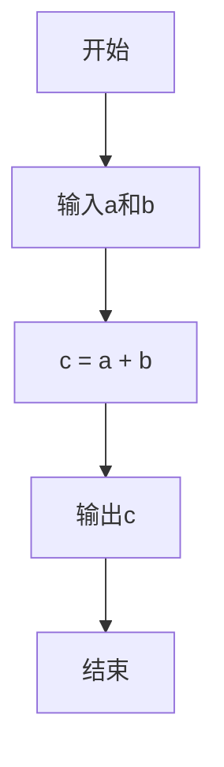
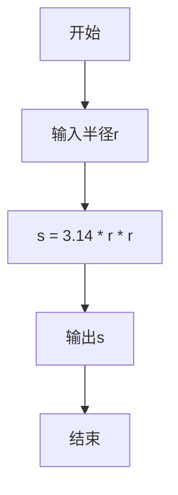

# 7.1 程序设计概述

> [!abstract] 核心问题
> 什么是算法？如何用流程图描述算法？程序设计的步骤是什么？

## 一、程序与程序设计

### 1. 程序定义

**程序（Program）**是为完成特定任务而编写的指令序列。

### 2. 程序设计定义

**程序设计（Programming）**是编写、测试和维护程序的过程。

### 3. 程序设计语言

| 语言类型 | 说明 | 示例 |
|---------|------|-----|
| **机器语言** | 直接用二进制编码 | 01010101 |
| **汇编语言** | 用助记符表示指令 | ADD、MOV |
| **高级语言** | 接近自然语言 | C、Java、Python |

## 二、算法基础

### 1. 算法定义

**算法（Algorithm）**是解决问题的步骤和方法。

### 2. 算法特性

| 特性 | 说明 |
|-----|------|
| **有穷性** | 算法必须在有限步骤内结束 |
| **确定性** | 每个步骤的含义明确 |
| **可行性** | 每个步骤都可以执行 |
| **输入** | 有零个或多个输入 |
| **输出** | 有一个或多个输出 |

### 3. 算法描述

| 方法 | 说明 |
|-----|------|
| **自然语言** | 用自然语言描述 |
| **流程图** | 用图形符号描述 |
| **伪代码** | 用类似编程语言的符号描述 |
| **程序代码** | 用编程语言实现 |

### 4. 流程图符号

| 符号 | 名称 | 说明 |
|-----|------|-----|
| **矩形** | 处理框 | 表示操作步骤 |
| **菱形** | 判断框 | 表示条件判断 |
| **平行四边形** | 输入输出框 | 表示输入或输出 |
| **圆角矩形** | 起止框 | 表示开始或结束 |
| **箭头** | 流程线 | 表示执行顺序 |
| **连接符** | 连接点 | 连接不同部分 |

### 5. 流程图示例

**计算两个数的和**：



**判断成绩是否及格**：

```mermaid
flowchart TD
  A[开始] --> B[输入成绩]
  B --> C{成绩 >= 60?}
  C -->|是| D[输出"及格"]
  C -->|否| E[输出"不及格"]
  D --> F[结束]
  E --> F
```

### 6. 伪代码示例

**计算阶乘**：

```
输入 n
result = 1
for i from 1 to n:
    result = result * i
输出 result
```

## 三、程序设计步骤

### 1. 需求分析

| 步骤 | 说明 |
|-----|------|
| **理解问题** | 明确问题的需求和目标 |
| **确定输入输出** | 确定程序的输入和输出 |
| **分析约束条件** | 分析时间、空间等约束 |

### 2. 算法设计

| 步骤 | 说明 |
|-----|------|
| **设计算法** | 设计解决问题的步骤 |
| **验证算法** | 验证算法的正确性 |
| **优化算法** | 优化算法的效率 |

### 3. 代码编写

| 步骤 | 说明 |
|-----|------|
| **选择语言** | 选择合适的编程语言 |
| **编写代码** | 根据算法编写代码 |
| **代码规范** | 遵循代码规范 |

### 4. 测试调试

| 步骤 | 说明 |
|-----|------|
| **测试用例设计** | 设计测试用例 |
| **运行测试** | 运行测试用例 |
| **调试错误** | 查找和修复错误 |

### 5. 维护优化

| 步骤 | 说明 |
|-----|------|
| **代码维护** | 修改和更新代码 |
| **性能优化** | 优化程序性能 |
| **文档编写** | 编写程序文档 |

## 四、程序设计风格

### 1. 可读性

| 原则 | 说明 |
|-----|------|
| **命名规范** | 使用有意义的变量名 |
| **注释** | 添加必要的注释 |
| **缩进** | 使用缩进表示代码层次 |
| **空行** | 使用空行分隔代码块 |

### 2. 可维护性

| 原则 | 说明 |
|-----|------|
| **模块化** | 将程序分为多个模块 |
| **函数化** | 使用函数封装功能 |
| **避免重复** | 避免重复代码 |

### 3. 效率

| 原则 | 说明 |
|-----|------|
| **时间效率** | 优化算法，减少运行时间 |
| **空间效率** | 优化数据结构，减少内存使用 |

## 五、结构化程序设计

### 1. 结构化程序设计定义

**结构化程序设计（Structured Programming）**是一种编程方法，使用三种基本控制结构。

### 2. 三种基本控制结构

| 结构 | 说明 | 流程图 |
|-----|------|-------|
| **顺序结构** | 按顺序执行 | 直线流程 |
| **选择结构** | 根据条件选择执行 | 分支流程 |
| **循环结构** | 重复执行 | 循环流程 |

### 3. 结构化程序设计原则

| 原则 | 说明 |
|-----|------|
| **自顶向下** | 从整体到局部 |
| **逐步求精** | 逐步细化功能 |
| **模块化** | 将程序分为模块 |

## 六、程序调试与测试

### 1. 错误类型

| 类型 | 说明 | 示例 |
|-----|------|-----|
| **语法错误** | 违反语言语法规则 | 拼写错误、缺少分号 |
| **运行错误** | 运行时出现错误 | 除零、数组越界 |
| **逻辑错误** | 程序逻辑错误 | 计算错误、条件错误 |

### 2. 调试方法

| 方法 | 说明 |
|-----|------|
| **打印调试** | 在关键位置打印变量值 |
| **断点调试** | 在关键位置设置断点 |
| **单步执行** | 逐行执行程序 |
| **日志调试** | 记录程序执行日志 |

### 3. 测试方法

| 方法 | 说明 |
|-----|------|
| **黑盒测试** | 不考虑内部结构，只测试输入输出 |
| **白盒测试** | 考虑内部结构，测试所有路径 |
| **单元测试** | 测试单个函数或模块 |
| **集成测试** | 测试多个模块的交互 |

## 七、易错点提示

> [!warning] 常见误区
> - **"程序就是算法"**：程序是算法的实现，算法是程序的逻辑。
> - **"流程图只是画图"**：流程图帮助理清思路，是程序设计的重要步骤。
> - **"代码写完就完成了"**：还需要测试、调试和维护。
> - **"代码越复杂越好"**：好的代码应该简洁清晰，易于理解。

## 八、示例与练习

### 示例

**例1**：设计计算圆面积的算法

**自然语言描述**：
1. 输入圆的半径
2. 计算面积：面积 = π × 半径²
3. 输出面积

**流程图**：



**Python代码**：

```python
r = float(input("请输入圆的半径："))
s = 3.14 * r * r
print("圆的面积是：", s)
```

### 练习题

1. 什么是算法？算法的特性是什么？
2. 流程图的基本符号有哪些？各符号的含义是什么？
3. 程序设计的步骤是什么？各步骤的要点是什么？
4. 结构化程序设计的三种基本控制结构是什么？

**导航**：上一章 [[6.4 数据库应用]] · [[MOC - 大学计算机基础A|返回课程地图]] · 下一节 [[7.2 基本控制结构]]