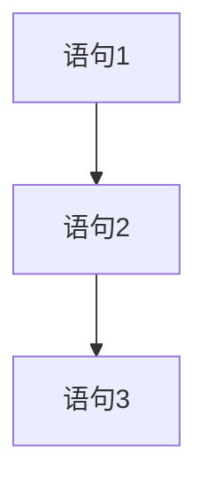
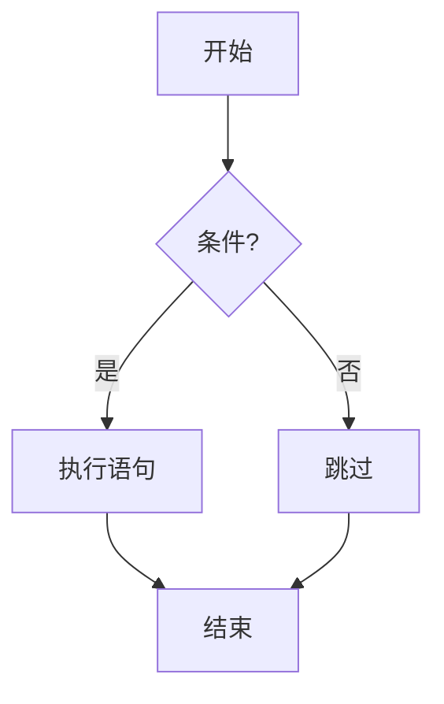
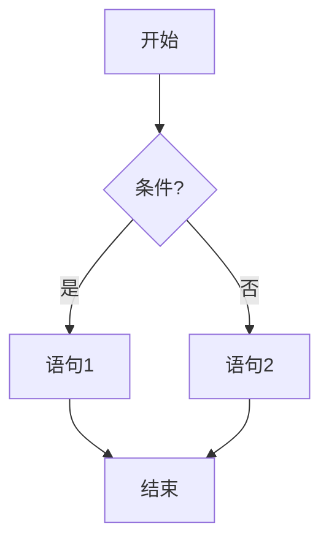
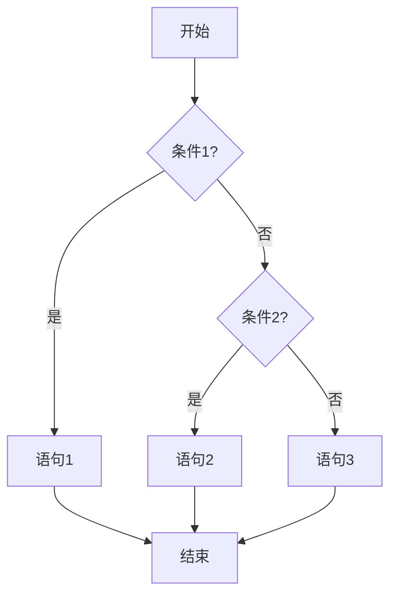
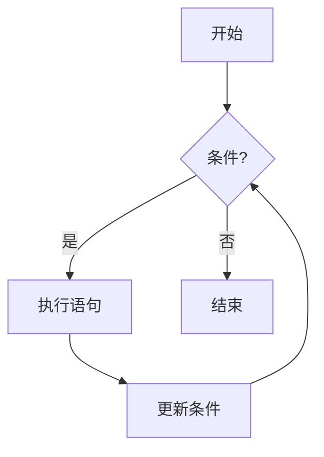
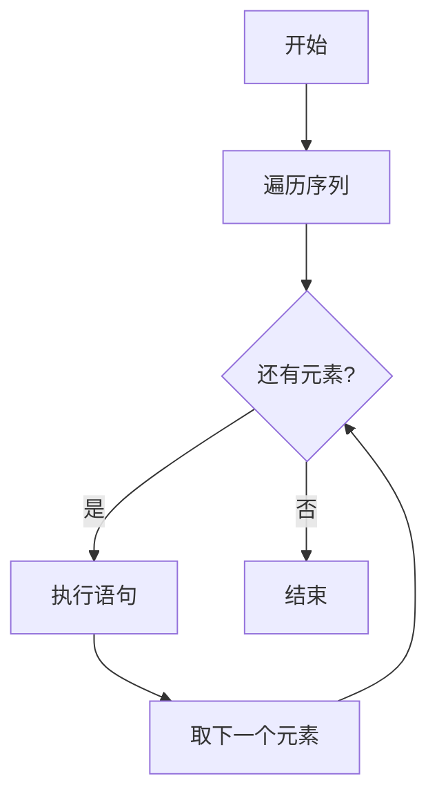

# 7.2 基本控制结构

> [!abstract] 核心问题
> 程序的三种基本控制结构是什么？如何使用选择和循环结构？

## 一、顺序结构

### 1. 顺序结构定义

**顺序结构**是按顺序依次执行语句。

### 2. 流程图



### 3. 示例

**Python代码**：

```python
print("Hello")
print("World")
x = 10
y = x + 5
print(y)
```

## 二、选择结构

### 1. 选择结构定义

**选择结构**根据条件判断执行不同的语句。

### 2. 单分支选择

**if语句**：

```python
if condition:
    statement1
    statement2
```

**流程图**：



**示例**：

```python
score = int(input("请输入成绩："))
if score >= 60:
    print("及格")
```

### 3. 双分支选择

**if-else语句**：

```python
if condition:
    statement1
else:
    statement2
```

**流程图**：



**示例**：

```python
score = int(input("请输入成绩："))
if score >= 60:
    print("及格")
else:
    print("不及格")
```

### 4. 多分支选择

**if-elif-else语句**：

```python
if condition1:
    statement1
elif condition2:
    statement2
else:
    statement3
```

**流程图**：



**示例**：

```python
score = int(input("请输入成绩："))
if score >= 90:
    print("优秀")
elif score >= 80:
    print("良好")
elif score >= 70:
    print("中等")
elif score >= 60:
    print("及格")
else:
    print("不及格")
```

### 5. 嵌套选择

**嵌套if语句**：

```python
if condition1:
    if condition2:
        statement1
    else:
        statement2
else:
    statement3
```

**示例**：

```python
age = int(input("请输入年龄："))
gender = input("请输入性别（男/女）：")
if age >= 18:
    if gender == "男":
        print("成年男性")
    else:
        print("成年女性")
else:
    print("未成年人")
```

### 6. 条件表达式

**三元运算符**：

```python
result = value1 if condition else value2
```

**示例**：

```python
score = int(input("请输入成绩："))
result = "及格" if score >= 60 else "不及格"
print(result)
```

## 三、循环结构

### 1. 循环结构定义

**循环结构**重复执行一组语句。

### 2. while循环

**while语句**：

```python
while condition:
    statement1
    statement2
```

**流程图**：



**示例**：

```python
i = 1
while i <= 10:
    print(i)
    i = i + 1
```

### 3. for循环

**for语句**：

```python
for variable in sequence:
    statement1
    statement2
```

**流程图**：



**示例**：

```python
for i in range(1, 11):
    print(i)
```

### 4. 循环嵌套

**嵌套循环**：

```python
for i in range(1, 4):
    for j in range(1, 4):
        print(i, j)
```

**示例**：打印九九乘法表

```python
for i in range(1, 10):
    for j in range(1, i+1):
        print(f"{j} × {i} = {i*j}", end="\t")
    print()
```

### 5. 循环控制语句

**break语句**：跳出循环

```python
for i in range(1, 11):
    if i == 5:
        break
    print(i)
```

**continue语句**：跳过当前循环

```python
for i in range(1, 11):
    if i % 2 == 0:
        continue
    print(i)
```

**else语句**：循环正常结束后执行

```python
for i in range(1, 11):
    print(i)
else:
    print("循环正常结束")
```

## 四、综合示例

### 1. 判断闰年

```python
year = int(input("请输入年份："))
if (year % 4 == 0 and year % 100 != 0) or (year % 400 == 0):
    print(f"{year}年是闰年")
else:
    print(f"{year}年不是闰年")
```

### 2. 计算阶乘

```python
n = int(input("请输入一个正整数："))
result = 1
for i in range(1, n+1):
    result *= i
print(f"{n}的阶乘是{result}")
```

### 3. 求最大值

```python
numbers = [3, 7, 2, 9, 5]
max_num = numbers[0]
for num in numbers:
    if num > max_num:
        max_num = num
print("最大值是", max_num)
```

### 4. 打印三角形

```python
n = int(input("请输入三角形高度："))
for i in range(1, n+1):
    print(" " * (n-i) + "*" * (2*i-1))
```

## 五、易错点提示

> [!warning] 常见误区
> - **"if语句后面必须有else"**：if语句可以单独使用，不一定需要else。
> - **"循环一定会执行"**：while循环的条件如果一开始就是False，循环体不会执行。
> - **"break只能跳出一层循环"**：break只能跳出当前所在的循环。
> - **"continue是跳过整个循环"**：continue只是跳过当前迭代，继续下一次迭代。

## 六、示例与练习

### 示例

**例1**：使用循环计算1到100的和

**解析**：

```python
sum = 0
for i in range(1, 101):
    sum += i
print("1到100的和是", sum)
```

### 练习题

1. 选择结构有哪些形式？各形式的语法是什么？
2. 循环结构有哪些形式？各形式的语法是什么？
3. break和continue语句的区别是什么？
4. 编写程序：判断一个数是否为素数。

**导航**：上一节 [[7.1 程序设计概述]] · [[MOC - 大学计算机基础A|返回课程地图]] · 下一节 [[7.3 数组与函数]]