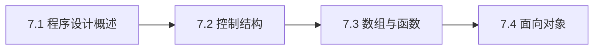

# 第7章：程序设计基础

> [!abstract] 章节定位
> 本章介绍程序设计的基本概念、控制结构、数组与函数以及面向对象基础，为后续编程学习奠定基础。

## 知识点导航

- [[7.1 程序设计概述]]：算法概念、流程图、结构化程序设计
- [[7.2 基本控制结构]]：顺序、选择、循环结构
- [[7.3 数组与函数]]：数组概念、函数定义与调用、参数传递
- [[7.4 面向对象基础]]：类与对象、封装、继承、多态

## 本章重点

| 知识点 | 核心内容 | 掌握程度 |
|-------|---------|---------|
| 7.1 程序设计概述 | 算法、流程图、结构化 | 理解 |
| 7.2 控制结构 | 顺序、选择、循环 | 掌握 |
| 7.3 数组与函数 | 数组、函数定义调用 | 掌握 |
| 7.4 面向对象 | 类与对象、三大特性 | 理解 |

## 学习路径

