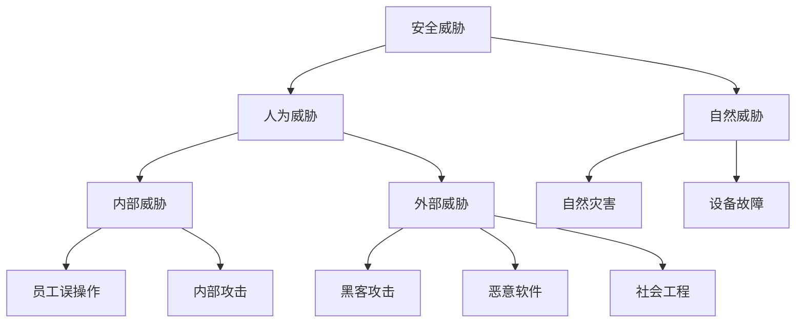

# 8.1 信息安全概述

> [!abstract] 核心问题
> 信息安全的目标是什么？面临哪些安全威胁？

## 一、信息安全定义

### 1. 安全定义

**信息安全（Information Security）**是保护信息系统中的数据和资源不受破坏、泄露或滥用。

### 2. 信息安全目标

| 目标 | 说明 |
|-----|------|
| **保密性（Confidentiality）** | 防止未授权访问 |
| **完整性（Integrity）** | 防止数据篡改 |
| **可用性（Availability）** | 确保系统正常运行 |
| **可控性（Controllability）** | 控制信息传播范围 |
| **不可否认性（Non-repudiation）** | 防止抵赖行为 |

### 3. 信息安全重要性

| 方面 | 说明 |
|-----|------|
| **个人** | 保护个人隐私和财产安全 |
| **企业** | 保护商业机密和客户数据 |
| **国家** | 保护国家关键基础设施 |

## 二、安全威胁分类

### 1. 威胁来源

### 2. 威胁类型

| 类型 | 说明 |
|-----|------|
| **恶意代码** | 病毒、蠕虫、木马、勒索软件 |
| **网络攻击** | DDoS、SQL注入、XSS |
| **社会工程** | 钓鱼、欺诈、身份冒充 |
| **物理攻击** | 盗窃、破坏硬件 |
| **内部威胁** | 员工泄露、误操作 |

### 3. 安全漏洞

| 类型 | 说明 |
|-----|------|
| **软件漏洞** | 程序代码中的缺陷 |
| **配置漏洞** | 系统配置不当 |
| **人为漏洞** | 用户安全意识薄弱 |

## 三、安全策略

### 1. 安全策略定义

**安全策略（Security Policy）**是组织制定的安全规则和措施。

### 2. 安全策略要素

| 要素 | 说明 |
|-----|------|
| **策略目标** | 明确安全目标和范围 |
| **责任划分** | 明确各部门和人员的责任 |
| **访问控制** | 规定访问权限和流程 |
| **应急响应** | 制定安全事件处理流程 |
| **审计日志** | 记录和审查安全事件 |

### 3. 安全策略实施

| 步骤 | 说明 |
|-----|------|
| **风险评估** | 识别安全威胁和漏洞 |
| **策略制定** | 制定安全策略和措施 |
| **实施部署** | 部署安全设备和软件 |
| **培训教育** | 培训员工安全意识 |
| **监控审计** | 监控和审查安全状态 |

## 四、安全技术

### 1. 访问控制

| 技术 | 说明 |
|-----|------|
| **身份认证** | 验证用户身份 |
| **授权管理** | 分配访问权限 |
| **访问日志** | 记录用户访问行为 |

### 2. 加密技术

| 技术 | 说明 |
|-----|------|
| **对称加密** | 加密和解密使用相同密钥 |
| **非对称加密** | 加密和解密使用不同密钥 |
| **哈希函数** | 将数据转换为固定长度摘要 |

### 3. 防火墙

| 类型 | 说明 |
|-----|------|
| **网络防火墙** | 过滤网络流量 |
| **主机防火墙** | 保护单台计算机 |
| **应用防火墙** | 保护特定应用 |

### 4. 入侵检测与防御

| 类型 | 说明 |
|-----|------|
| **IDS** | 检测入侵行为 |
| **IPS** | 检测并阻止入侵行为 |

### 5. 安全审计

| 技术 | 说明 |
|-----|------|
| **日志分析** | 分析系统日志 |
| **行为监控** | 监控用户行为 |
| **安全评估** | 评估系统安全性 |

## 五、安全管理

### 1. 人员管理

| 措施 | 说明 |
|-----|------|
| **背景审查** | 审查员工背景 |
| **权限管理** | 最小权限原则 |
| **培训教育** | 安全意识培训 |

### 2. 设备管理

| 措施 | 说明 |
|-----|------|
| **设备登记** | 登记所有设备 |
| **设备监控** | 监控设备使用 |
| **设备销毁** | 安全销毁废弃设备 |

### 3. 数据管理

| 措施 | 说明 |
|-----|------|
| **数据分类** | 分类管理数据 |
| **数据备份** | 定期备份数据 |
| **数据销毁** | 安全销毁数据 |

### 4. 应急响应

| 步骤 | 说明 |
|-----|------|
| **发现事件** | 发现安全事件 |
| **评估影响** | 评估事件影响 |
| **采取措施** | 采取应对措施 |
| **恢复系统** | 恢复受影响系统 |
| **调查原因** | 调查事件原因 |
| **改进措施** | 改进安全措施 |

## 六、安全意识

### 1. 安全意识重要性

| 方面 | 说明 |
|-----|------|
| **第一道防线** | 用户是安全的第一道防线 |
| **人为因素** | 大多数安全事件与人有关 |
| **持续教育** | 安全意识需要持续培养 |

### 2. 安全意识要点

| 要点 | 说明 |
|-----|------|
| **密码安全** | 使用强密码，定期更换 |
| **邮件安全** | 不打开可疑邮件 |
| **链接安全** | 不点击可疑链接 |
| **软件更新** | 及时更新软件 |
| **数据备份** | 定期备份数据 |

### 3. 安全意识培训

| 方式 | 说明 |
|-----|------|
| **安全培训** | 定期安全培训 |
| **安全演练** | 模拟安全事件演练 |
| **安全宣传** | 安全知识宣传 |

## 七、易错点提示

> [!warning] 常见误区
> - **"安装杀毒软件就安全了"**：杀毒软件只是安全防护的一部分。
> - **"安全技术可以解决所有问题"**：安全需要技术和管理相结合。
> - **"安全只需要关注外部威胁"**：内部威胁同样重要。
> - **"安全是一次性的工作"**：安全需要持续维护和更新。

## 八、示例与练习

### 示例

**例1**：分析企业信息安全策略的组成

**解析**：
- **策略目标**：保护企业数据和系统安全
- **责任划分**：IT部门负责技术安全，各部门负责人负责部门安全
- **访问控制**：基于角色分配权限，定期审查权限
- **应急响应**：制定安全事件响应流程，定期演练
- **审计日志**：记录所有安全事件，定期审计

### 练习题

1. 信息安全的目标是什么？各目标的含义是什么？
2. 安全威胁分为哪些类型？各类型的特点是什么？
3. 安全策略的要素有哪些？如何实施安全策略？
4. 为什么安全意识很重要？安全意识培训的方式有哪些？

**导航**：上一章 [[7.4 面向对象基础]] · [[MOC - 大学计算机基础A|返回课程地图]] · 下一节 [[8.2 密码学基础]]