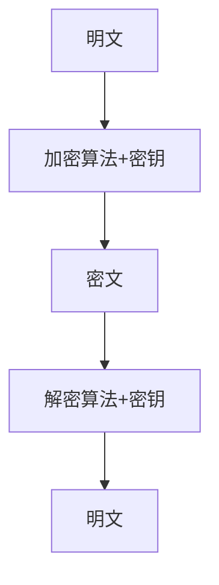
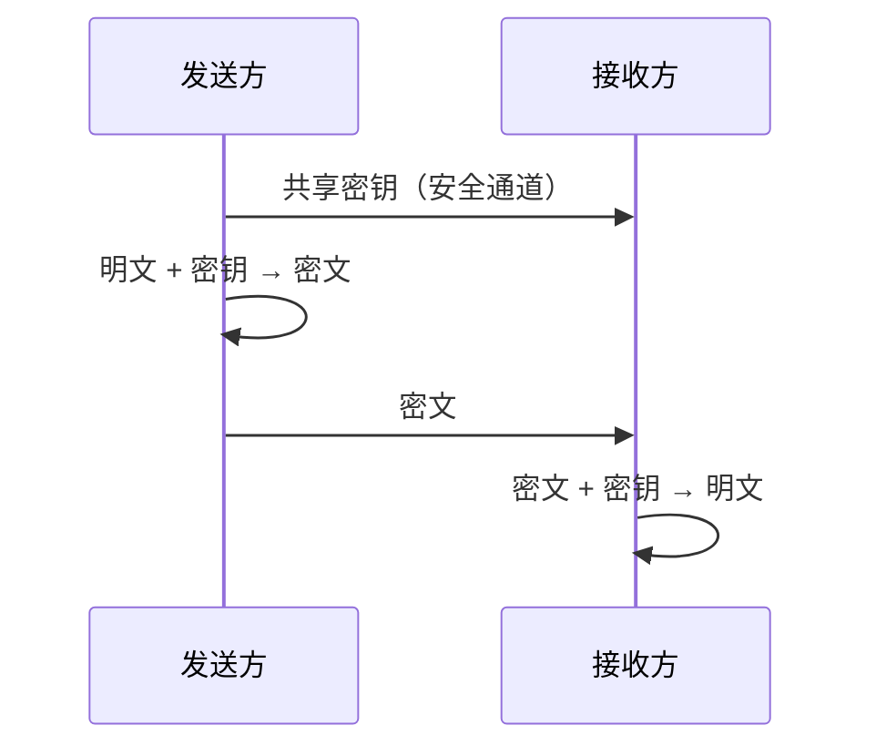
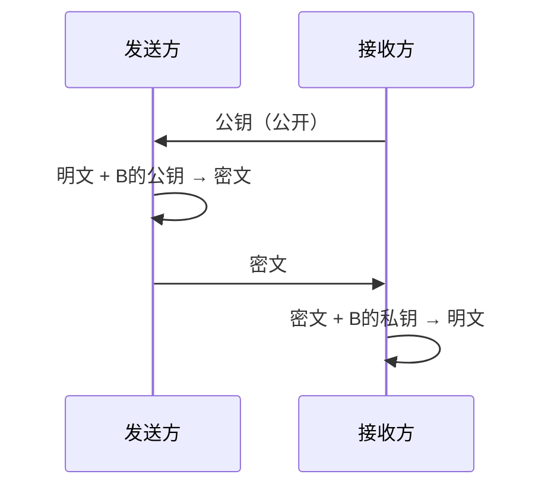
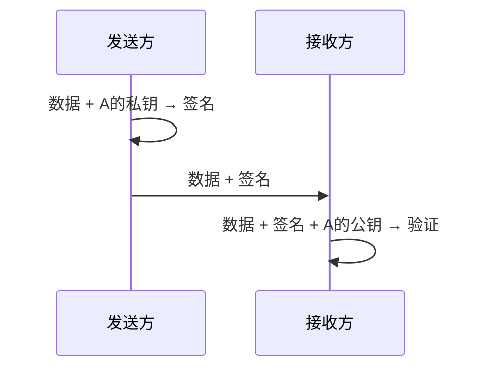
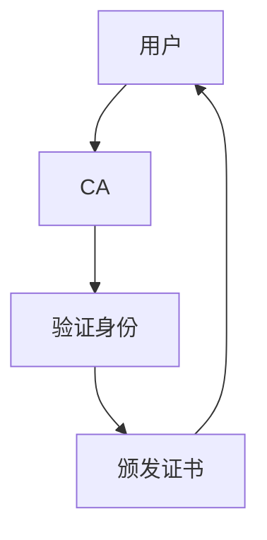
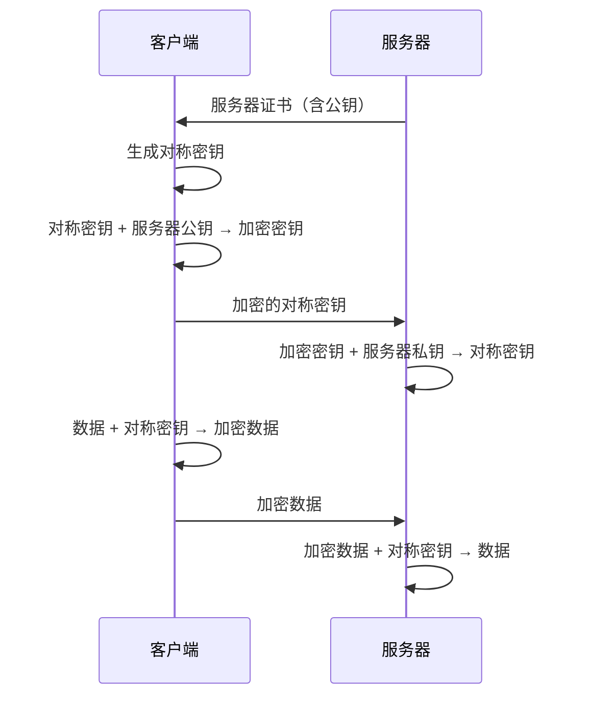

# 8.2 密码学基础

> [!abstract] 核心问题
> 加密和解密的原理是什么？对称加密和非对称加密有什么区别？

## 一、密码学概述

### 1. 密码学定义

**密码学（Cryptography）**是研究如何隐藏和保护信息的技术。

### 2. 密码学历史

| 阶段 | 说明 |
|-----|------|
| **古典密码** | 手工加密，如凯撒密码 |
| **现代密码** | 机械和电子加密 |
| **当代密码** | 计算机加密，如DES、RSA |

### 3. 密码学目标

| 目标 | 说明 |
|-----|------|
| **保密性** | 防止未授权访问 |
| **完整性** | 防止数据篡改 |
| **认证** | 验证数据来源 |
| **不可否认性** | 防止抵赖 |

## 二、加密基础

### 1. 加密与解密



| 术语 | 说明 |
|-----|------|
| **明文（Plaintext）** | 原始数据 |
| **密文（Ciphertext）** | 加密后的数据 |
| **密钥（Key）** | 加密和解密使用的参数 |
| **加密算法** | 将明文转换为密文的方法 |
| **解密算法** | 将密文转换为明文的方法 |

### 2. 密码系统分类

| 类型 | 说明 |
|-----|------|
| **对称密码** | 加密和解密使用相同密钥 |
| **非对称密码** | 加密和解密使用不同密钥 |
| **哈希函数** | 将数据转换为固定长度摘要 |

## 三、对称加密

### 1. 对称加密原理

**对称加密（Symmetric Encryption）**使用相同的密钥进行加密和解密。

### 2. 对称加密流程



### 3. 对称加密算法

| 算法 | 说明 | 密钥长度 |
|-----|------|---------|
| **DES** | 数据加密标准，已过时 | 56位 |
| **3DES** | 三重DES，增强DES | 168位 |
| **AES** | 高级加密标准，主流 | 128/192/256位 |
| **RC4** | 流密码，已不安全 | 可变长度 |

### 4. AES加密过程

| 步骤 | 说明 |
|-----|------|
| **轮密钥生成** | 从主密钥生成多轮密钥 |
| **初始轮** | 明文与第一轮密钥异或 |
| **加密轮** | 多轮替换和置换 |
| **最终轮** | 最后一轮变换 |

### 5. 对称加密优缺点

| 优点 | 说明 |
|-----|------|
| **速度快** | 加密解密效率高 |
| **算法成熟** | 经过充分验证 |

| 缺点 | 说明 |
|-----|------|
| **密钥分发** | 密钥需要安全分发 |
| **密钥管理** | 密钥数量随用户增加而增加 |

## 四、非对称加密

### 1. 非对称加密原理

**非对称加密（Asymmetric Encryption）**使用一对密钥：公钥和私钥。

### 2. 非对称加密流程



### 3. 密钥对

| 密钥 | 说明 |
|-----|------|
| **公钥（Public Key）** | 公开给所有人 |
| **私钥（Private Key）** | 只有持有者知道 |

### 4. 非对称加密算法

| 算法 | 说明 | 密钥长度 |
|-----|------|---------|
| **RSA** | 基于大数分解，主流 | 1024/2048/4096位 |
| **ECC** | 基于椭圆曲线，高效 | 160/256/384位 |
| **DSA** | 数字签名算法 | 可变长度 |

### 5. RSA加密过程

| 步骤 | 说明 |
|-----|------|
| **密钥生成** | 生成公钥和私钥 |
| **加密** | 使用公钥加密 |
| **解密** | 使用私钥解密 |

### 6. 非对称加密优缺点

| 优点 | 说明 |
|-----|------|
| **密钥分发方便** | 公钥可以公开 |
| **密钥管理简单** | 每个用户只需一对密钥 |
| **支持数字签名** | 可以验证身份 |

| 缺点 | 说明 |
|-----|------|
| **速度慢** | 加密解密效率低 |
| **密钥长度长** | 需要较长密钥保证安全 |

## 五、哈希函数

### 1. 哈希函数定义

**哈希函数（Hash Function）**将任意长度的数据转换为固定长度的摘要。

### 2. 哈希函数特性

| 特性 | 说明 |
|-----|------|
| **单向性** | 无法从摘要还原原始数据 |
| **抗碰撞性** | 难以找到两个不同数据产生相同摘要 |
| **确定性** | 相同输入产生相同输出 |
| **雪崩效应** | 微小输入变化导致输出剧烈变化 |

### 3. 哈希函数应用

| 应用 | 说明 |
|-----|------|
| **数据完整性** | 验证数据是否被篡改 |
| **密码存储** | 存储密码的哈希值 |
| **数字签名** | 生成签名 |
| **数据索引** | 快速查找数据 |

### 4. 常见哈希函数

| 函数 | 说明 | 输出长度 |
|-----|------|---------|
| **MD5** | 消息摘要算法5，已不安全 | 128位 |
| **SHA-1** | 安全哈希算法1，已不安全 | 160位 |
| **SHA-2** | 安全哈希算法2，主流 | 256/512位 |
| **SHA-3** | 安全哈希算法3，最新 | 可变长度 |

### 5. 哈希函数示例

```python
import hashlib

data = "Hello, World!"
hash_value = hashlib.sha256(data.encode()).hexdigest()
print(hash_value)  # 输出哈希值
```

## 六、数字签名

### 1. 数字签名定义

**数字签名（Digital Signature）**是用于验证数据来源和完整性的技术。

### 2. 数字签名流程



### 3. 数字签名特性

| 特性 | 说明 |
|-----|------|
| **不可伪造** | 只有私钥持有者可以生成签名 |
| **不可否认** | 签名可以证明数据来源 |
| **完整性** | 签名验证数据是否被篡改 |

### 4. 数字签名算法

| 算法 | 说明 |
|-----|------|
| **RSA** | 基于RSA的数字签名 |
| **DSA** | 数字签名算法 |
| **ECDSA** | 椭圆曲线数字签名算法 |

## 七、数字证书

### 1. 数字证书定义

**数字证书（Digital Certificate）**是用于验证公钥持有者身份的文档。

### 2. 数字证书组成

| 组成部分 | 说明 |
|---------|------|
| **公钥** | 持有者的公钥 |
| **身份信息** | 持有者的身份 |
| **有效期** | 证书的有效期 |
| **签名** | CA的数字签名 |

### 3. CA认证

**CA（Certificate Authority）**是证书颁发机构：



### 4. HTTPS中的证书

| 步骤 | 说明 |
|-----|------|
| **浏览器请求** | 浏览器向服务器请求证书 |
| **服务器返回证书** | 服务器返回数字证书 |
| **浏览器验证** | 浏览器验证证书有效性 |
| **建立连接** | 使用公钥加密建立安全连接 |

## 八、混合加密

### 1. 混合加密原理

**混合加密**结合对称加密和非对称加密的优点：

| 步骤 | 说明 |
|-----|------|
| **对称加密** | 使用对称密钥加密数据 |
| **非对称加密** | 使用对方公钥加密对称密钥 |
| **传输** | 传输加密的数据和加密的对称密钥 |

### 2. HTTPS中的混合加密



## 九、易错点提示

> [!warning] 常见误区
> - **"对称加密比非对称加密好"**：各有优缺点，应结合使用。
> - **"哈希函数就是加密"**：哈希函数不可逆，不是加密。
> - **"数字签名就是数字证书"**：数字签名是技术，数字证书是文档。
> - **"HTTPS一定安全"**：HTTPS只是传输安全，网站内容可能不安全。

## 十、示例与练习

### 示例

**例1**：分析HTTPS的加密过程

**解析**：
1. 客户端请求服务器证书
2. 服务器返回包含公钥的证书
3. 客户端验证证书有效性
4. 客户端生成对称密钥，用服务器公钥加密
5. 客户端发送加密的对称密钥给服务器
6. 服务器用私钥解密得到对称密钥
7. 双方使用对称密钥加密通信数据

### 练习题

1. 加密和解密的基本原理是什么？
2. 对称加密和非对称加密有什么区别？各有什么优缺点？
3. 哈希函数的特性是什么？常见的哈希函数有哪些？
4. 数字签名的作用是什么？数字签名的流程是怎样的？

**导航**：上一节 [[8.1 信息安全概述]] · [[MOC - 大学计算机基础A|返回课程地图]] · 下一节 [[8.3 系统安全]]