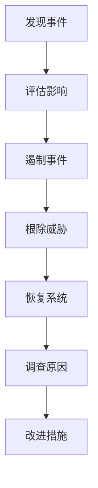

# 8.3 系统安全

> [!abstract] 核心问题
> 操作系统面临哪些安全威胁？如何保护操作系统安全？

## 一、系统安全概述

### 1. 系统安全定义

**系统安全（System Security）**是保护计算机系统免受攻击和滥用。

### 2. 系统安全目标

| 目标 | 说明 |
|-----|------|
| **系统完整性** | 保证系统不被篡改 |
| **数据保密性** | 保护系统中的数据 |
| **系统可用性** | 保证系统正常运行 |
| **用户认证** | 验证用户身份 |
| **访问控制** | 控制用户访问权限 |

## 二、操作系统安全

### 1. 操作系统安全威胁

| 威胁类型 | 说明 |
|---------|------|
| **恶意软件** | 病毒、蠕虫、木马 |
| **漏洞利用** | 利用系统漏洞攻击 |
| **权限提升** | 获取更高权限 |
| **拒绝服务** | 使系统无法正常服务 |
| **数据泄露** | 泄露系统中的数据 |

### 2. 操作系统安全机制

| 机制 | 说明 |
|-----|------|
| **用户账户管理** | 创建和管理用户账户 |
| **权限管理** | 设置用户访问权限 |
| **访问控制列表** | 细粒度的访问控制 |
| **审计日志** | 记录系统活动 |
| **安全策略** | 制定安全规则 |

### 3. Windows安全

| 安全特性 | 说明 |
|---------|------|
| **用户账户控制（UAC）** | 提示权限提升 |
| **Windows Defender** | 内置杀毒软件 |
| **BitLocker** | 磁盘加密 |
| **防火墙** | 内置防火墙 |

### 4. Linux安全

| 安全特性 | 说明 |
|---------|------|
| **用户管理** | 严格的用户权限 |
| **sudo** | 临时提升权限 |
| **AppArmor/SELinux** | 强制访问控制 |
| **iptables/firewalld** | 防火墙 |

## 三、恶意软件防护

### 1. 恶意软件类型

| 类型 | 说明 |
|-----|------|
| **病毒（Virus）** | 依附于其他程序 |
| **蠕虫（Worm）** | 独立传播 |
| **木马（Trojan）** | 伪装成合法程序 |
| **间谍软件（Spyware）** | 收集用户信息 |
| **勒索软件（Ransomware）** | 加密用户数据勒索 |

### 2. 恶意软件传播途径

| 途径 | 说明 |
|-----|------|
| **电子邮件** | 恶意附件 |
| **网页** | 恶意脚本 |
| **可移动介质** | U盘、移动硬盘 |
| **漏洞利用** | 系统漏洞 |

### 3. 恶意软件防护措施

| 措施 | 说明 |
|-----|------|
| **安装杀毒软件** | 实时监控和查杀 |
| **及时更新系统** | 修补安全漏洞 |
| **不打开可疑附件** | 谨慎处理邮件附件 |
| **使用防火墙** | 阻止恶意网络连接 |
| **定期备份数据** | 防止数据丢失 |

### 4. 杀毒软件工作原理

| 步骤 | 说明 |
|-----|------|
| **特征码检测** | 比对已知病毒特征 |
| **启发式检测** | 检测可疑行为 |
| **行为监控** | 监控程序行为 |
| **沙箱分析** | 在隔离环境中分析 |

## 四、访问控制

### 1. 访问控制定义

**访问控制（Access Control）**是控制用户对系统资源的访问。

### 2. 访问控制模型

| 模型 | 说明 |
|-----|------|
| **自主访问控制（DAC）** | 用户自主控制访问权限 |
| **强制访问控制（MAC）** | 系统强制控制访问权限 |
| **基于角色的访问控制（RBAC）** | 根据角色分配权限 |

### 3. 访问控制实现

| 方法 | 说明 |
|-----|------|
| **用户认证** | 验证用户身份 |
| **权限分配** | 分配访问权限 |
| **访问日志** | 记录访问行为 |
| **权限审查** | 定期审查权限 |

### 4. 最小权限原则

**最小权限原则**：用户只获得完成任务所需的最小权限。

| 优点 | 说明 |
|-----|------|
| **减少风险** | 即使账户泄露，损失也有限 |
| **防止滥用** | 限制权限滥用 |
| **便于审计** | 权限清晰，便于审计 |

## 五、数据安全

### 1. 数据分类

| 类别 | 说明 |
|-----|------|
| **公开数据** | 可以公开的数据 |
| **内部数据** | 内部使用的数据 |
| **敏感数据** | 需要保护的数据 |
| **机密数据** | 高度保密的数据 |

### 2. 数据保护措施

| 措施 | 说明 |
|-----|------|
| **数据加密** | 加密存储的数据 |
| **访问控制** | 控制数据访问 |
| **数据备份** | 定期备份数据 |
| **数据脱敏** | 对敏感数据脱敏处理 |

### 3. 数据备份策略

| 策略 | 说明 |
|-----|------|
| **完全备份** | 备份所有数据 |
| **增量备份** | 备份变化的数据 |
| **差异备份** | 备份上次完全备份后变化的数据 |
| **3-2-1策略** | 3份数据、2种介质、1份异地 |

### 4. 数据恢复

| 步骤 | 说明 |
|-----|------|
| **确定恢复范围** | 确定需要恢复的数据 |
| **选择备份** | 选择合适的备份 |
| **执行恢复** | 执行恢复操作 |
| **验证恢复** | 验证恢复结果 |

## 六、安全审计

### 1. 安全审计定义

**安全审计（Security Audit）**是审查系统安全状态的过程。

### 2. 安全审计内容

| 内容 | 说明 |
|-----|------|
| **账户审计** | 审查用户账户 |
| **权限审计** | 审查权限分配 |
| **日志审计** | 审查系统日志 |
| **漏洞扫描** | 扫描系统漏洞 |

### 3. 安全审计工具

| 工具 | 说明 |
|-----|------|
| **日志分析工具** | 分析系统日志 |
| **漏洞扫描工具** | 扫描安全漏洞 |
| **合规检查工具** | 检查合规性 |

### 4. 安全审计流程

| 步骤 | 说明 |
|-----|------|
| **计划** | 制定审计计划 |
| **执行** | 执行审计 |
| **分析** | 分析审计结果 |
| **报告** | 生成审计报告 |
| **整改** | 整改发现的问题 |

## 七、应急响应

### 1. 应急响应定义

**应急响应（Incident Response）**是处理安全事件的过程。

### 2. 应急响应流程

### 3. 应急响应团队

| 角色 | 职责 |
|-----|------|
| **安全分析师** | 分析安全事件 |
| **系统管理员** | 管理系统 |
| **网络管理员** | 管理网络 |
| **法务人员** | 处理法律问题 |
| **公关人员** | 处理公众沟通 |

### 4. 应急响应计划

| 要素 | 说明 |
|-----|------|
| **团队组成** | 明确团队成员 |
| **流程定义** | 定义响应流程 |
| **联系方式** | 明确联系方式 |
| **演练计划** | 定期演练 |

## 八、易错点提示

> [!warning] 常见误区
> - **"操作系统默认是安全的"**：操作系统需要配置和加固。
> - **"杀毒软件可以防所有恶意软件"**：杀毒软件不能防未知恶意软件。
> - **"备份越多越好"**：备份需要合理策略，不是越多越好。
> - **"安全审计只是走过场"**：安全审计是发现问题的重要手段。

## 九、示例与练习

### 示例

**例1**：制定企业系统安全策略

**解析**：
- **用户管理**：定期审查用户账户，删除无用账户
- **权限管理**：基于角色分配权限，遵循最小权限原则
- **恶意软件防护**：安装统一的杀毒软件，及时更新
- **数据备份**：实施3-2-1备份策略
- **安全审计**：定期进行安全审计
- **应急响应**：制定应急响应计划，定期演练

### 练习题

1. 操作系统面临哪些安全威胁？如何保护操作系统安全？
2. 恶意软件有哪些类型？如何防护恶意软件？
3. 访问控制的模型有哪些？各模型的特点是什么？
4. 数据备份策略有哪些？如何实施数据备份？

**导航**：上一节 [[8.2 密码学基础]] · [[MOC - 大学计算机基础A|返回课程地图]] · 下一节 [[8.4 网络安全]]