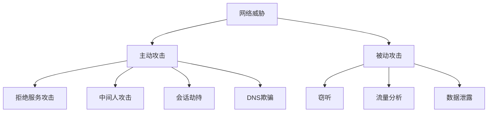
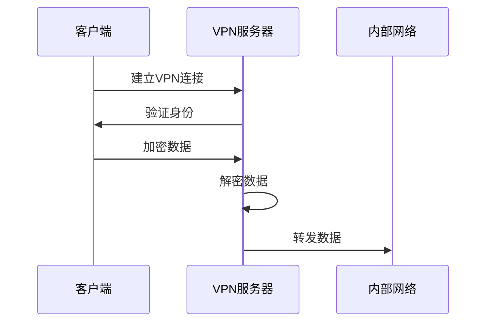
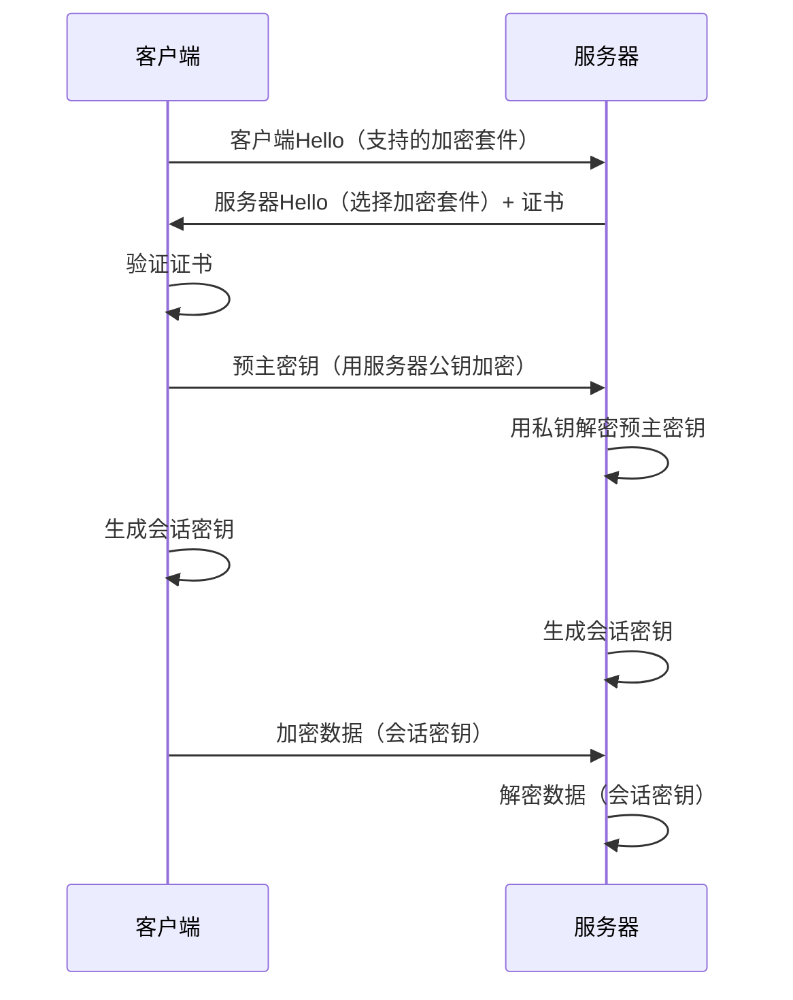

# 8.4 网络安全

> [!abstract] 核心问题
> 网络面临哪些安全威胁？如何保护网络安全？

## 一、网络安全概述

### 1. 网络安全定义

**网络安全（Network Security）**是保护网络系统中的数据和资源免受攻击。

### 2. 网络安全目标

| 目标 | 说明 |
|-----|------|
| **网络完整性** | 保证网络不被篡改 |
| **数据保密性** | 保护传输中的数据 |
| **网络可用性** | 保证网络正常运行 |
| **身份认证** | 验证网络用户身份 |
| **访问控制** | 控制网络访问权限 |

## 二、网络安全威胁

### 1. 威胁分类

### 2. 常见网络攻击

| 攻击类型 | 说明 |
|---------|------|
| **拒绝服务攻击（DoS/DDoS）** | 使系统无法正常服务 |
| **中间人攻击（MITM）** | 拦截和篡改通信 |
| **SQL注入** | 通过SQL语句注入攻击 |
| **跨站脚本（XSS）** | 在网页中注入脚本 |
| **跨站请求伪造（CSRF）** | 伪造用户请求 |
| **DNS欺骗** | 篡改DNS解析结果 |
| **ARP欺骗** | 篡改ARP缓存 |

### 3. 攻击向量

| 向量 | 说明 |
|-----|------|
| **网络钓鱼** | 欺骗用户泄露信息 |
| **恶意网站** | 包含恶意代码的网站 |
| **漏洞利用** | 利用软件漏洞攻击 |
| **社会工程** | 通过欺骗获取信息 |

## 三、防火墙

### 1. 防火墙定义

**防火墙（Firewall）**是网络安全的第一道防线，过滤网络流量。

### 2. 防火墙类型

| 类型 | 说明 |
|-----|------|
| **网络防火墙** | 保护整个网络 |
| **主机防火墙** | 保护单台计算机 |
| **软件防火墙** | 软件实现 |
| **硬件防火墙** | 专用硬件 |

### 3. 防火墙工作原理

| 机制 | 说明 |
|-----|------|
| **包过滤** | 根据规则过滤数据包 |
| **状态检测** | 跟踪连接状态 |
| **应用代理** | 代理应用层连接 |

### 4. 防火墙规则

| 规则类型 | 说明 |
|---------|------|
| **允许** | 允许特定流量通过 |
| **拒绝** | 拒绝特定流量 |
| **日志** | 记录特定流量 |

### 5. 防火墙配置原则

| 原则 | 说明 |
|-----|------|
| **默认拒绝** | 默认拒绝所有流量 |
| **最小权限** | 只允许必要的流量 |
| **明确规则** | 规则清晰明确 |
| **定期审查** | 定期审查规则 |

## 四、入侵检测与防御

### 1. IDS与IPS

| 类型 | 说明 |
|-----|------|
| **IDS（入侵检测系统）** | 检测入侵行为，发出警报 |
| **IPS（入侵防御系统）** | 检测并阻止入侵行为 |

### 2. IDS工作原理

| 方法 | 说明 |
|-----|------|
| **签名检测** | 比对已知攻击特征 |
| **异常检测** | 检测异常行为 |
| **启发式检测** | 检测可疑模式 |

### 3. IDS部署方式

| 方式 | 说明 |
|-----|------|
| **网络IDS** | 监控网络流量 |
| **主机IDS** | 监控主机活动 |

### 4. IPS工作原理

| 步骤 | 说明 |
|-----|------|
| **检测** | 检测入侵行为 |
| **分析** | 分析攻击类型 |
| **响应** | 采取响应措施 |
| **阻断** | 阻断攻击流量 |

## 五、虚拟专用网络

### 1. VPN定义

**VPN（Virtual Private Network）**是在公共网络上建立的加密连接。

### 2. VPN类型

| 类型 | 说明 |
|-----|------|
| **远程访问VPN** | 远程用户访问内部网络 |
| **站点到站点VPN** | 连接两个站点 |

### 3. VPN协议

| 协议 | 说明 |
|-----|------|
| **IPsec** | 安全的IP协议 |
| **SSL/TLS** | 安全套接层 |
| **OpenVPN** | 开源VPN协议 |

### 4. VPN工作原理

### 5. VPN应用场景

| 场景 | 说明 |
|-----|------|
| **远程办公** | 员工远程访问公司网络 |
| **安全浏览** | 加密网络流量 |
| **绕过限制** | 访问受限内容 |

## 六、安全协议

### 1. 网络层安全协议

| 协议 | 说明 |
|-----|------|
| **IPsec** | 安全的IP协议 |
| **VPN** | 虚拟专用网络 |

### 2. 传输层安全协议

| 协议 | 说明 |
|-----|------|
| **SSL/TLS** | 安全套接层 |
| **SSH** | 安全外壳协议 |

### 3. 应用层安全协议

| 协议 | 说明 |
|-----|------|
| **HTTPS** | 安全的HTTP |
| **SFTP** | 安全的FTP |
| **SMTPS** | 安全的SMTP |

### 4. TLS工作原理

## 七、无线网络安全

### 1. 无线网络威胁

| 威胁 | 说明 |
|-----|------|
| **窃听** | 监听无线通信 |
| **中间人攻击** | 拦截和篡改通信 |
| **邪恶孪生** | 伪造合法WiFi |
| **WEP/WPA破解** | 破解加密 |

### 2. 无线网络安全标准

| 标准 | 说明 |
|-----|------|
| **WEP** | 有线等效保密，已不安全 |
| **WPA** | WiFi保护访问，已不安全 |
| **WPA2** | WiFi保护访问2，主流 |
| **WPA3** | WiFi保护访问3，最新 |

### 3. 无线网络安全措施

| 措施 | 说明 |
|-----|------|
| **使用WPA3** | 使用最新的安全标准 |
| **隐藏SSID** | 隐藏WiFi名称 |
| **使用强密码** | 使用复杂密码 |
| **启用MAC过滤** | 限制连接的设备 |

## 八、Web安全

### 1. Web安全威胁

| 威胁 | 说明 |
|-----|------|
| **SQL注入** | 通过SQL语句注入攻击 |
| **跨站脚本（XSS）** | 在网页中注入脚本 |
| **跨站请求伪造（CSRF）** | 伪造用户请求 |
| **文件上传漏洞** | 上传恶意文件 |
| **目录遍历** | 访问未授权目录 |

### 2. Web安全防护

| 措施 | 说明 |
|-----|------|
| **输入验证** | 验证用户输入 |
| **参数化查询** | 使用参数化SQL查询 |
| **输出编码** | 对输出进行编码 |
| **CSRF令牌** | 使用CSRF令牌 |
| **文件类型检查** | 检查上传文件类型 |

### 3. HTTPS

**HTTPS**是安全的HTTP协议：

| 作用 | 说明 |
|-----|------|
| **数据加密** | 加密传输数据 |
| **身份验证** | 验证服务器身份 |
| **完整性** | 防止数据篡改 |

## 九、网络安全最佳实践

### 1. 网络安全策略

| 策略 | 说明 |
|-----|------|
| **网络分段** | 将网络分成多个段 |
| **访问控制** | 控制网络访问 |
| **日志监控** | 监控网络日志 |
| **定期审计** | 定期安全审计 |

### 2. 网络安全工具

| 工具 | 说明 |
|-----|------|
| **防火墙** | 过滤网络流量 |
| **IDS/IPS** | 检测和阻止入侵 |
| **VPN** | 加密网络连接 |
| **安全扫描器** | 扫描安全漏洞 |

### 3. 网络安全培训

| 内容 | 说明 |
|-----|------|
| **安全意识** | 提高安全意识 |
| **安全操作** | 安全操作规范 |
| **应急响应** | 应急响应流程 |

## 十、易错点提示

> [!warning] 常见误区
> - **"防火墙可以防所有攻击"**：防火墙无法防内部攻击和社会工程。
> - **"VPN一定安全"**：VPN需要正确配置和管理。
> - **"HTTPS网站一定安全"**：HTTPS只保证传输安全，网站内容可能不安全。
> - **"无线网络不安全"**：使用WPA3和强密码可以保证安全。

## 十一、示例与练习

### 示例

**例1**：分析企业网络安全架构

**解析**：
- **边界防护**：部署防火墙和IDS/IPS
- **网络分段**：将网络分成内部网络和DMZ
- **VPN**：为远程员工提供VPN访问
- **安全监控**：实时监控网络流量
- **定期审计**：定期进行安全审计

### 练习题

1. 网络安全威胁有哪些类型？各类型的特点是什么？
2. 防火墙的工作原理是什么？如何配置防火墙规则？
3. IDS和IPS有什么区别？各有什么作用？
4. VPN的工作原理是什么？VPN应用场景有哪些？

**导航**：上一节 [[8.3 系统安全]] · [[MOC - 大学计算机基础A|返回课程地图]]