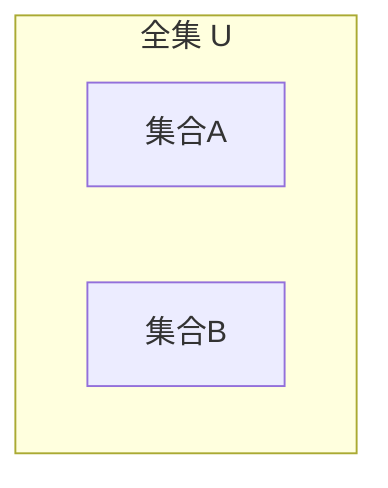

# 3.1 集合的基本概念

> [!abstract] 核心问题
> 什么是集合？如何表示集合？

## 一、集合的定义

### 1. 集合概念

**集合（Set）**是由确定的、互不相同的对象组成的整体。

| 要素 | 说明 |
|-----|------|
| **元素** | 组成集合的对象 |
| **确定性** | 任给对象，能确定是否属于该集合 |
| **互异性** | 集合中元素互不相同 |
| **无序性** | 集合中元素顺序无关 |

### 2. 常用符号

| 符号 | 含义 |
|-----|------|
| $a \in A$ | $a$ 是 $A$ 的元素 |
| $a \notin A$ | $a$ 不是 $A$ 的元素 |
| $\emptyset$ | 空集 |
| $\mathbb{N}$ | 自然数集 |
| $\mathbb{Z}$ | 整数集 |
| $\mathbb{Q}$ | 有理数集 |
| $\mathbb{R}$ | 实数集 |

### 3. 集合示例

| 集合 | 说明 |
|-----|------|
| $\{1, 2, 3\}$ | 包含1、2、3的集合 |
| $\{x \mid x \text{是偶数}\}$ | 所有偶数的集合 |
| $\emptyset$ | 空集 |

## 二、集合的表示方法

### 1. 列举法

将集合中的元素一一列出。

```
A = {1, 2, 3, 4, 5}
B = {a, b, c}
```

### 2. 描述法

用谓词描述元素的性质。

```
A = {x | x ∈ ℕ ∧ x ≤ 5}
B = {x | x² - 4 = 0}
```

### 3. 文氏图

用图形表示集合关系。



## 三、集合的关系

### 1. 子集

**子集（Subset）**：如果 $A$ 的所有元素都是 $B$ 的元素，则 $A \subseteq B$。

```
A ⊆ B ⇔ ∀x (x ∈ A → x ∈ B)
```

### 2. 真子集

**真子集（Proper Subset）**：$A \subset B$ 当且仅当 $A \subseteq B$ 且 $A \neq B$。

### 3. 相等

**相等（Equal）**：$A = B$ 当且仅当 $A \subseteq B$ 且 $B \subseteq A$。

### 4. 子集关系性质

| 性质 | 说明 |
|-----|------|
| **自反性** | $A \subseteq A$ |
| **传递性** | $A \subseteq B \land B \subseteq C \Rightarrow A \subseteq C$ |
| **反对称性** | $A \subseteq B \land B \subseteq A \Rightarrow A = B$ |

## 四、幂集

### 1. 幂集定义

**幂集（Power Set）**：集合 $A$ 的所有子集组成的集合，记为 $\mathcal{P}(A)$。

### 2. 幂集示例

**例1**：设 $A = \{1, 2\}$，则 $\mathcal{P}(A) = \{\emptyset, \{1\}, \{2\}, \{1, 2\}\}$

### 3. 幂集大小

若 $|A| = n$，则 $|\mathcal{P}(A)| = 2^n$。

## 五、常见集合

### 1. 有限集与无限集

| 类型 | 说明 | 示例 |
|-----|------|-----|
| **有限集** | 元素个数有限 | $\{1, 2, 3\}$ |
| **无限集** | 元素个数无限 | $\mathbb{N}$ |

### 2. 空集

```
∅ = {}
```

### 3. 全集

**全集（Universal Set）**：包含所有考虑对象的集合，记为 $U$。

## 六、易错点提示

> [!warning] 常见误区
> - **"空集不是任何集合的子集"**：$\emptyset \subseteq A$ 对任何集合 $A$ 成立。
> - **"子集和元素混淆"**：$a \in A$ 和 $\{a\} \subseteq A$ 是不同的概念。
> - **"幂集计算错误"**：幂集包含空集和全集本身。

## 七、示例与练习

### 示例

**例1**：设 $A = \{1, \{2, 3\}, 4\}$，判断下列命题的真假：

1. $1 \in A$ —— 真
2. $\{2, 3\} \in A$ —— 真
3. $\{1\} \subseteq A$ —— 真
4. $2 \in A$ —— 假（2不是A的元素，{2,3}才是）

### 练习题

1. 写出集合 $\{a, b, c\}$ 的幂集
2. 判断 $\emptyset \subseteq \emptyset$ 是否成立
3. 证明：若 $A \subseteq B$ 且 $B \subseteq C$，则 $A \subseteq C$

**导航**：[[MOC - 离散数学|返回课程地图]] · 下一节 [[3.2 集合运算]]