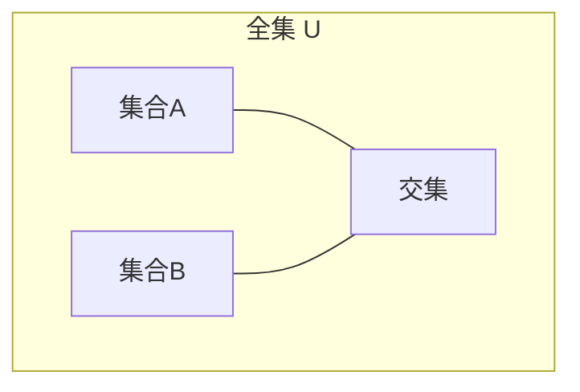
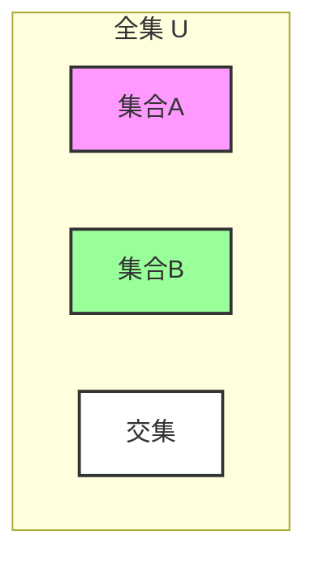

# 3.2 集合运算

> [!abstract] 核心问题
> 集合有哪些基本运算？如何计算集合的大小？

## 一、基本集合运算

### 1. 并集

**并集（Union）**：$A \cup B = \{x \mid x \in A \lor x \in B\}$



### 2. 交集

**交集（Intersection）**：$A \cap B = \{x \mid x \in A \land x \in B\}$

### 3. 差集

**差集（Difference）**：$A - B = \{x \mid x \in A \land x \notin B\}$

### 4. 补集

**补集（Complement）**：$\overline{A} = U - A = \{x \mid x \notin A\}$

### 5. 对称差

**对称差（Symmetric Difference）**：$A \oplus B = (A - B) \cup (B - A)$

## 二、运算性质

### 1. 交换律

```
A ∪ B = B ∪ A
A ∩ B = B ∩ A
A ⊕ B = B ⊕ A
```

### 2. 结合律

```
(A ∪ B) ∪ C = A ∪ (B ∪ C)
(A ∩ B) ∩ C = A ∩ (B ∩ C)
(A ⊕ B) ⊕ C = A ⊕ (B ⊕ C)
```

### 3. 分配律

```
A ∪ (B ∩ C) = (A ∪ B) ∩ (A ∪ C)
A ∩ (B ∪ C) = (A ∩ B) ∪ (A ∩ C)
```

### 4. 德摩根律

```
$\overline{A \cup B} = \overline{A} \cap \overline{B}$
$\overline{A \cap B} = \overline{A} \cup \overline{B}$
```

### 5. 吸收律

```
A ∪ (A ∩ B) = A
A ∩ (A ∪ B) = A
```

## 三、文氏图表示

### 示例：$(A - B) \cup (B - A)$



## 四、集合的笛卡尔积

### 1. 有序对

**有序对（Ordered Pair）**：$(a, b)$

### 2. 笛卡尔积

**笛卡尔积（Cartesian Product）**：$A \times B = \{(a, b) \mid a \in A \land b \in B\}$

### 3. 笛卡尔积性质

| 性质 | 说明 |
|-----|------|
| **非交换性** | $A \times B \neq B \times A$（一般情况） |
| **分配律** | $A \times (B \cup C) = (A \times B) \cup (A \times C)$ |
| **大小** | $|A \times B| = |A| \times |B|$ |

### 示例

**例1**：设 $A = \{1, 2\}$，$B = \{a, b\}$，则

```
A × B = {(1, a), (1, b), (2, a), (2, b)}
B × A = {(a, 1), (a, 2), (b, 1), (b, 2)}
```

## 五、集合运算示例

### 示例1

**已知**：$A = \{1, 2, 3, 4\}$，$B = \{3, 4, 5, 6\}$，求 $A \cup B$，$A \cap B$，$A - B$

**解**：

```
A ∪ B = {1, 2, 3, 4, 5, 6}
A ∩ B = {3, 4}
A - B = {1, 2}
```

### 示例2

**证明**：$A - (B \cup C) = (A - B) \cap (A - C)$

**证明**：

```
A - (B ∪ C) = {x | x ∈ A ∧ x ∉ (B ∪ C)}
            = {x | x ∈ A ∧ x ∉ B ∧ x ∉ C}
            = {x | (x ∈ A ∧ x ∉ B) ∧ (x ∈ A ∧ x ∉ C)}
            = (A - B) ∩ (A - C)
```

## 六、易错点提示

> [!warning] 常见误区
> - **"差集是交换的"**：$A - B \neq B - A$
> - **"笛卡尔积是交换的"**：$A \times B \neq B \times A$
> - **"德摩根律记错"**：并集的补集是补集的交集。

## 七、示例与练习

### 练习题

1. 已知 $A = \{a, b, c\}$，$B = \{b, c, d\}$，求 $A \oplus B$
2. 证明 $A \cup (B \cap C) = (A \cup B) \cap (A \cup C)$
3. 设 $|A| = 3$，$|B| = 4$，求 $|A \times B|$ 和 $|\mathcal{P}(A \times B)|$

**导航**：上一节 [[3.1 集合的基本概念]] · [[MOC - 离散数学|返回课程地图]] · 下一节 [[3.3 集合恒等式]]