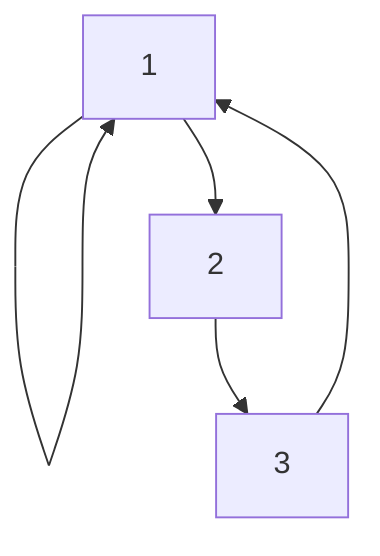

# 4.1 二元关系

> [!abstract] 核心问题
> 什么是二元关系？关系有哪些基本性质？

## 一、关系的定义

### 1. 二元关系概念

**二元关系（Binary Relation）**：从集合 $A$ 到集合 $B$ 的关系是笛卡尔积 $A \times B$ 的子集。

```
R ⊆ A × B
```

### 2. 关系的表示

| 表示方法 | 说明 | 示例 |
|---------|------|-----|
| **集合表示** | 列出有序对 | $\{(1, a), (2, b)\}$ |
| **关系矩阵** | 用矩阵表示 | $\begin{bmatrix}1 & 0 \\ 0 & 1\end{bmatrix}$ |
| **关系图** | 用图形表示 | 有向图 |

### 3. 特殊关系

| 关系 | 定义 |
|-----|------|
| **空关系** | $R = \emptyset$ |
| **全关系** | $R = A \times B$ |
| **恒等关系** | $I_A = \{(x, x) \mid x \in A\}$ |

## 二、关系的性质

### 1. 自反性

**自反（Reflexive）**：$\forall x \in A, (x, x) \in R$

### 2. 反自反性

**反自反（Irreflexive）**：$\forall x \in A, (x, x) \notin R$

### 3. 对称性

**对称（Symmetric）**：$\forall x, y \in A, (x, y) \in R \Rightarrow (y, x) \in R$

### 4. 反对称性

**反对称（Antisymmetric）**：$\forall x, y \in A, (x, y) \in R \land (y, x) \in R \Rightarrow x = y$

### 5. 传递性

**传递（Transitive）**：$\forall x, y, z \in A, (x, y) \in R \land (y, z) \in R \Rightarrow (x, z) \in R$

### 6. 性质对比表

| 性质 | 关系矩阵特征 | 关系图特征 |
|-----|------------|-----------|
| **自反** | 对角线全为1 | 每个顶点有自环 |
| **反自反** | 对角线全为0 | 每个顶点无自环 |
| **对称** | 矩阵对称 | 有向边成对出现 |
| **反对称** | 若 $a_{ij}=1$ 且 $i \neq j$，则 $a_{ji}=0$ | 若有 $i \to j$ 则无 $j \to i$ |
| **传递** | 若 $a_{ij}=1$ 且 $a_{jk}=1$，则 $a_{ik}=1$ | 若有 $i \to j$ 和 $j \to k$，则有 $i \to k$ |

## 三、关系的表示方法

### 1. 关系矩阵

**定义**：设 $A = \{a_1, a_2, \dots, a_n\}$，$B = \{b_1, b_2, \dots, b_m\}$，则 $R$ 的关系矩阵 $M_R$ 为 $n \times m$ 矩阵，其中：

```
M_R[i][j] = 1 当且仅当 (a_i, b_j) ∈ R
M_R[i][j] = 0 当且仅当 (a_i, b_j) ∉ R
```

### 示例

**例1**：设 $A = \{1, 2, 3\}$，$R = \{(1, 1), (1, 2), (2, 3), (3, 1)\}$，则

```
M_R = 
[1 1 0]
[0 0 1]
[1 0 0]
```

### 2. 关系图

**定义**：用顶点表示集合元素，用有向边表示关系中的有序对。

### 示例

**例2**：设 $A = \{1, 2, 3\}$，$R = \{(1, 1), (1, 2), (2, 3), (3, 1)\}$，则关系图为：



## 四、关系的运算

### 1. 关系的并、交、差、补

```
R ∪ S = {(x, y) | (x, y) ∈ R ∨ (x, y) ∈ S}
R ∩ S = {(x, y) | (x, y) ∈ R ∧ (x, y) ∈ S}
R - S = {(x, y) | (x, y) ∈ R ∧ (x, y) ∉ S}
\overline{R} = A × B - R
```

### 2. 关系的复合

**复合（Composition）**：$R \circ S = \{(x, z) | \exists y, (x, y) \in R \land (y, z) \in S\}$

### 示例

**例3**：设 $R = \{(1, 2), (2, 3)\}$，$S = \{(2, 4), (3, 5)\}$，则

```
R ∘ S = {(1, 4), (2, 5)}
```

### 3. 关系的逆

**逆（Inverse）**：$R^{-1} = \{(y, x) | (x, y) \in R\}$

### 示例

**例4**：设 $R = \{(1, 2), (2, 3)\}$，则

```
R^{-1} = {(2, 1), (3, 2)}
```

## 五、易错点提示

> [!warning] 常见误区
> - **"自反和反自反对立"**：存在既不自反也不反自反的关系。
> - **"对称和反对称对立"**：存在既对称又反对称的关系（如恒等关系）。
> - **"复合关系顺序搞反"**：$R \circ S$ 是先R后S，不是先S后R。

## 六、示例与练习

### 练习题

1. 设 $A = \{a, b, c\}$，$R = \{(a, a), (a, b), (b, c), (c, a)\}$，判断 $R$ 的性质
2. 设 $R = \{(1, 2), (2, 3), (3, 4)\}$，$S = \{(2, 1), (3, 2), (4, 3)\}$，求 $R \circ S$ 和 $S \circ R$
3. 设 $R$ 是对称关系，证明 $R^{-1}$ 也是对称关系

**导航**：[[MOC - 离散数学|返回课程地图]] · 下一节 [[4.2 关系的运算]]