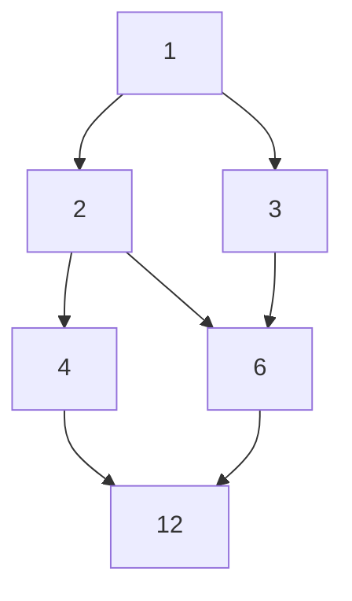

# 4.4 偏序关系

> [!abstract] 核心问题
> 什么是偏序关系？如何用哈斯图表示偏序关系？

## 一、偏序关系定义

### 1. 偏序关系概念

**偏序关系（Partial Order Relation）**：满足自反性、反对称性和传递性的关系。

### 2. 偏序集

**偏序集（Poset）**：集合 $A$ 和偏序关系 $R$ 组成的有序对 $(A, R)$。

### 3. 偏序关系示例

| 关系 | 是否偏序关系 | 理由 |
|-----|------------|------|
| "小于等于" | 是 | 自反、反对称、传递 |
| "整除" | 是 | 自反、反对称、传递 |
| "包含" | 是 | 自反、反对称、传递 |
| "大于" | 否 | 不自反 |

### 示例

**例1**：设 $A = \{1, 2, 3, 4\}$，$R = \{(x, y) | x$ 整除 $y\}$，判断是否为偏序关系。

**解**：

- **自反性**：$x$ 整除 $x$，成立
- **反对称性**：$x$ 整除 $y$ 且 $y$ 整除 $x \Rightarrow x = y$，成立
- **传递性**：$x$ 整除 $y$ 且 $y$ 整除 $z \Rightarrow x$ 整除 $z$，成立

因此，$R$ 是偏序关系。

## 二、可比与不可比

### 1. 可比定义

**可比（Comparable）**：设 $(A, \preceq)$ 是偏序集，$x, y \in A$，如果 $x \preceq y$ 或 $y \preceq x$，则称 $x$ 和 $y$ 可比。

### 2. 不可比定义

**不可比（Incomparable）**：如果 $x$ 和 $y$ 不可比，则记作 $x \parallel y$。

### 示例

**例2**：设 $A = \{1, 2, 3, 4\}$，偏序关系为整除关系，则：

- 1和2可比（1整除2）
- 2和3不可比（2不整除3，3不整除2）
- 2和4可比（2整除4）

## 三、全序关系

### 1. 全序关系定义

**全序关系（Total Order）**：偏序关系中任意两个元素都可比。

### 示例

**例3**：$(ℤ, ≤)$ 是全序集，因为任意两个整数都可比。

**例4**：$(\{1, 2, 3, 4\}, 整除)$ 不是全序集，因为2和3不可比。

## 四、哈斯图

### 1. 哈斯图定义

**哈斯图（Hasse Diagram）**：用图形表示偏序关系，省略自环和传递边。

### 2. 哈斯图画法

| 步骤 | 说明 |
|-----|------|
| 1 | 顶点表示集合元素 |
| 2 | 如果 $x \preceq y$ 且不存在 $z$ 使得 $x \preceq z \preceq y$，则画一条从 $x$ 到 $y$ 的边 |
| 3 | 边的方向从下往上 |

### 示例

**例5**：设 $A = \{1, 2, 3, 4, 6, 12\}$，偏序关系为整除关系，画出哈斯图。



### 例6**：设 $A = \{a, b, c\}$，偏序关系为子集包含关系，画出哈斯图。

```mermaid
graph TD
    {} --> {a}
    {} --> {b}
    {} --> {c}
    {a} --> {a,b}
    {a} --> {a,c}
    {b} --> {a,b}
    {b} --> {b,c}
    {c} --> {a,c}
    {c} --> {b,c}
    {a,b} --> {a,b,c}
    {a,c} --> {a,b,c}
    {b,c} --> {a,b,c}
```

## 五、偏序集中的特殊元素

### 1. 极大元与极小元

| 类型 | 定义 |
|-----|------|
| **极大元** | 不存在 $y \in A$ 使得 $x \preceq y$ 且 $x \neq y$ |
| **极小元** | 不存在 $y \in A$ 使得 $y \preceq x$ 且 $x \neq y$ |

### 2. 最大元与最小元

| 类型 | 定义 |
|-----|------|
| **最大元** | $\forall y \in A, y \preceq x$ |
| **最小元** | $\forall y \in A, x \preceq y$ |

### 3. 上界与下界

| 类型 | 定义 |
|-----|------|
| **上界** | $\forall y \in B, y \preceq x$（$B \subseteq A$） |
| **下界** | $\forall y \in B, x \preceq y$（$B \subseteq A$） |

### 4. 最小上界与最大下界

| 类型 | 定义 |
|-----|------|
| **最小上界** | 所有上界中的最小元 |
| **最大下界** | 所有下界中的最大元 |

### 示例

**例7**：设 $A = \{1, 2, 3, 4, 6, 12\}$，偏序关系为整除关系，$B = \{2, 3\}$，求：

- **极大元**：12
- **极小元**：1
- **最大元**：12
- **最小元**：1
- **上界**：6, 12
- **下界**：1
- **最小上界**：6
- **最大下界**：1

## 六、格

### 1. 格的定义

**格（Lattice）**：偏序集中任意两个元素都有最小上界和最大下界。

### 示例

**例8**：$(\mathcal{P}(A), \subseteq)$ 是格，因为任意两个子集的并是最小上界，交是最大下界。

**例9**：$(\{1, 2, 3, 4, 6, 12\}, 整除)$ 是格，因为任意两个元素的最小公倍数是最小上界，最大公约数是最大下界。

## 七、易错点提示

> [!warning] 常见误区
> - **"偏序关系和等价关系混淆"**：偏序关系是反对称的，等价关系是对称的。
> - **"极大元就是最大元"**：极大元不一定是最大元，最大元是唯一的。
> - **"哈斯图中边的方向搞反"**：边的方向从下往上，表示从小到大。

## 八、示例与练习

### 练习题

1. 设 $A = \{1, 2, 3, 4, 6, 8, 12, 24\}$，偏序关系为整除关系，画出哈斯图。
2. 设 $A = \{a, b, c\}$，偏序关系为子集包含关系，求 $\{\{a\}, \{b\}\}$ 的最小上界和最大下界。
3. 判断 $(\{1, 2, 3, 4\}, 整除)$ 是否为格。

**导航**：上一节 [[4.3 等价关系与划分]] · [[MOC - 离散数学|返回课程地图]] · 下一节 [[4.5 函数]]