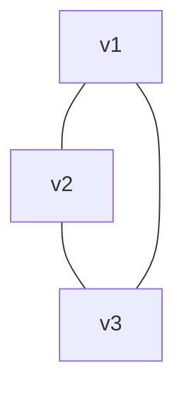
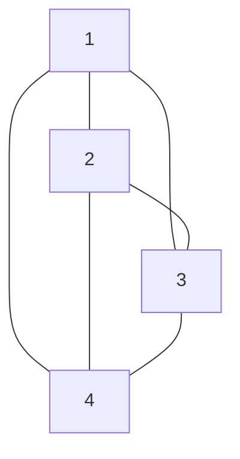
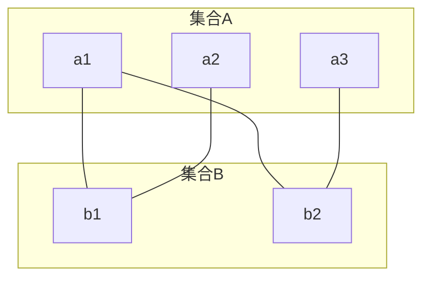

# 5.1 图的基本概念

> [!abstract] 核心问题
> 什么是图？图有哪些类型？

## 一、图的定义

### 1. 图的概念

**图（Graph）**：由顶点集合 $V$ 和边集合 $E$ 组成的有序对 $G = (V, E)$。

### 2. 图的表示

| 表示方法 | 说明 | 示例 |
|---------|------|-----|
| **集合表示** | $G = (\{v_1, v_2, v_3\}, \{\{v_1, v_2\}, \{v_2, v_3\}\})$ | - |
| **图形表示** | 用顶点和边的图形 | 见下图 |
| **邻接矩阵** | 用矩阵表示顶点间关系 | $\begin{bmatrix}0 & 1 \\ 1 & 0\end{bmatrix}$ |
| **邻接表** | 用链表表示顶点邻接关系 | 见下文 |

### 示例

**例1**：简单图的图形表示



## 二、图的类型

### 1. 无向图与有向图

| 类型 | 定义 | 示例 |
|-----|------|-----|
| **无向图** | 边没有方向 | $e = \{u, v\}$ |
| **有向图** | 边有方向 | $e = (u, v)$ |

### 2. 简单图与多重图

| 类型 | 定义 | 示例 |
|-----|------|-----|
| **简单图** | 无环、无重边 | 标准图 |
| **多重图** | 允许重边 | 见下文 |
| **伪图** | 允许环和重边 | 见下文 |

### 3. 完全图

**完全图（Complete Graph）**：任意两个顶点之间都有边相连。

- $n$ 个顶点的无向完全图记为 $K_n$
- $n$ 个顶点的有向完全图有 $n(n-1)$ 条边

### 示例

**例2**：$K_4$（4个顶点的无向完全图）



### 4. 二分图

**二分图（Bipartite Graph）**：顶点可以分成两个不相交的集合，边只在集合间存在。

### 示例

**例3**：二分图



### 5. 正则图

**正则图（Regular Graph）**：每个顶点的度数相同。

- **k-正则图**：每个顶点度数为k

## 三、图的基本术语

### 1. 顶点的度数

**度数（Degree）**：顶点关联的边数。

- 无向图：$deg(v)$
- 有向图：$deg^+(v)$（出度），$deg^-(v)$（入度）

### 2. 握手定理

**握手定理（Handshaking Theorem）**：

```
Σ deg(v) = 2|E|（无向图）
Σ deg^+(v) = Σ deg^-(v) = |E|（有向图）
```

### 示例

**例4**：验证握手定理

```
图有4个顶点，度数分别为2, 2, 3, 3
Σ deg(v) = 2 + 2 + 3 + 3 = 10
|E| = 5
2|E| = 10，符合握手定理
```

### 3. 路径与回路

| 类型 | 定义 |
|-----|------|
| **路径（Path）** | 顶点序列，相邻顶点间有边 |
| **简单路径** | 路径中顶点不重复 |
| **回路（Cycle）** | 起点和终点相同的路径 |
| **简单回路** | 除起点终点外顶点不重复 |

### 4. 连通性

| 类型 | 定义 |
|-----|------|
| **连通图** | 任意两个顶点间有路径 |
| **强连通图** | 有向图中任意两个顶点间双向可达 |
| **弱连通图** | 有向图忽略方向后连通 |

## 四、图的同构

### 1. 同构定义

**同构（Isomorphism）**：两个图的顶点和边存在一一对应关系。

### 2. 同构判定

| 条件 | 说明 |
|-----|------|
| **顶点数相同** | 必要条件 |
| **边数相同** | 必要条件 |
| **度数序列相同** | 必要条件 |
| **存在同构映射** | 充分条件 |

### 示例

**例5**：判断两个图是否同构

```
图1：顶点{a,b,c}，边{{a,b}, {b,c}, {c,a}}
图2：顶点{1,2,3}，边{{1,2}, {2,3}, {3,1}}

存在同构映射：a→1, b→2, c→3，因此同构。
```

## 五、易错点提示

> [!warning] 常见误区
> - **"无向图和有向图混淆"**：无向边是无序对，有向边是有序对。
> - **"度数和边数关系记错"**：无向图度数和是边数的2倍。
> - **"路径和回路混淆"**：回路是起点和终点相同的路径。

## 六、示例与练习

### 练习题

1. 画出 $K_5$（5个顶点的完全图）
2. 验证握手定理：一个图有5个顶点，度数分别为1, 2, 3, 4, 5，是否存在这样的图？
3. 判断两个图是否同构：图1有顶点{a,b,c,d}，边{{a,b}, {b,c}, {c,d}, {d,a}}；图2有顶点{1,2,3,4}，边{{1,2}, {1,3}, {2,4}, {3,4}}。

**导航**：[[MOC - 离散数学|返回课程地图]] · 下一节 [[5.2 图的连通性]]