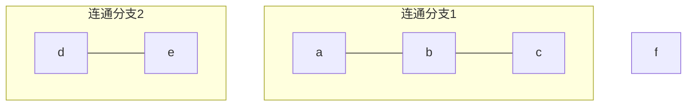
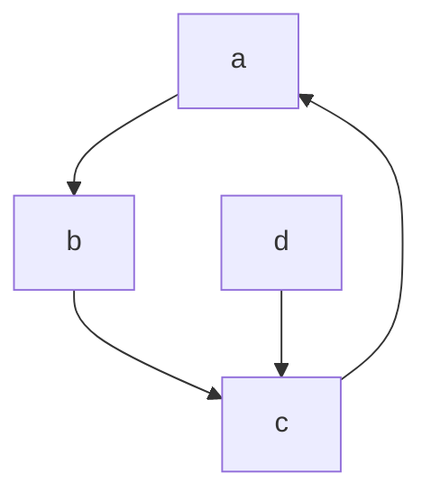
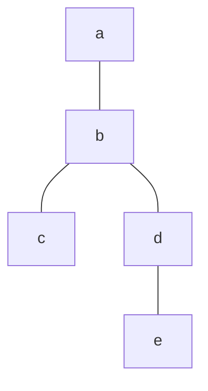

# 5.2 图的连通性

> [!abstract] 核心问题
> 如何判断图的连通性？如何计算最短路径？

## 一、连通性定义

### 1. 无向图的连通性

**连通（Connected）**：无向图中任意两个顶点之间有路径。

**连通分支（Connected Component）**：极大连通子图。

### 示例

**例1**：判断图的连通性



此图有3个连通分支：{a,b,c}、{d,e}、{f}。

### 2. 有向图的连通性

| 类型 | 定义 |
|-----|------|
| **强连通** | 任意两个顶点间双向可达 |
| **单向连通** | 任意两个顶点间至少单向可达 |
| **弱连通** | 忽略方向后连通 |

### 示例

**例2**：判断有向图的连通性



- 强连通分支：{a,b,c}
- {d} 是弱连通但不是强连通

## 二、割点和割边

### 1. 割点

**割点（Cut Vertex）**：删除该顶点后图的连通分支数增加。

### 2. 割边

**割边（Cut Edge / Bridge）**：删除该边后图的连通分支数增加。

### 示例

**例3**：找出图中的割点和割边



- 割点：b, d
- 割边：{b,d}, {d,e}

## 三、图的矩阵表示

### 1. 邻接矩阵

**邻接矩阵（Adjacency Matrix）**：$A = [a_{ij}]$，其中：

```
a_ij = 1 如果顶点i和顶点j之间有边
a_ij = 0 否则
```

### 示例

**例4**：图的邻接矩阵

```
图：顶点{1,2,3}，边{{1,2}, {2,3}, {3,1}}

A = 
[0 1 1]
[1 0 1]
[1 1 0]
```

### 2. 可达矩阵

**可达矩阵（Reachability Matrix）**：$P = [p_{ij}]$，其中：

```
p_ij = 1 如果顶点i到顶点j有路径
p_ij = 0 否则
```

### 计算方法

```
P = A + A² + A³ + ... + Aⁿ
```

### 示例

**例5**：计算可达矩阵

```
A = 
[0 1 0]
[0 0 1]
[1 0 0]

A² = 
[0 0 1]
[1 0 0]
[0 1 0]

A³ = 
[1 0 0]
[0 1 0]
[0 0 1]

P = A + A² + A³ = 
[1 1 1]
[1 1 1]
[1 1 1]
```

## 四、最短路径算法

### 1. BFS算法

**广度优先搜索（BFS）**：用于无权图的最短路径。

### 算法步骤

| 步骤 | 说明 |
|-----|------|
| 1 | 初始化距离数组 |
| 2 | 使用队列进行层次遍历 |
| 3 | 更新相邻顶点的距离 |

### 示例

**例6**：BFS求最短路径

```
图：顶点{1,2,3,4,5}，边{{1,2}, {1,3}, {2,4}, {3,4}, {4,5}}
起点：1

BFS过程：
距离[1] = 0
距离[2] = 1, 距离[3] = 1
距离[4] = 2
距离[5] = 3
```

### 2. Dijkstra算法

**Dijkstra算法**：用于带权图的最短路径（边权非负）。

### 算法步骤

| 步骤 | 说明 |
|-----|------|
| 1 | 初始化距离数组 |
| 2 | 使用优先队列选择距离最小的顶点 |
| 3 | 更新相邻顶点的距离 |

### 示例

**例7**：Dijkstra算法求最短路径

```
图：顶点{1,2,3,4}，边及权重：{1,2}=2, {1,3}=5, {2,3}=1, {2,4}=3, {3,4}=1
起点：1

Dijkstra过程：
距离[1] = 0
选择1：距离[2]=2, 距离[3]=5
选择2：距离[3]=3, 距离[4]=5
选择3：距离[4]=4
选择4：结束

最短路径：1→2→3→4，长度4
```

## 五、连通性应用

### 1. 网络路由

**路由算法**：寻找网络中两点间的最短路径。

### 2. 社交网络

**社区发现**：找出图中的连通分支。

### 3. 电路设计

**电路连通性**：确保电路中各组件连通。

## 六、易错点提示

> [!warning] 常见误区
> - **"强连通和弱连通混淆"**：强连通要求双向可达，弱连通只要求忽略方向后连通。
> - **"割点和割边混淆"**：割点是顶点，割边是边。
> - **"Dijkstra算法适用于负权边"**：Dijkstra算法不适用于负权边，应使用Bellman-Ford算法。

## 七、示例与练习

### 练习题

1. 用BFS算法求图中从顶点1到顶点5的最短路径：顶点{1,2,3,4,5}，边{{1,2}, {1,3}, {2,4}, {3,4}, {4,5}}
2. 用Dijkstra算法求带权图的最短路径：顶点{1,2,3,4}，边及权重：{1,2}=3, {1,3}=1, {2,4}=2, {3,4}=4
3. 找出图中的割点和割边：顶点{1,2,3,4,5}，边{{1,2}, {2,3}, {2,4}, {3,5}, {4,5}}

**导航**：上一节 [[5.1 图的基本概念]] · [[MOC - 离散数学|返回课程地图]] · 下一节 [[5.3 图的矩阵表示]]