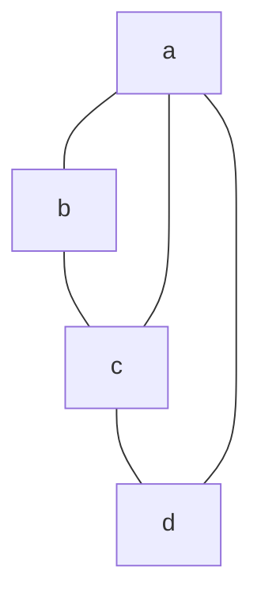
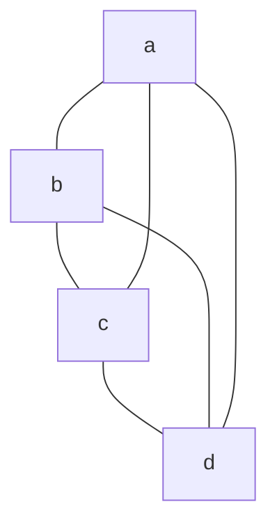

# 5.4 欧拉图与哈密顿图

> [!abstract] 核心问题
> 什么是欧拉图和哈密顿图？如何判定它们？

## 一、欧拉图

### 1. 欧拉路径与欧拉回路

| 类型 | 定义 |
|-----|------|
| **欧拉路径** | 经过每条边恰好一次的路径 |
| **欧拉回路** | 经过每条边恰好一次的回路 |

### 2. 欧拉图判定

**定理1**：无向图存在欧拉回路当且仅当：

| 条件 | 说明 |
|-----|------|
| **连通性** | 图是连通的 |
| **度数条件** | 每个顶点的度数都是偶数 |

**定理2**：无向图存在欧拉路径（非回路）当且仅当：

| 条件 | 说明 |
|-----|------|
| **连通性** | 图是连通的 |
| **度数条件** | 恰好有两个顶点的度数是奇数 |

### 示例

**例1**：判断是否存在欧拉回路



- 度数：deg(a)=3, deg(b)=2, deg(c)=3, deg(d)=2
- 有两个奇数度顶点，存在欧拉路径但不存在欧拉回路

### 3. 有向图的欧拉图判定

**定理3**：有向图存在欧拉回路当且仅当：

| 条件 | 说明 |
|-----|------|
| **强连通性** | 图是强连通的 |
| **度数条件** | 每个顶点的出度等于入度 |

**定理4**：有向图存在欧拉路径当且仅当：

| 条件 | 说明 |
|-----|------|
| **弱连通性** | 图是弱连通的 |
| **度数条件** | 恰好有一个顶点出度=入度+1，一个顶点入度=出度+1，其余顶点出度=入度 |

## 二、哈密顿图

### 1. 哈密顿路径与哈密顿回路

| 类型 | 定义 |
|-----|------|
| **哈密顿路径** | 经过每个顶点恰好一次的路径 |
| **哈密顿回路** | 经过每个顶点恰好一次的回路 |

### 2. 哈密顿图判定

#### 必要条件

**定理5**：若 $G$ 是哈密顿图，则对任意顶点子集 $S \subseteq V$，有：

```
ω(G - S) ≤ |S|
```

其中 $\omega(G - S)$ 是删除 $S$ 后的连通分支数。

#### 充分条件

**定理6（Dirac定理）**：设 $G$ 是 $n \geq 3$ 的简单图，如果每个顶点的度数至少为 $n/2$，则 $G$ 是哈密顿图。

**定理7（Ore定理）**：设 $G$ 是 $n \geq 3$ 的简单图，如果对任意两个不相邻的顶点 $u, v$，有：

```
deg(u) + deg(v) ≥ n
```

则 $G$ 是哈密顿图。

### 示例

**例2**：判断是否存在哈密顿回路


- 这是一个完全图 $K_4$，存在哈密顿回路：a→b→c→d→a

### 3. 哈密顿图应用

**旅行商问题（TSP）**：寻找经过每个城市恰好一次的最短路径。

## 三、欧拉图与哈密顿图对比

| 特征 | 欧拉图 | 哈密顿图 |
|-----|--------|----------|
| **遍历对象** | 边 | 顶点 |
| **判定难度** | 存在多项式算法 | 至今无多项式算法 |
| **应用** | 一笔画问题 | 旅行商问题 |
| **判定定理** | 明确的充要条件 | 只有充分条件或必要条件 |

## 四、一笔画问题

### 1. 问题描述

**一笔画**：能否用一笔画完图中的所有边，每条边恰好一次。

### 2. 判定方法

| 情况 | 结论 |
|-----|------|
| **所有顶点度数都是偶数** | 可以一笔画，且可以回到起点 |
| **恰好两个顶点度数是奇数** | 可以一笔画，从一个奇数度顶点出发，到另一个结束 |
| **其他情况** | 不能一笔画 |

### 示例

**例3**：判断能否一笔画



- 度数：deg(a)=3, deg(b)=3, deg(c)=3, deg(d)=3
- 有4个奇数度顶点，不能一笔画

## 五、易错点提示

> [!warning] 常见误区
> - **"欧拉图和哈密顿图混淆"**：欧拉图遍历边，哈密顿图遍历顶点。
> - **"哈密顿图判定定理记错"**：Dirac定理是充分条件，不是必要条件。
> - **"一笔画和哈密顿路径混淆"**：一笔画是欧拉路径，不是哈密顿路径。

## 六、示例与练习

### 练习题

1. 判断图是否存在欧拉回路：顶点{1,2,3,4,5}，边{{1,2}, {1,3}, {2,4}, {2,5}, {3,4}, {3,5}, {4,5}}
2. 判断图是否存在哈密顿回路：顶点{1,2,3,4}，边{{1,2}, {1,3}, {2,4}, {3,4}}
3. 证明：完全图 $K_n$（$n \geq 3$）是哈密顿图

**导航**：上一节 [[5.3 图的矩阵表示]] · [[MOC - 离散数学|返回课程地图]] · 下一章 [[6.1 树的定义与性质]]