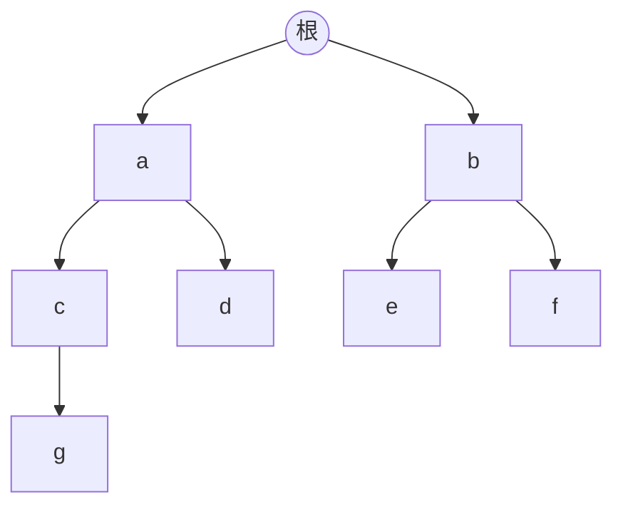
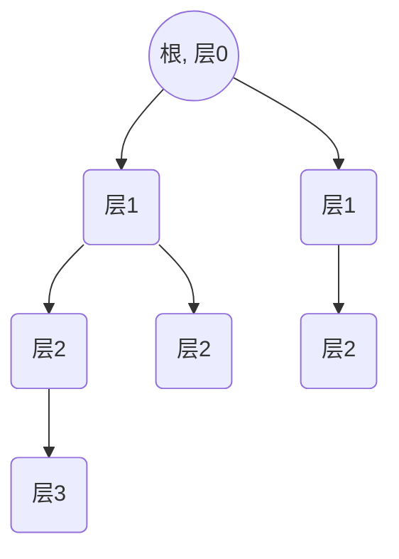
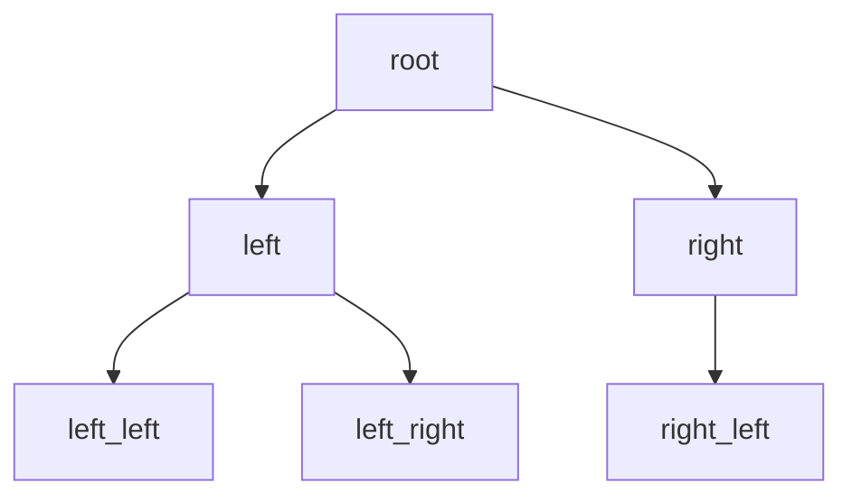

# 6.1 树的定义与性质

> [!abstract] 核心问题
> 什么是树？树有哪些基本性质？

## 一、树的定义

### 1. 树的概念

**树（Tree）**：连通且无回路的无向图。

**森林（Forest）**：无回路的无向图（每个连通分支是树）。

### 2. 树的表示



### 3. 树的等价定义

| 条件 | 说明 |
|-----|------|
| **连通无回路** | 树的基本定义 |
| **连通且 |V| = |E| + 1** | 顶点数比边数多1 |
| **无回路且 |V| = |E| + 1** | 无回路且顶点数比边数多1 |
| **任意两顶点间唯一路径** | 路径唯一 |
| **连通且删除任意边不连通** | 边都是割边 |

## 二、树的基本性质

### 1. 顶点数和边数关系

```
|E| = |V| - 1
```

### 示例

**例1**：一棵有10个顶点的树有多少条边？

**解**：|E| = 10 - 1 = 9

### 2. 度数和关系

**握手定理**：$\sum deg(v) = 2|E| = 2(|V| - 1)$

### 示例

**例2**：一棵有5个顶点的树，度数序列可能是{1,1,1,2,3}吗？

**解**：$\sum deg(v) = 1+1+1+2+3 = 8$，$2(|V|-1) = 8$，符合。

### 3. 叶子数

**定理**：设树有 $n$ 个顶点，$k$ 个叶子，则：

```
k ≥ 2（至少有两个叶子）
```

### 示例

**例3**：证明树至少有两个叶子。

**证明**：设树有 $n$ 个顶点，$k$ 个叶子，非叶子顶点度数至少为2。

```
Σ deg(v) = k×1 + (n-k)×2 ≥ k + 2(n-k) = 2n - k
但 Σ deg(v) = 2(n-1) = 2n - 2
所以 2n - k ≤ 2n - 2 ⇒ k ≥ 2
```

## 三、树的分类

### 1. 根树与自由树

| 类型 | 定义 | 示例 |
|-----|------|-----|
| **自由树** | 无向树，无指定根 | 普通树 |
| **根树** | 有指定根的树 | 见下文 |

### 2. 根树的术语

| 术语 | 定义 |
|-----|------|
| **根** | 指定的顶点 |
| **叶子** | 度数为1的顶点（除根外） |
| **分支点** | 度数大于1的顶点 |
| **父节点** | 靠近根的相邻顶点 |
| **子节点** | 远离根的相邻顶点 |
| **祖先** | 从根到该顶点路径上的顶点 |
| **后代** | 该顶点可达的所有顶点 |
| **层数** | 从根到该顶点的路径长度 |
| **高度** | 树的最大层数 |

### 示例

**例4**：根树的术语



- 叶子：d, e, f
- 分支点：root, a, b, c
- 高度：3

### 3. m叉树

| 类型 | 定义 |
|-----|------|
| **m叉树** | 每个顶点最多有m个子节点 |
| **完全m叉树** | 每个顶点恰好有m个子节点或0个子节点 |
| **正则m叉树** | 每个非叶子顶点恰好有m个子节点 |

### 示例

**例5**：二叉树



## 四、树的应用

### 1. 数据结构

**二叉搜索树**：用于快速查找。

**堆**：用于优先队列。

### 2. 网络路由

**生成树**：网络中的最小连通子图。

### 3. 决策树

**决策树**：用于分类和回归。

## 五、易错点提示

> [!warning] 常见误区
> - **"树和图混淆"**：树是无回路的连通图。
> - **"顶点数和边数关系记错"**：|E| = |V| - 1，不是|V| = |E| - 1。
> - **"叶子数至少为1"**：树至少有两个叶子，不是一个。

## 六、示例与练习

### 练习题

1. 一棵有20个顶点的树有多少条边？
2. 证明：树中任意两个顶点之间有唯一路径。
3. 设树有10个顶点，其中4个顶点度数为2，3个顶点度数为3，求叶子数。

**导航**：[[MOC - 离散数学|返回课程地图]] · 下一节 [[6.2 生成树]]