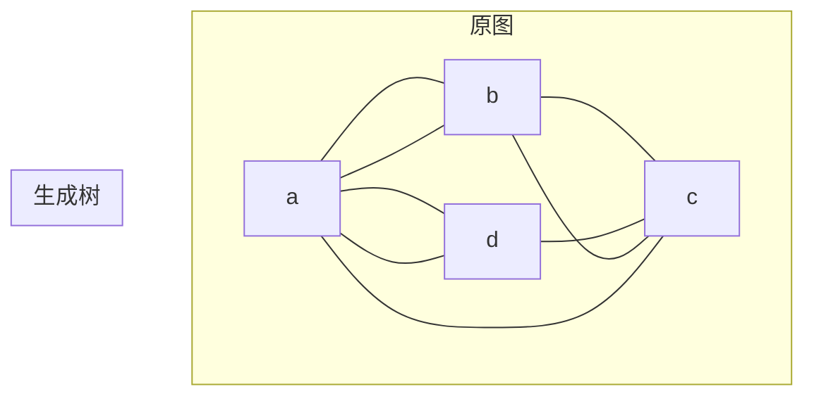

# 6.2 生成树

> [!abstract] 核心问题
> 什么是生成树？如何求最小生成树？

## 一、生成树定义

### 1. 生成树概念

**生成树（Spanning Tree）**：图 $G$ 的生成树是 $G$ 的一个连通无回路子图，包含 $G$ 的所有顶点。

### 2. 生成树性质

| 性质 | 说明 |
|-----|------|
| **顶点数** | 与原图相同 |
| **边数** | |V| - 1 |
| **连通性** | 连通 |
| **无回路** | 无回路 |

### 示例

**例1**：图的生成树



## 二、生成树的存在性

### 1. 定理

**定理**：图 $G$ 有生成树当且仅当 $G$ 是连通的。

### 2. 证明

**必要性**：如果 $G$ 有生成树，则生成树连通，因此 $G$ 连通。

**充分性**：如果 $G$ 连通，递归删除回路中的边，直到无回路，得到生成树。

## 三、生成树的计数

### 1. Kirchhoff定理

**Kirchhoff定理**：图的生成树数量等于其 Laplace 矩阵的任意一个代数余子式。

### Laplace矩阵

**Laplace矩阵**：$L = D - A$，其中 $D$ 是度数矩阵，$A$ 是邻接矩阵。

### 示例

**例2**：计算生成树数量

```
图：顶点{1,2,3}，边{{1,2}, {2,3}, {3,1}}

L = 
[2 -1 -1]
[-1 2 -1]
[-1 -1 2]

删除第一行第一列，代数余子式为：
|[2 -1]|
|[-1 2]| = 4 - 1 = 3

生成树数量：3
```

## 四、最小生成树

### 1. 最小生成树概念

**最小生成树（Minimum Spanning Tree, MST）**：带权图中，边权之和最小的生成树。

### 2. Prim算法

**Prim算法**：从任意顶点开始，逐步添加权最小的边。

### 算法步骤

| 步骤 | 说明 |
|-----|------|
| 1 | 初始化：选择任意顶点作为起点 |
| 2 | 重复：选择连接已选顶点和未选顶点的最小权边 |
| 3 | 终止：所有顶点都被选中 |

### 示例

**例3**：Prim算法求最小生成树

```
图：顶点{1,2,3,4}，边及权重：{1,2}=3, {1,3}=1, {1,4}=4, {2,3}=2, {2,4}=5, {3,4}=6

Prim过程：
选择顶点1
选择边{1,3}(权重1)，顶点集={1,3}
选择边{3,2}(权重2)，顶点集={1,3,2}
选择边{1,4}(权重4)，顶点集={1,3,2,4}

最小生成树权重：1+2+4=7
```

### 3. Kruskal算法

**Kruskal算法**：按边权从小到大排序，依次添加边，避免形成回路。

### 算法步骤

| 步骤 | 说明 |
|-----|------|
| 1 | 将边按权重从小到大排序 |
| 2 | 重复：选择最小权边，如果不形成回路则添加 |
| 3 | 终止：添加了|V|-1条边 |

### 示例

**例4**：Kruskal算法求最小生成树

```
图：顶点{1,2,3,4}，边及权重：{1,2}=3, {1,3}=1, {1,4}=4, {2,3}=2, {2,4}=5, {3,4}=6

排序：{1,3}=1, {2,3}=2, {1,2}=3, {1,4}=4, {2,4}=5, {3,4}=6

Kruskal过程：
选择{1,3}(1)，不形成回路
选择{2,3}(2)，不形成回路
选择{1,2}(3)，形成回路，跳过
选择{1,4}(4)，不形成回路

最小生成树权重：1+2+4=7
```

## 五、生成树应用

### 1. 网络设计

**最小成本网络**：设计成本最低的通信网络。

### 2. 电路设计

**最小布线**：设计布线最短的电路。

### 3. 聚类分析

**层次聚类**：使用最小生成树进行层次聚类。

## 六、易错点提示

> [!warning] 常见误区
> - **"生成树和最小生成树混淆"**：生成树是任意的，最小生成树是权最小的。
> - **"Prim和Kruskal算法混淆"**：Prim是从顶点扩展，Kruskal是按边权排序。
> - **"生成树数量计算错误"**：使用Kirchhoff定理，不是简单的组合数。

## 七、示例与练习

### 练习题

1. 用Prim算法求最小生成树：顶点{1,2,3,4,5}，边及权重：{1,2}=5, {1,3}=1, {2,4}=2, {3,4}=4, {3,5}=6, {4,5}=3
2. 用Kruskal算法求同一图的最小生成树
3. 计算图的生成树数量：顶点{1,2,3,4}，边{{1,2}, {1,3}, {1,4}, {2,3}, {2,4}, {3,4}}

**导航**：上一节 [[6.1 树的定义与性质]] · [[MOC - 离散数学|返回课程地图]] · 下一节 [[6.3 二叉树]]