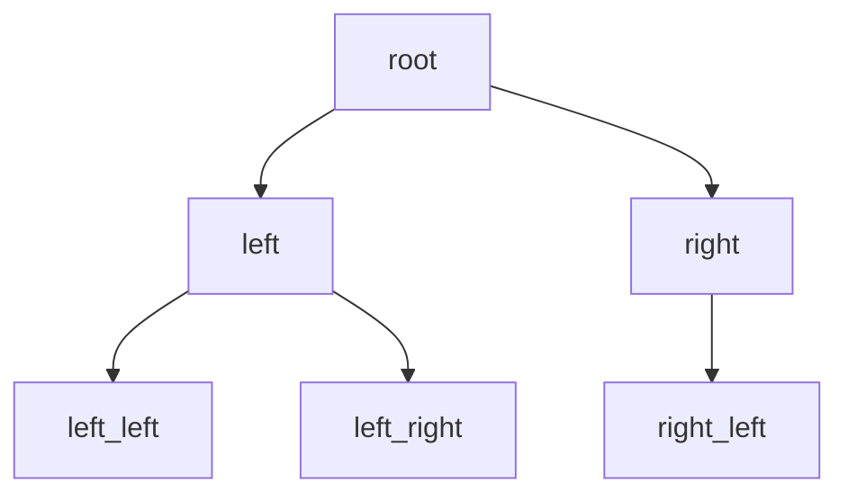
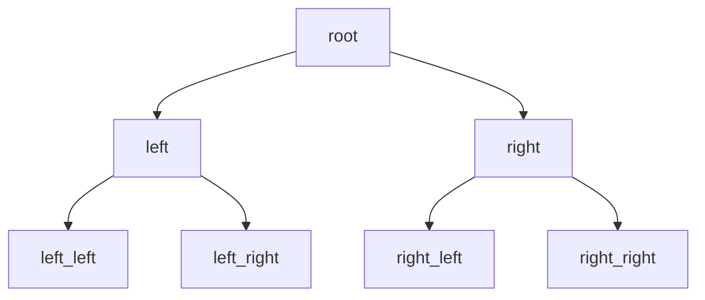
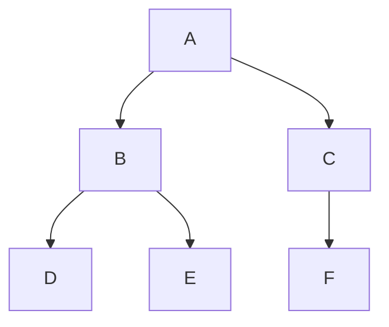
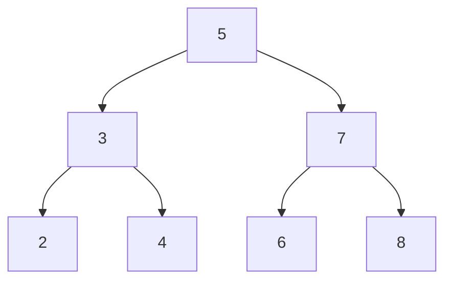
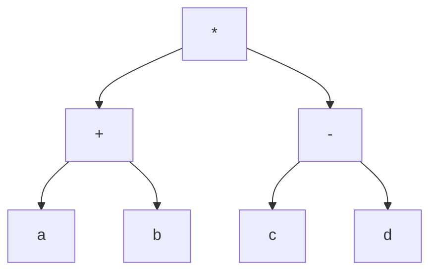

# 6.3 二叉树

> [!abstract] 核心问题
> 什么是二叉树？二叉树有哪些性质？如何遍历二叉树？

## 一、二叉树定义

### 1. 二叉树概念

**二叉树（Binary Tree）**：每个顶点最多有两个子节点的根树。

### 2. 二叉树类型

| 类型 | 定义 | 示例 |
|-----|------|-----|
| **普通二叉树** | 每个顶点0-2个子节点 | 见下文 |
| **满二叉树** | 每个非叶子顶点恰好有两个子节点 | 见下文 |
| **完全二叉树** | 除最后一层外，每层都满，最后一层从左到右填充 | 见下文 |

### 示例

**例1**：普通二叉树



### 例2**：满二叉树



### 例3**：完全二叉树


## 二、二叉树性质

### 1. 顶点数与层数关系

**定理**：设二叉树高度为 $h$，则：

| 关系 | 说明 |
|-----|------|
| **最少顶点数** | $h + 1$（每层一个顶点） |
| **最多顶点数** | $2^{h+1} - 1$（满二叉树） |

### 示例

**例4**：高度为3的二叉树最多有多少个顶点？

**解**：$2^{3+1} - 1 = 15$

### 2. 叶子数与分支点数关系

**定理**：设二叉树有 $n_0$ 个叶子，$n_2$ 个度数为2的顶点，则：

```
n_0 = n_2 + 1
```

### 证明

**证明**：设总顶点数为 $n$，边数为 $e$。

```
n = n_0 + n_1 + n_2
e = n - 1
Σ deg(v) = 2e = 2(n - 1)
但 Σ deg(v) = n_0×1 + n_1×2 + n_2×3
所以 n_0 + 2n_1 + 3n_2 = 2(n_0 + n_1 + n_2 - 1)
化简得：n_0 = n_2 + 1
```

### 3. 完全二叉树性质

**定理**：完全二叉树中，第 $i$ 层最多有 $2^i$ 个顶点。

## 三、二叉树遍历

### 1. 前序遍历

**前序遍历（Preorder Traversal）**：根 → 左子树 → 右子树

### 示例

**例5**：前序遍历



前序遍历结果：A → B → D → E → C → F

### 2. 中序遍历

**中序遍历（Inorder Traversal）**：左子树 → 根 → 右子树

### 示例

**例6**：中序遍历

中序遍历结果：D → B → E → A → F → C

### 3. 后序遍历

**后序遍历（Postorder Traversal）**：左子树 → 右子树 → 根

### 示例

**例7**：后序遍历

后序遍历结果：D → E → B → F → C → A

### 4. 层序遍历

**层序遍历（Level Order Traversal）**：按层次从左到右遍历

### 示例

**例8**：层序遍历

层序遍历结果：A → B → C → D → E → F

## 四、二叉搜索树

### 1. 二叉搜索树定义

**二叉搜索树（Binary Search Tree, BST）**：对于任意顶点，左子树所有顶点的值小于该顶点，右子树所有顶点的值大于该顶点。

### 2. BST性质

| 性质 | 说明 |
|-----|------|
| **中序遍历有序** | 中序遍历结果是有序序列 |
| **查找效率** | 平均O(log n)，最坏O(n) |
| **插入效率** | 平均O(log n)，最坏O(n) |

### 示例

**例9**：二叉搜索树



中序遍历：2 → 3 → 4 → 5 → 6 → 7 → 8

## 五、二叉树应用

### 1. 表达式树

**表达式树**：用二叉树表示算术表达式。

### 示例

**例10**：表达式 $(a + b) × (c - d)$ 的表达式树



### 2. Huffman树

**Huffman树**：用于数据压缩。

### 3. 决策树

**决策树**：用于分类和回归。

## 六、易错点提示

> [!warning] 常见误区
> - **"二叉树和树混淆"**：二叉树是特殊的根树，每个顶点最多两个子节点。
> - **"遍历顺序记错"**：前序是根左右，中序是左根右，后序是左右根。
> - **"满二叉树和完全二叉树混淆"**：满二叉树是完全二叉树的特例。

## 七、示例与练习

### 练习题

1. 画出高度为3的满二叉树
2. 对二叉树进行三种遍历：顶点{A,B,C,D,E,F,G}，A是根，B是左子，C是右子，D是B的左子，E是B的右子，F是C的左子，G是C的右子
3. 证明：二叉树中叶子数等于度数为2的顶点数加1

**导航**：上一节 [[6.2 生成树]] · [[MOC - 离散数学|返回课程地图]] · 下一节 [[6.4 前缀码]]