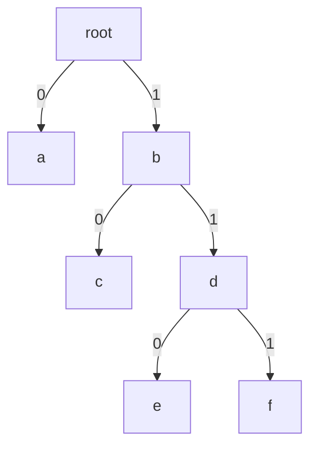
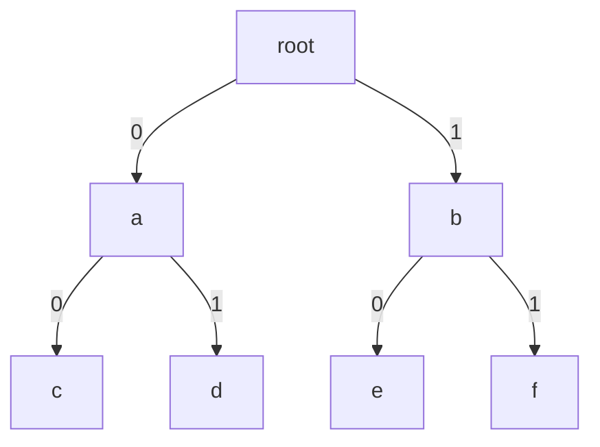

# 6.4 前缀码

> [!abstract] 核心问题
> 什么是前缀码？如何构造最优前缀码？

## 一、前缀码定义

### 1. 前缀码概念

**前缀码（Prefix Code）**：一个编码集合中，任何一个编码都不是另一个编码的前缀。

### 2. 前缀码性质

| 性质 | 说明 |
|-----|------|
| **无前缀** | 任何编码不是其他编码的前缀 |
| **唯一解码** | 可以唯一解码 |
| **二叉树表示** | 可以用二叉树表示 |

### 示例

**例1**：判断是否为前缀码

- {0, 10, 110, 111} —— 是前缀码
- {0, 01, 001} —— 不是前缀码（0是01的前缀）

## 二、前缀码与二叉树

### 1. 二叉树构造前缀码

**方法**：左分支标0，右分支标1，叶子对应编码。

### 示例

**例2**：用二叉树构造前缀码



前缀码：{0, 10, 110, 111}

### 2. 前缀码构造二叉树

**方法**：编码作为路径，从根到叶子。

### 示例

**例3**：从前缀码构造二叉树

前缀码：{00, 01, 10, 11}



## 三、最优前缀码

### 1. 最优前缀码概念

**最优前缀码（Optimal Prefix Code）**：给定字符频率，平均编码长度最小的前缀码。

### 2. 平均编码长度

**定义**：$L = \sum f_i l_i$，其中 $f_i$ 是字符频率，$l_i$ 是编码长度。

### 示例

**例4**：计算平均编码长度

字符频率：a:0.4, b:0.3, c:0.2, d:0.1

编码方案1：{00, 01, 10, 11}
```
L = 0.4×2 + 0.3×2 + 0.2×2 + 0.1×2 = 2
```

编码方案2：{0, 10, 110, 111}
```
L = 0.4×1 + 0.3×2 + 0.2×3 + 0.1×3 = 1.9
```

方案2更优。

## 四、Huffman算法

### 1. Huffman算法步骤

| 步骤 | 说明 |
|-----|------|
| 1 | 将每个字符看作一个节点，权重为频率 |
| 2 | 选择权重最小的两个节点合并 |
| 3 | 新节点权重为两个节点权重之和 |
| 4 | 重复直到只剩一个节点 |
| 5 | 从根到叶子的路径即为编码 |

### 示例

**例5**：Huffman算法构造最优前缀码

字符频率：a:0.4, b:0.3, c:0.2, d:0.1

```
步骤1：节点{a:0.4, b:0.3, c:0.2, d:0.1}
步骤2：合并c和d，新节点cd:0.3
步骤3：节点{a:0.4, b:0.3, cd:0.3}
步骤4：合并b和cd，新节点bcd:0.6
步骤5：节点{a:0.4, bcd:0.6}
步骤6：合并a和bcd，根节点:1.0

编码：
a: 0
b: 10
c: 110
d: 111

平均长度：0.4×1 + 0.3×2 + 0.2×3 + 0.1×3 = 1.9
```

### 2. Huffman算法性质

| 性质 | 说明 |
|-----|------|
| **最优性** | 构造的前缀码是最优的 |
| **复杂度** | O(n log n) |
| **贪心策略** | 每次选择最小的两个合并 |

## 五、前缀码应用

### 1. 数据压缩

**Huffman编码**：用于无损数据压缩。

### 2. 通信

**纠错码**：用于数据传输中的错误检测和纠正。

### 3. 文件格式

**GIF格式**：使用LZW编码，基于前缀码思想。

## 六、易错点提示

> [!warning] 常见误区
> - **"前缀码和后缀码混淆"**：前缀码要求无前缀，后缀码要求无后缀。
> - **"Huffman算法步骤记错"**：每次合并权重最小的两个节点。
> - **"平均长度计算错误"**：加权平均，不是简单平均。

## 七、示例与练习

### 练习题

1. 判断是否为前缀码：{0, 10, 110, 1110}
2. 用Huffman算法构造最优前缀码：字符频率{a:0.5, b:0.25, c:0.125, d:0.125}
3. 计算上题的平均编码长度

**导航**：上一节 [[6.3 二叉树]] · [[MOC - 离散数学|返回课程地图]] · 下一章 [[7.1 基本计数原理]]