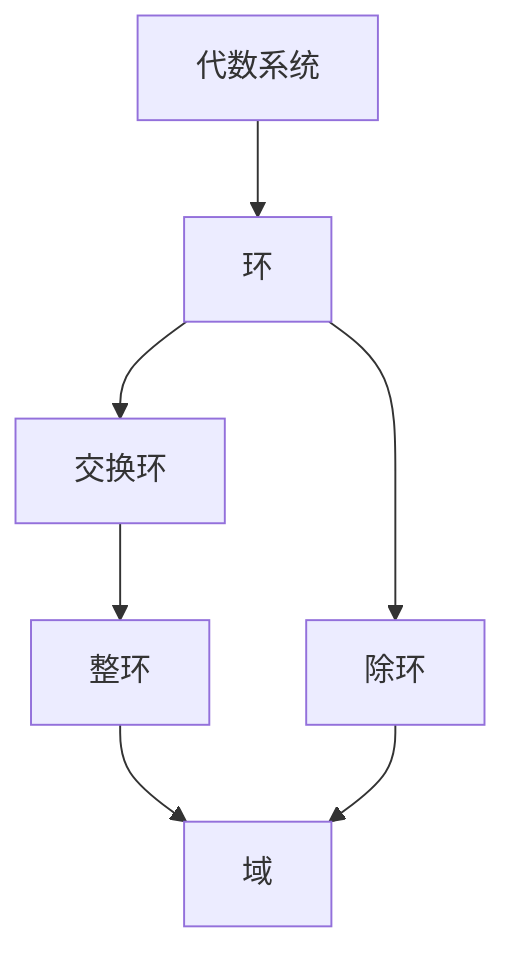

# 8.3 环与域

> [!abstract] 核心问题
> 什么是环和域？它们之间有什么关系？

## 一、环

### 1. 环的定义

**环（Ring）**：非空集合 $R$ 上定义两个运算 $+$ 和 $×$，满足：

| 条件 | 说明 |
|-----|------|
| **$<R, +>$ 是交换群** | 加法交换群 |
| **$<R, ×>$ 是半群** | 乘法半群 |
| **乘法对加法分配** | $\forall a, b, c, a × (b + c) = a × b + a × c$ 且 $(b + c) × a = b × a + c × a$ |

### 示例

**例1**：环示例

- $<ℤ, +, ×>$：整数环
- $<ℚ, +, ×>$：有理数环
- $<ℝ, +, ×>$：实数环
- $<ℤ_n, +_n, ×_n>$：模n环

### 2. 环的性质

| 性质 | 说明 |
|-----|------|
| **加法交换律** | $\forall a, b, a + b = b + a$ |
| **加法结合律** | $\forall a, b, c, (a + b) + c = a + (b + c)$ |
| **加法单位元** | $\exists 0, \forall a, a + 0 = 0 + a = a$ |
| **加法逆元** | $\forall a, \exists -a, a + (-a) = 0$ |
| **乘法结合律** | $\forall a, b, c, (a × b) × c = a × (b × c)$ |
| **分配律** | $a × (b + c) = a × b + a × c$ |

### 3. 特殊环

| 类型 | 定义 | 示例 |
|-----|------|-----|
| **交换环** | 乘法交换 | $<ℤ, +, ×>$ |
| **有单位元环** | 乘法有单位元 | $<ℤ, +, ×>$（单位元是1） |
| **整环** | 交换环+有单位元+无零因子 | $<ℤ, +, ×>$ |
| **除环** | 有单位元+非零元有乘法逆元 | 四元数环 |

### 零因子

**零因子（Zero Divisor）**：$\exists a, b ≠ 0, a × b = 0$

### 示例

**例2**：零因子

在 $<ℤ_6, +_6, ×_6>$ 中：

```
2 ×₆ 3 = 6 ≡ 0 (mod 6)

所以2和3是零因子。
```

## 二、域

### 1. 域的定义

**域（Field）**：满足以下条件的交换环 $<F, +, ×>$：

| 条件 | 说明 |
|-----|------|
| **有单位元** | $\exists 1 ≠ 0$ |
| **非零元可逆** | $\forall a ≠ 0, \exists a^{-1}, a × a^{-1} = 1$ |

### 示例

**例3**：域示例

- $<ℚ, +, ×>$：有理数域
- $<ℝ, +, ×>$：实数域
- $<ℂ, +, ×>$：复数域
- $<ℤ_p, +_p, ×_p>$（p是质数）：有限域

### 2. 域的性质

| 性质 | 说明 |
|-----|------|
| **交换环** | 乘法交换 |
| **有单位元** | 存在1 |
| **无零因子** | $\forall a, b ≠ 0, a × b ≠ 0$ |
| **非零元可逆** | $\forall a ≠ 0, \exists a^{-1}$ |

### 示例

**例4**：有限域 $<ℤ_5, +_5, ×_5>$

```
+₅ | 0 1 2 3 4
----+----------
0   | 0 1 2 3 4
1   | 1 2 3 4 0
2   | 2 3 4 0 1
3   | 3 4 0 1 2
4   | 4 0 1 2 3

×₅ | 0 1 2 3 4
----+----------
0   | 0 0 0 0 0
1   | 0 1 2 3 4
2   | 0 2 4 1 3
3   | 0 3 1 4 2
4   | 0 4 3 2 1

非零元的逆元：
1⁻¹ = 1
2⁻¹ = 3（因为2×₅3=6≡1）
3⁻¹ = 2（因为3×₅2=6≡1）
4⁻¹ = 4（因为4×₅4=16≡1）
```

## 三、环与域的关系

### 关系图



### 对比表

| 代数系统 | 加法群 | 乘法半群 | 乘法交换 | 单位元 | 非零元可逆 |
|---------|--------|---------|---------|--------|-----------|
| **环** | 是 | 是 | 不一定 | 不一定 | 不一定 |
| **交换环** | 是 | 是 | 是 | 不一定 | 不一定 |
| **整环** | 是 | 是 | 是 | 是 | 不一定 |
| **域** | 是 | 是 | 是 | 是 | 是 |

## 四、理想

### 1. 理想定义

**理想（Ideal）**：设 $<R, +, ×>$ 是环，$I \subseteq R$，如果：

| 条件 | 说明 |
|-----|------|
| **$<I, +>$ 是子群** | 加法子群 |
| **吸收性** | $\forall r \in R, \forall a \in I, r × a \in I$ 且 $a × r \in I$ |

### 示例

**例5**：理想

在 $<ℤ, +, ×>$ 中：

- $nℤ$ 是理想，其中n是整数

### 2. 主理想

**主理想（Principal Ideal）**：由一个元素生成的理想。

```
(a) = {r × a × s | r, s ∈ R}
```

## 五、环与域应用

### 1. 密码学

**有限域**：用于设计加密算法（如AES）。

### 2. 编码理论

**编码**：利用有限域设计纠错码。

### 3. 数论

**代数数论**：研究代数数域。

## 六、易错点提示

> [!warning] 常见误区
> - **"环和域混淆"**：域要求非零元可逆，环不要求。
> - **"整环和域混淆"**：整环不一定非零元可逆。
> - **"零因子和单位元混淆"**：零因子使乘积为0，单位元不改变乘积。

## 七、示例与练习

### 练习题

1. 判断 $<ℤ_4, +_4, ×_4>$ 是否为整环
2. 判断 $<ℤ_7, +_7, ×_7>$ 是否为域
3. 找出 $<ℤ, +, ×>$ 的所有主理想

**导航**：上一节 [[8.2 半群与群]] · [[MOC - 离散数学|返回课程地图]] · 下一节 [[8.4 格与布尔代数]]