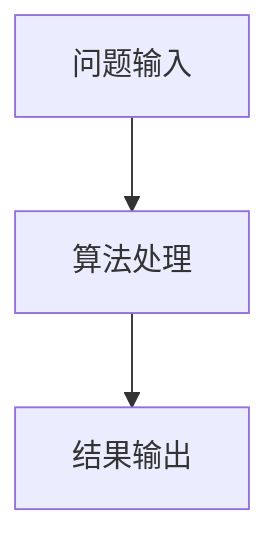

# 1.1 算法的基本概念

> [!abstract] 核心问题
> 什么是算法？算法需要满足哪些特性？如何评价一个算法的优劣？

## 一、算法的定义

**算法（Algorithm）**是对特定问题求解步骤的一种描述，是指令的有限序列。



## 二、算法的五个特性

| 特性 | 定义 | 说明 |
|-----|------|------|
| **有穷性** | 算法在执行有限步后必须终止 | 不能无限循环 |
| **确定性** | 每一步都有确切的定义 | 无歧义 |
| **可行性** | 每一步都能够有效执行并得到确定结果 | 操作可实现 |
| **输入** | 有零个或多个输入 | 零输入如随机数生成 |
| **输出** | 有一个或多个输出 | 与输入有特定关系 |

> [!warning] 易错点
> 有穷性强调"有限步内终止"，而非"有限时间内终止"。理论上有限步的算法可能需要很长时间执行。

## 三、算法的设计要求

### 1. 正确性（Correctness）
算法必须正确解决问题，满足问题的所有规格说明。

### 2. 可读性（Readability）
算法应易于理解，便于调试和维护。

### 3. 健壮性（Robustness）
算法应能处理非法输入，给出合理的错误提示。

### 4. 效率（Efficiency）
算法应尽量减少时间和空间的消耗。

## 四、算法与程序的区别

| 对比项 | 算法 | 程序 |
|-------|------|------|
| **有穷性** | 必须满足 | 可以不满足（如操作系统） |
| **语言** | 抽象描述 | 具体编程语言实现 |
| **正确性** | 逻辑正确 | 需要通过测试验证 |

## 五、算法的表示方法

1. **自然语言**：通俗易懂，但容易产生歧义
2. **流程图**：直观清晰，适合简单算法
3. **伪代码**：介于自然语言和程序之间，结构清晰
4. **程序设计语言**：可直接执行，但依赖具体语言

## 六、示例：欧几里得算法

**问题**：求两个正整数的最大公约数

```python
def gcd(a, b):
    while b != 0:
        a, b = b, a % b
    return a
```

**分析**：
- 正确性：基于辗转相除法原理
- 时间复杂度：O(log(min(a,b)))
- 空间复杂度：O(1)

---

**导航**：[[MOC - 第1章.md|返回章节导航]] · 下一节 [[1.2-时间复杂度分析.md]]