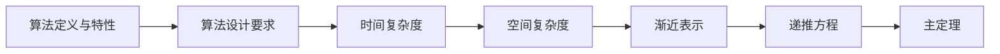

# 第1章-算法概述与复杂度分析

> [!abstract] 本章定位
> 本章介绍算法的基本概念、复杂度分析方法和递推方程求解技术，是学习后续算法设计方法的基础。

## 学习主线

## 章节内容

- [[1.1-算法的基本概念.md]]：算法定义、五个特性、设计要求
- [[1.2-时间复杂度分析.md]]：时间复杂度、空间复杂度、渐近记号
- [[1.3-递推方程求解.md]]：递推关系、递归树、主定理

## 考点汇总

> [!important] 核心考点
> 1. 算法的五个特性：有穷性、确定性、可行性、输入、输出
> 2. 时间复杂度分析方法：循环次数、递归分析、递推方程
> 3. 渐近表示：O、Ω、Θ、o、ω的定义和区别
> 4. 主定理的应用条件和公式
> 5. 常见复杂度排序：O(1) < O(logn) < O(n) < O(nlogn) < O(n²) < O(2ⁿ)

## 前后章节依赖

| 方向 | 章节 | 依赖关系 |
|-----|------|---------|
| 先修 | 离散数学 | 递推关系、集合论基础 |
| 后续 | 分治法 | 递归复杂度分析 |

## 复习自测

> [!question] 自测题
> 1. 什么是算法？算法的五个特性是什么？
> 2. 如何分析一个算法的时间复杂度？
> 3. 渐近表示O、Ω、Θ有什么区别？
> 4. 主定理的适用条件是什么？
> 5. 求解递推方程T(n) = 2T(n/2) + n的解。