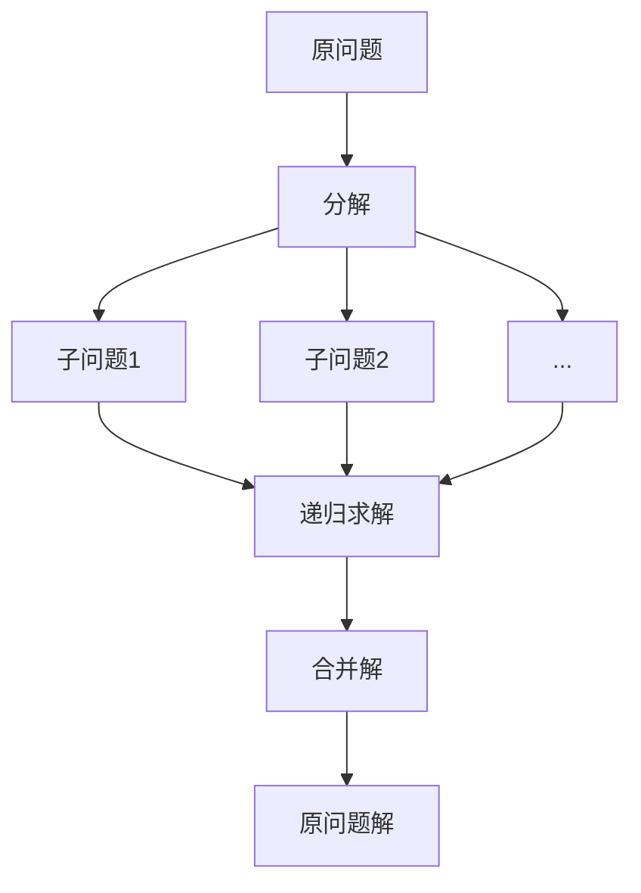

# 2.1 分治法的基本思想

> [!abstract] 核心问题
> 分治法的基本思想是什么？包含哪三个步骤？适用条件是什么？

## 一、分治法的定义

**分治法（Divide and Conquer）**是一种递归算法设计策略，将问题分解为若干个子问题，递归求解子问题，然后合并子问题的解得到原问题的解。



## 二、分治法的三个步骤

### 1. 分解（Divide）
将原问题分解为若干个规模较小、相互独立、与原问题形式相同的子问题。

### 2. 求解（Conquer）
递归求解各个子问题。如果子问题规模足够小，则直接求解。

### 3. 合并（Combine）
将各个子问题的解合并为原问题的解。

## 三、分治法的适用条件

一个问题适用分治法求解，通常需要满足以下条件：

| 条件 | 说明 |
|-----|------|
| **可分解性** | 问题可以分解为若干个子问题 |
| **独立性** | 子问题之间相互独立 |
| **可合并性** | 子问题的解可以合并为原问题的解 |
| **规模缩小** | 子问题规模比原问题小 |

## 四、分治法的递归结构

```python
def divide_and_conquer(problem):
    if problem.size <= threshold:
        return solve_directly(problem)  # 基线条件
    subproblems = split(problem)        # 分解
    solutions = [divide_and_conquer(sub) for sub in subproblems]  # 求解
    return combine(solutions)           # 合并
```

## 五、分治法的复杂度分析

分治法的时间复杂度通常可以用递推方程表示：

```
T(n) = aT(n/b) + f(n)
```

其中：
- `a`：子问题的个数
- `b`：子问题的规模缩小因子
- `f(n)`：分解和合并的时间

使用主定理求解：
- 归并排序：T(n) = 2T(n/2) + O(n) = Θ(nlogn)
- 二分查找：T(n) = T(n/2) + O(1) = Θ(logn)

## 六、分治法与其他算法策略的对比

| 策略 | 核心思想 | 适用场景 |
|-----|---------|---------|
| **分治法** | 分解独立子问题 | 子问题独立，可合并 |
| **动态规划** | 利用重叠子问题 | 子问题重叠，最优子结构 |
| **贪心算法** | 局部最优选择 | 贪心选择性质，最优子结构 |

> [!warning] 易错点
> 分治法要求子问题相互独立，如果子问题重叠，应该使用动态规划。

---

**导航**：[[MOC - 第2章.md|返回章节导航]] · 下一节 [[2.2-经典分治算法.md]]