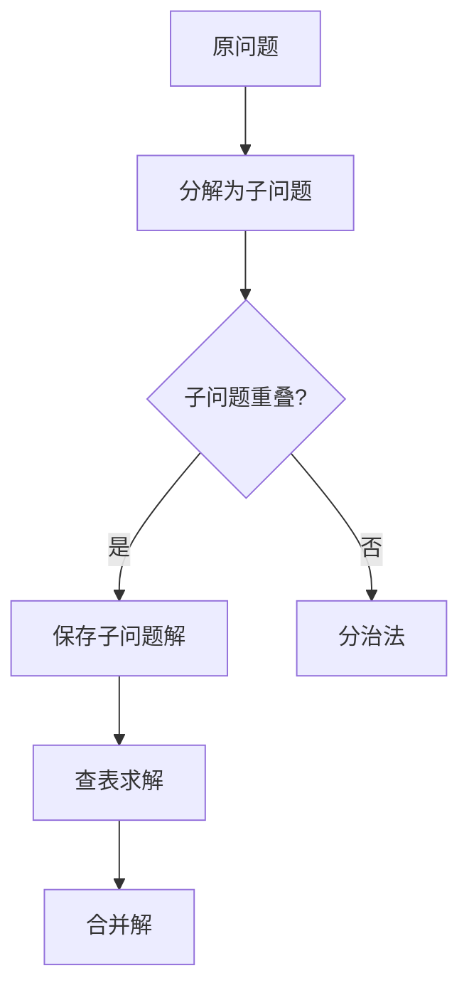

# 3.1 动态规划的基本思想

> [!abstract] 核心问题
> 动态规划的基本思想是什么？与分治法有什么区别？两个基本要素是什么？

## 一、动态规划的定义

**动态规划（Dynamic Programming）**是一种算法设计策略，将问题分解为若干个子问题，保存子问题的解，避免重复计算，从而提高效率。



## 二、动态规划与分治法的区别

| 对比项 | 分治法 | 动态规划 |
|-------|--------|---------|
| **子问题关系** | 相互独立 | 重叠子问题 |
| **求解方式** | 递归求解 | 自底向上/记忆化 |
| **时间复杂度** | 可能指数级 | 多项式级 |
| **适用条件** | 子问题独立 | 最优子结构+重叠子问题 |

## 三、动态规划的两个基本要素

### 1. 最优子结构（Optimal Substructure）

问题的最优解包含子问题的最优解。

```
示例：最短路径问题
从A到C的最短路径 = min(从A到B的最短路径 + B到C的路径)
```

### 2. 重叠子问题（Overlapping Subproblems）

递归求解时，会重复计算相同的子问题。

```
示例：斐波那契数列
F(5) = F(4) + F(3)
F(4) = F(3) + F(2)
F(3) = F(2) + F(1)
F(3)和F(2)被重复计算
```

## 四、动态规划的设计步骤

### 1. 定义状态（State）
定义dp[i][j]表示什么含义。

### 2. 建立状态转移方程（Transition）
建立dp[i][j]与子问题解之间的关系。

### 3. 确定边界条件（Base Case）
确定初始状态的值。

### 4. 确定计算顺序（Order）
确保计算dp[i][j]时，所需的子问题解已经计算完毕。

## 五、动态规划的两种实现方式

### 1. 自底向上（Bottom-Up）
从最小的子问题开始，逐步计算到大问题。

```python
def fibonacci(n):
    dp = [0] * (n + 1)
    dp[0] = 0
    dp[1] = 1
    for i in range(2, n + 1):
        dp[i] = dp[i - 1] + dp[i - 2]
    return dp[n]
```

### 2. 记忆化搜索（Top-Down）
递归求解，用备忘录保存已计算的结果。

```python
def fibonacci(n, memo=None):
    if memo is None:
        memo = {}
    if n in memo:
        return memo[n]
    if n <= 1:
        return n
    memo[n] = fibonacci(n - 1, memo) + fibonacci(n - 2, memo)
    return memo[n]
```

## 六、示例：斐波那契数列

**问题**：计算第n个斐波那契数

**递归解法**（时间复杂度O(2ⁿ)）：
```python
def fib(n):
    if n <= 1:
        return n
    return fib(n-1) + fib(n-2)
```

**动态规划解法**（时间复杂度O(n)）：
```python
def fib(n):
    if n <= 1:
        return n
    a, b = 0, 1
    for _ in range(2, n+1):
        a, b = b, a + b
    return b
```

> [!warning] 易错点
> 动态规划的关键是识别重叠子问题，避免重复计算。如果子问题不重叠，使用分治法更合适。

---

**导航**：[[MOC - 第3章.md|返回章节导航]] · 下一节 [[3.2-经典动态规划问题.md]]