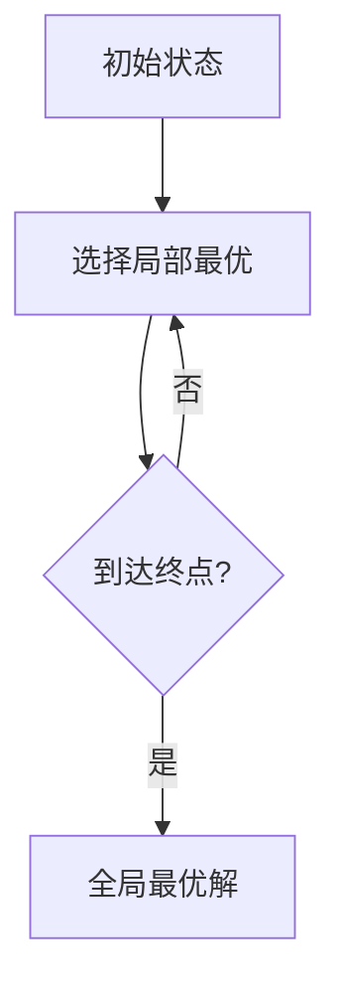

# 4.1 贪心算法的基本思想

> [!abstract] 核心问题
> 贪心算法的基本思想是什么？与动态规划有什么区别？适用条件是什么？

## 一、贪心算法的定义

**贪心算法（Greedy Algorithm）**是一种算法设计策略，在每一步选择中都采取当前状态下最优的选择，希望通过局部最优达到全局最优。



## 二、贪心算法与动态规划的区别

| 对比项 | 贪心算法 | 动态规划 |
|-------|---------|---------|
| **决策方式** | 自顶向下，每步贪心选择 | 自底向上，保存子问题解 |
| **最优性** | 局部最优→全局最优 | 全局最优包含子问题最优 |
| **适用条件** | 贪心选择性质+最优子结构 | 最优子结构+重叠子问题 |
| **时间复杂度** | 通常较低 | 通常较高 |
| **例子** | 活动选择、哈夫曼编码 | LCS、背包问题 |

## 三、贪心算法的两个要素

### 1. 贪心选择性质（Greedy Choice Property）

全局最优解可以通过一系列局部最优选择得到。

> [!example] 示例
> 活动选择问题：每次选择结束时间最早的活动，可以得到最大兼容活动数。

### 2. 最优子结构（Optimal Substructure）

问题的最优解包含子问题的最优解。

> [!example] 示例
> 最短路径问题：从A到C的最短路径包含从A到B的最短路径。

## 四、贪心算法的设计步骤

### 1. 确定问题的最优子结构
证明问题具有最优子结构性质。

### 2. 证明贪心选择性质
证明每一步的贪心选择可以导致全局最优解。

### 3. 设计贪心策略
确定每一步如何选择局部最优。

### 4. 实现算法
按照贪心策略逐步求解。

## 五、贪心算法的适用条件

一个问题适用贪心算法，通常需要满足：

| 条件 | 说明 |
|-----|------|
| **贪心选择性质** | 局部最优选择可以导致全局最优 |
| **最优子结构** | 问题的最优解包含子问题的最优解 |
| **无后效性** | 当前选择不影响后续选择的最优性 |

## 六、示例：找零钱问题

**问题**：用最少的硬币数凑成金额n。

**贪心策略**：每次选择面额最大的硬币。

```python
def coin_change(coins, amount):
    coins.sort(reverse=True)
    count = 0
    for coin in coins:
        while amount >= coin:
            amount -= coin
            count += 1
        if amount == 0:
            break
    return count if amount == 0 else -1
```

**适用条件**：硬币面额满足贪心选择性质（如人民币面额）。

> [!warning] 易错点
> 贪心算法不总是正确的！需要证明贪心选择性质成立。例如，硬币面额{1, 3, 4}凑金额6，贪心选择4+1+1=3枚，最优解3+3=2枚。

---

**导航**：[[MOC - 第4章.md|返回章节导航]] · 下一节 [[4.2-经典贪心算法.md]]