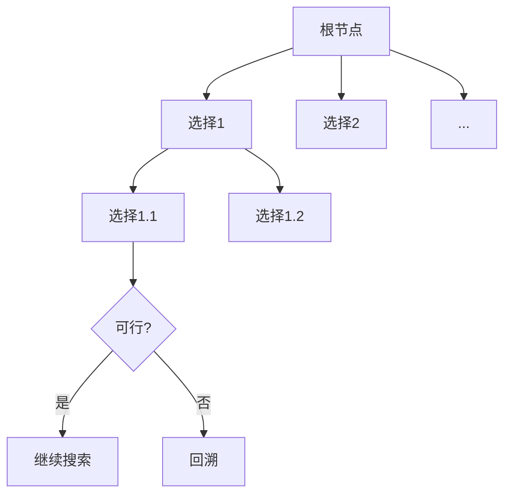

# 5.1 回溯法的基本思想

> [!abstract] 核心问题
> 回溯法的基本思想是什么？解空间树是什么？如何进行剪枝？

## 一、回溯法的定义

**回溯法（Backtracking）**是一种基于深度优先搜索的算法设计策略，通过构造解空间树，在搜索过程中进行剪枝，避免无效搜索。



## 二、解空间树（Solution Space Tree）

### 1. 子集树（Subset Tree）
当问题是从n个元素中选择满足条件的子集时，解空间树有2ⁿ个叶子节点。

```
示例：从{1,2,3}中选择子集
        []
      /   \
     [1]   []
    / \    / \
  [1,2][1][2] []
```

### 2. 排列树（Permutation Tree）
当问题是求n个元素的排列时，解空间树有n!个叶子节点。

```
示例：{1,2,3}的排列
        1          2          3
       / \        / \        / \
      2   3      1   3      1   2
     /     \    /     \    /     \
    3       2  3       1  2       1
```

## 三、回溯法的基本步骤

### 1. 定义解空间
确定问题的解空间结构（子集树或排列树）。

### 2. 确定搜索策略
通常使用深度优先搜索（DFS）。

### 3. 构造约束函数
判断当前部分解是否满足约束条件。

### 4. 构造限界函数
判断当前部分解是否有可能扩展为最优解。

### 5. 搜索解空间
按照搜索策略遍历解空间树，进行剪枝。

## 四、剪枝策略

### 1. 约束函数（Constraint Function）
剪去不满足约束条件的分支。

> [!example] 示例
> n皇后问题中，判断新放置的皇后是否与已放置的皇后冲突。

### 2. 限界函数（Bounding Function）
剪去不可能得到最优解的分支。

> [!example] 示例
> 0-1背包问题中，如果当前重量已经超过背包容量，则剪去该分支。

## 五、回溯法的实现框架

```python
def backtrack(path, choices):
    if is_complete(path):
        result.append(path.copy())
        return
    
    for choice in choices:
        if is_valid(path, choice):
            path.append(choice)
            backtrack(path, choices)
            path.pop()
```

## 六、回溯法与其他算法策略的对比

| 策略 | 搜索方式 | 适用场景 | 时间复杂度 |
|-----|---------|---------|-----------|
| **回溯法** | 深度优先+剪枝 | 组合优化问题 | 通常指数级 |
| **分支限界法** | 广度优先+剪枝 | 最优解问题 | 通常指数级 |
| **动态规划** | 自底向上 | 最优子结构问题 | 多项式级 |

> [!warning] 易错点
> 回溯法的关键是设计有效的剪枝策略，否则时间复杂度会很高。剪枝策略越好，算法效率越高。

---

**导航**：[[MOC - 第5章.md|返回章节导航]] · 下一节 [[5.2-经典回溯问题.md]]