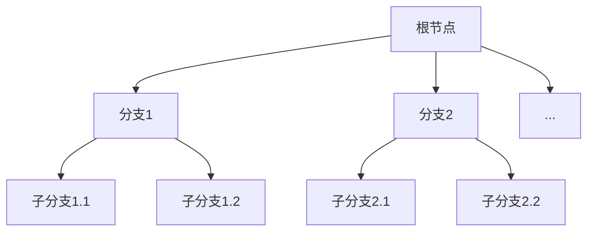

# 6.1 分支限界法的基本思想

> [!abstract] 核心问题
> 分支限界法的基本思想是什么？与回溯法有什么区别？

## 一、分支限界法的定义

**分支限界法（Branch and Bound）**是一种基于广度优先搜索的算法设计策略，通过构造解空间树，在搜索过程中进行剪枝，找到最优解。



## 二、分支限界法与回溯法的区别

| 对比项 | 回溯法 | 分支限界法 |
|-------|--------|-----------|
| **搜索方式** | 深度优先搜索（DFS） | 广度优先搜索（BFS） |
| **目标** | 找到所有解或一个解 | 找到最优解 |
| **剪枝策略** | 约束函数 | 约束函数+限界函数 |
| **数据结构** | 栈 | 队列或优先队列 |
| **内存消耗** | 较小（只保存路径） | 较大（保存所有活节点） |

## 三、分支限界法的基本步骤

### 1. 定义解空间
确定问题的解空间结构。

### 2. 确定分支策略
如何生成子节点。

### 3. 设计限界函数
估计当前节点能达到的最优值。

### 4. 选择搜索策略
队列式或优先队列式。

### 5. 搜索解空间
按照搜索策略遍历解空间树，进行剪枝。

## 四、分支策略

### 1. 静态分支
按照固定顺序生成子节点。

### 2. 动态分支
根据当前状态动态选择分支顺序。

## 五、限界函数

### 1. 上界函数（用于最小化问题）
估计从当前节点出发能达到的最小代价。

### 2. 下界函数（用于最大化问题）
估计从当前节点出发能达到的最大收益。

> [!example] 示例
> 0-1背包问题中，剩余物品的最大价值估计作为上界。

## 六、搜索策略

### 1. 队列式分支限界（FIFO）
按照先进先出的顺序处理节点。

```python
from collections import deque

def bfs_branch_bound(root):
    queue = deque([root])
    while queue:
        node = queue.popleft()
        if is_solution(node):
            return node
        for child in expand(node):
            if is_bounded(child):
                queue.append(child)
    return None
```

### 2. 优先队列式分支限界（LC）
按照优先级（通常是限界函数值）处理节点。

```python
import heapq

def pq_branch_bound(root):
    heap = [(bound(root), root)]
    while heap:
        _, node = heapq.heappop(heap)
        if is_solution(node):
            return node
        for child in expand(node):
            if is_bounded(child):
                heapq.heappush(heap, (bound(child), child))
    return None
```

> [!warning] 易错点
> 分支限界法通常用于求最优解问题，而回溯法可以用于求所有解或一个解。分支限界法的内存消耗通常比回溯法大。

---

**导航**：[[MOC - 第6章.md|返回章节导航]] · 下一节 [[6.2-分支限界法的实现.md]]