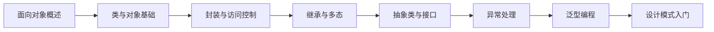

# 面向对象程序设计A

> [!abstract] 课程定位
> 本课程是计算机专业核心课程，系统讲授面向对象的基本概念、设计原则和编程实践，涵盖类与对象、封装、继承、多态、接口、异常处理、泛型编程和设计模式等核心内容，兼顾Java和C++两种主流语言。

> [!info] 进阶学习路径
> 完成本课程后，可深入学习以下方向：
> - **高级编程**：设计模式 → 架构设计 → 软件工程
> - **Java方向**：Java EE → Spring框架 → 微服务
> - **C++方向**：STL → 高性能编程 → 系统编程

## 学习路线



## 课程目录

### 第1章-面向对象概述

- [[知识点/第1章-面向对象概述/MOC - 第1章.md|第1章导航]]
- [[知识点/第1章-面向对象概述/1.1 面向对象思想]]：面向对象与面向过程对比
- [[知识点/第1章-面向对象概述/1.2 三大特性]]：封装、继承、多态
- [[知识点/第1章-面向对象概述/1.3 UML类图]]：类图的基本符号和表示

### 第2章-类与对象基础

- [[知识点/第2章-类与对象基础/MOC - 第2章.md|第2章导航]]
- [[知识点/第2章-类与对象基础/2.1 类的定义]]：类的结构、成员变量、成员方法
- [[知识点/第2章-类与对象基础/2.2 对象的创建与使用]]：构造方法、new关键字
- [[知识点/第2章-类与对象基础/2.3 方法重载]]：方法重载的定义和应用
- [[知识点/第2章-类与对象基础/2.4 this关键字]]：this的用法和意义

### 第3章-封装与访问控制

- [[知识点/第3章-封装与访问控制/MOC - 第3章.md|第3章导航]]
- [[知识点/第3章-封装与访问控制/3.1 封装的概念]]：封装的原理和目的
- [[知识点/第3章-封装与访问控制/3.2 访问修饰符]]：public、private、protected、默认
- [[知识点/第3章-封装与访问控制/3.3 Getter与Setter]]：访问器和修改器方法
- [[知识点/第3章-封装与访问控制/3.4 static关键字]]：静态成员的特点和使用

### 第4章-继承与多态

- [[知识点/第4章-继承与多态/MOC - 第4章.md|第4章导航]]
- [[知识点/第4章-继承与多态/4.1 继承的概念]]：extends关键字、父类与子类
- [[知识点/第4章-继承与多态/4.2 方法重写]]：override的规则和应用
- [[知识点/第4章-继承与多态/4.3 多态的实现]]：向上转型、动态绑定
- [[知识点/第4章-继承与多态/4.4 super关键字]]：super的用法和意义

### 第5章-抽象类与接口

- [[知识点/第5章-抽象类与接口/MOC - 第5章.md|第5章导航]]
- [[知识点/第5章-抽象类与接口/5.1 抽象类]]：abstract类和抽象方法
- [[知识点/第5章-抽象类与接口/5.2 接口]]：interface的定义和实现
- [[知识点/第5章-抽象类与接口/5.3 抽象类与接口对比]]：两者的区别和选择
- [[知识点/第5章-抽象类与接口/5.4 接口的多实现]]：Java的接口多重继承

### 第6章-异常处理

- [[知识点/第6章-异常处理/MOC - 第6章.md|第6章导航]]
- [[知识点/第6章-异常处理/6.1 异常的概念]]：异常的分类和层次结构
- [[知识点/第6章-异常处理/6.2 try-catch-finally]]：异常捕获和处理
- [[知识点/第6章-异常处理/6.3 throws关键字]]：异常声明和传播
- [[知识点/第6章-异常处理/6.4 自定义异常]]：自定义异常类的创建

### 第7章-泛型编程

- [[知识点/第7章-泛型编程/MOC - 第7章.md|第7章导航]]
- [[知识点/第7章-泛型编程/7.1 泛型的概念]]：泛型的定义和作用
- [[知识点/第7章-泛型编程/7.2 泛型类]]：泛型类的定义和使用
- [[知识点/第7章-泛型编程/7.3 泛型方法]]：泛型方法的定义和使用
- [[知识点/第7章-泛型编程/7.4 通配符]]：?、extends、super

### 第8章-设计模式入门

- [[知识点/第8章-设计模式入门/MOC - 第8章.md|第8章导航]]
- [[知识点/第8章-设计模式入门/8.1 设计原则]]：SOLID原则
- [[知识点/第8章-设计模式入门/8.2 单例模式]]：Singleton模式的实现
- [[知识点/第8章-设计模式入门/8.3 工厂模式]]：Factory模式的实现
- [[知识点/第8章-设计模式入门/8.4 观察者模式]]：Observer模式的实现

## 习题导航

| 章节 | 习题文件 | 覆盖内容 |
|-----|---------|---------|
| 第1章 | [[习题/习题-第1章-面向对象概述.md]] | 面向对象思想、三大特性、UML类图 |
| 第2章 | [[习题/习题-第2章-类与对象基础.md]] | 类的定义、对象创建、方法重载、this关键字 |
| 第3章 | [[习题/习题-第3章-封装与访问控制.md]] | 封装概念、访问修饰符、Getter/Setter、static关键字 |
| 第4章 | [[习题/习题-第4章-继承与多态.md]] | 继承概念、方法重写、多态实现、super关键字 |
| 第5章 | [[习题/习题-第5章-抽象类与接口.md]] | 抽象类、接口、抽象类与接口对比、接口多实现 |
| 第6章 | [[习题/习题-第6章-异常处理.md]] | 异常概念、try-catch-finally、throws、自定义异常 |
| 第7章 | [[习题/习题-第7章-泛型编程.md]] | 泛型概念、泛型类、泛型方法、通配符 |
| 第8章 | [[习题/习题-第8章-设计模式入门.md]] | SOLID原则、单例模式、工厂模式、观察者模式 |

## 易混淆概念对比

| 概念对 | 区别 | 联系 |
|-------|------|------|
| **类 vs 对象** | 类是模板；对象是实例 | 对象是类的实例化 |
| **重载 vs 重写** | 重载在同一类；重写在子类 | 都是多态的体现 |
| **抽象类 vs 接口** | 抽象类有实现；接口只有声明 | 都是抽象机制 |
| **this vs super** | this指当前对象；super指父类对象 | 都用于访问成员 |
| **继承 vs 组合** | 继承是"is-a"；组合是"has-a" | 都是复用机制 |
| **泛型 vs Object** | 泛型是类型安全的；Object需要强制转换 | 都用于通用编程 |

## 复习要点

> [!question] 核心问题自测
> 1. 面向对象的三大特性是什么？各自解决什么问题？
> 2. 类和对象的关系是什么？如何创建和使用对象？
> 3. 封装的原理是什么？访问修饰符有哪些？
> 4. 继承和多态的关系是什么？如何实现多态？
> 5. 抽象类和接口的区别是什么？何时使用？
> 6. 异常处理的机制是什么？try-catch-finally的执行顺序？
> 7. 泛型的作用是什么？通配符有哪些？
> 8. 常用设计模式有哪些？各自解决什么问题？

## 笔记维护约定

- 每个章节包含：MOC导航笔记、知识点笔记、assets资源目录
- 知识点笔记使用标准概念名命名
- 代码示例同时提供Java和C++两种语言
- 使用Mermaid绘制类图和流程图
- 使用表格对比易混淆概念

```dataview
TABLE status AS 状态, course AS 课程
FROM #面向对象
WHERE file.name != this.file.name
SORT file.name ASC
```