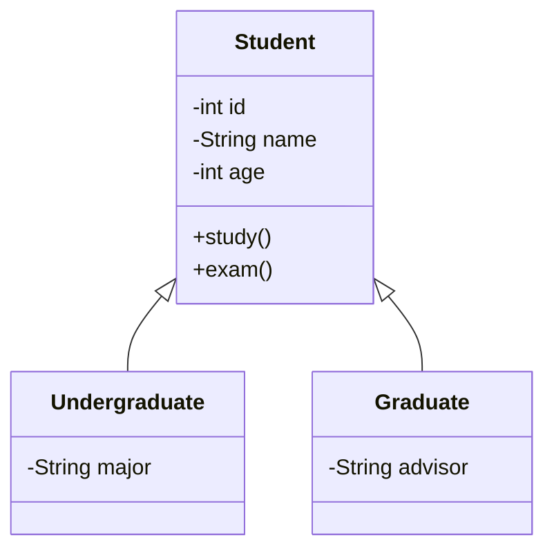

# 习题-第1章 面向对象概述

> [!abstract] 本章重点
> 本章习题覆盖面向对象思想、三大特性、UML类图等核心知识点，题型贴合本科大二期末考纲。

---

## 一、选择题

### 单选题

1. 面向对象程序设计的三大特性不包括（ ）
   A. 封装
   B. 继承
   C. 多态
   D. 并发

2. 下列关于面向对象和面向过程的描述，错误的是（ ）
   A. 面向过程关注"怎么做"，面向对象关注"做什么"
   B. 面向过程以函数为基本单位，面向对象以对象为基本单位
   C. 面向过程更容易实现代码复用
   D. 面向对象更符合人类的思维方式

3. 封装的主要目的是（ ）
   A. 提高代码执行效率
   B. 隐藏内部实现细节，提供统一接口
   C. 增加代码行数
   D. 方便调试

4. 继承的主要作用是（ ）
   A. 实现代码复用
   B. 提高运行速度
   C. 减少内存占用
   D. 简化语法

5. 多态的实现方式不包括（ ）
   A. 方法重载
   B. 方法重写
   C. 向上转型
   D. 变量声明

6. 下列关于UML类图的描述，正确的是（ ）
   A. 类图只能表示类之间的继承关系
   B. 类图中的属性必须标注可见性
   C. 类图中的方法可以不标注返回类型
   D. 类图中的关联关系用实线表示

7. 在UML类图中，表示继承关系的是（ ）
   A. 实线带空心三角箭头
   B. 虚线带空心三角箭头
   C. 实线带实心箭头
   D. 虚线带实心箭头

8. 下列关于面向对象设计原则的描述，错误的是（ ）
   A. 高内聚低耦合
   B. 开闭原则
   C. 单一职责原则
   D. 越多继承越好

### 多选题

1. 下列属于面向对象三大特性的有（ ）
   A. 封装
   B. 继承
   C. 多态
   D. 抽象

2. 下列关于封装的描述，正确的有（ ）
   A. 封装将数据和操作数据的方法绑定在一起
   B. 封装可以防止外部直接访问对象的内部状态
   C. 封装提高了代码的可维护性
   D. 封装降低了代码的灵活性

3. 下列关于UML类图的描述，正确的有（ ）
   A. 类用矩形表示，分为三层：类名、属性、方法
   B. 关联关系表示类之间的连接
   C. 聚合关系表示整体与部分的关系
   D. 依赖关系表示一个类使用另一个类

---

## 二、填空题

1. 面向对象的三大特性是______、______、______。

2. 面向过程编程以______为核心，面向对象编程以______为核心。

3. 封装的基本思想是______。

4. 继承体现了______关系，组合体现了______关系。

5. 多态分为______多态和______多态。

6. UML类图中，类的可见性符号：+表示______，-表示______，#表示______。

7. UML类图中，关联关系的多重性表示______。

8. 设计模式是______。

---

## 三、简答题

1. 简述面向对象和面向过程的区别。

2. 什么是封装？封装的优点是什么？

3. 什么是继承？继承的优点是什么？

4. 什么是多态？多态的实现方式有哪些？

5. 简述UML类图中常见的关系类型及其表示方法。

---

## 四、综合应用题

### 题1：概念辨析

比较面向对象和面向过程在以下方面的差异：
(1) 基本单位
(2) 设计思路
(3) 代码复用方式
(4) 扩展性

### 题2：UML类图

根据以下描述绘制UML类图：
- 学生(Student)有学号(id)、姓名(name)、年龄(age)属性
- 学生可以学习(study)、考试(exam)
- 本科生(Undergraduate)是学生的子类，有专业(major)属性
- 研究生(Graduate)是学生的子类，有导师(advisor)属性

### 题3：三大特性分析

分析以下场景如何体现面向对象的三大特性：
场景：银行账户系统，包含储蓄账户和信用卡账户。

### 题4：设计原则

举例说明以下设计原则在面向对象设计中的应用：
(1) 单一职责原则
(2) 开闭原则
(3) 依赖倒置原则

---

## 参考答案

### 选择题答案

**单选题**：
1. D
2. C
3. B
4. A
5. D
6. D
7. A
8. D

**多选题**：
1. ABC
2. ABC
3. ABCD

### 填空题答案

1. 封装、继承、多态
2. 函数，对象
3. 将数据和操作数据的方法绑定在一起，隐藏内部实现
4. "is-a"，"has-a"
5. 编译时（重载），运行时（重写）
6. public，private，protected
7. 参与关联的对象数量
8. 解决特定问题的通用解决方案

### 简答题答案

1. 面向过程以函数为基本单位，关注"怎么做"；面向对象以对象为基本单位，关注"做什么"。面向过程按步骤执行，面向对象通过对象交互完成任务。

2. 封装是将对象的状态和行为绑定在一起，对外隐藏内部实现细节，只提供统一接口。优点：提高安全性、可维护性、可复用性。

3. 继承是子类获得父类的属性和方法。优点：代码复用、层次结构清晰、扩展性好。

4. 多态是同一接口有不同实现。实现方式：方法重载（编译时多态）、方法重写（运行时多态）、接口实现。

5. 关联（实线）、依赖（虚线箭头）、继承（实线空心三角）、聚合（空心菱形实线）、组合（实心菱形实线）。

### 综合应用题答案

**题1答案**：
(1) 基本单位：面向过程是函数，面向对象是对象
(2) 设计思路：面向过程是自顶向下逐步细化，面向对象是自底向上逐步构建
(3) 代码复用：面向过程通过函数调用，面向对象通过继承和组合
(4) 扩展性：面向过程修改困难，面向对象通过继承和接口易于扩展

**题2答案**：

**题3答案**：
- 封装：账户的余额等数据被隐藏，通过存款、取款方法访问
- 继承：储蓄账户和信用卡账户继承账户的基本属性和方法
- 多态：不同类型账户的利息计算方法不同，通过重写实现

**题4答案**：
(1) 单一职责：一个类只负责一个功能，如User类只负责用户相关操作
(2) 开闭原则：对扩展开放，对修改关闭，如通过接口扩展功能
(3) 依赖倒置：高层模块依赖抽象，不依赖具体实现

---

**导航**：[[MOC - 面向对象程序设计A|返回课程地图]] · 下一章习题 [[习题-第2章-类与对象基础]]