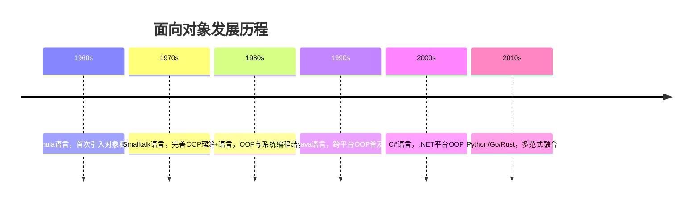

# 1.1 面向对象思想

> [!abstract] 定义
> 面向对象程序设计（Object-Oriented Programming, OOP）是一种程序设计范式，以**对象**为基本单元，将数据和操作数据的方法封装在一起，通过对象之间的交互来构建程序。

## 1.1.1 核心思想

### 万物皆对象

- **对象**：现实世界中具有**状态**和**行为**的实体
- **状态**：对象的属性（数据）
- **行为**：对象可以执行的操作（方法）

> [!example] 示例
> - 汽车对象：状态（颜色、速度、品牌），行为（加速、刹车、鸣笛）
> - 学生对象：状态（姓名、年龄、成绩），行为（学习、考试、休息）

### 面向过程 vs 面向对象

| 对比维度 | 面向过程 | 面向对象 |
|---------|---------|---------|
| **核心单元** | 函数/过程 | 对象 |
| **设计思路** | 自顶向下，逐步分解 | 自底向上，组合对象 |
| **数据与操作** | 分离 | 封装在一起 |
| **代码复用** | 函数调用 | 继承、组合 |
| **可维护性** | 修改影响全局 | 局部修改，影响小 |
| **适用场景** | 简单任务、算法密集 | 复杂系统、需求变化频繁 |

> [!example] 示例对比：绘制矩形
>
> **面向过程**：
> ```java
> public class DrawRectangle {
>     public static void draw(int x, int y, int width, int height) {
>         // 绘制逻辑
>     }
>     
>     public static void main(String[] args) {
>         draw(10, 20, 100, 50);
>     }
> }
> ```
>
> **面向对象**：
> ```java
> public class Rectangle {
>     private int x, y, width, height;
>     
>     public Rectangle(int x, int y, int width, int height) {
>         this.x = x; this.y = y;
>         this.width = width; this.height = height;
>     }
>     
>     public void draw() {
>         // 绘制逻辑
>     }
> }
> ```

## 1.1.2 面向对象的优势

1. **模块化**：每个对象是独立的模块，降低耦合度
2. **可复用性**：通过继承和组合实现代码复用
3. **可维护性**：修改局部不影响全局
4. **可扩展性**：通过多态和接口实现行为扩展
5. **易理解性**：符合人类认知习惯，贴近现实世界

## 1.1.3 发展历程



## 1.1.4 易错点

> [!warning] 常见误区
> 1. **误区**：面向对象就是用类编程
>    **纠正**：面向对象的核心是**封装、继承、多态**，类只是实现手段之一
>
> 2. **误区**：面向对象一定更好
>    **纠正**：选择合适的范式，简单任务用面向过程更高效

## 1.1.5 关键术语

| 术语 | 英文 | 定义 |
|-----|------|------|
| 对象 | Object | 具有状态和行为的实体 |
| 类 | Class | 对象的模板/蓝图 |
| 实例 | Instance | 类的具体对象 |
| 属性 | Attribute | 对象的状态数据 |
| 方法 | Method | 对象的行为操作 |