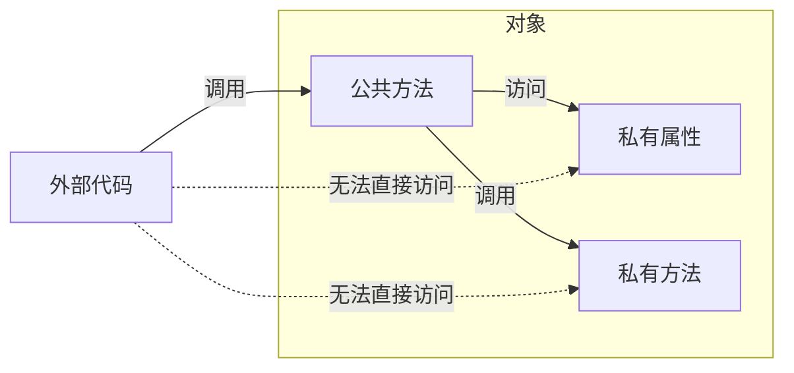
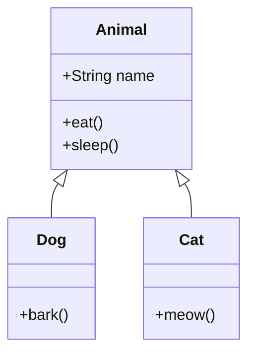
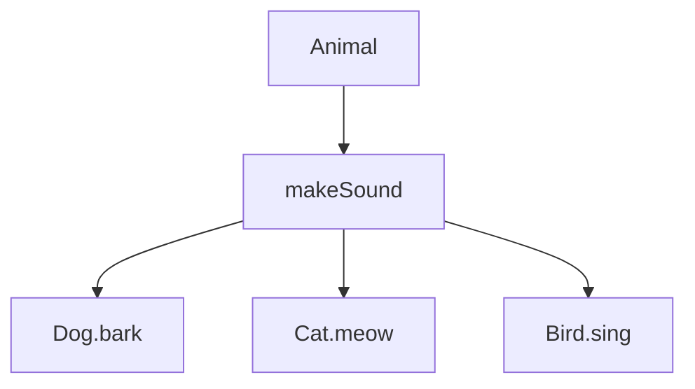
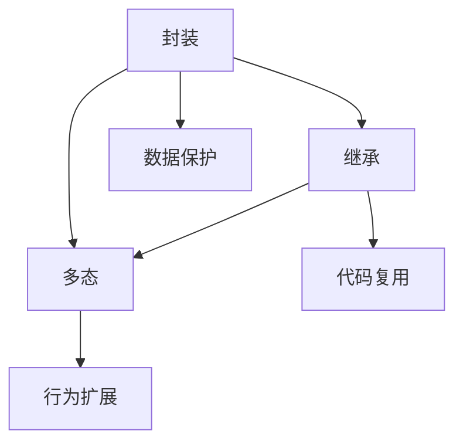

# 1.2 三大特性

> [!abstract] 定义
> 面向对象程序设计的三大核心特性：**封装（Encapsulation）**、**继承（Inheritance）**、**多态（Polymorphism）**，它们共同构成了OOP的理论基础。

## 1.2.1 封装

### 定义

封装是指将对象的**状态**（属性）和**行为**（方法）捆绑在一起，并对外隐藏对象的内部实现细节，只通过公开接口与外界交互。

### 原理



### 封装的好处

| 好处 | 说明 |
|-----|------|
| **数据保护** | 防止外部随意修改对象状态 |
| **接口稳定** | 内部实现变化不影响外部调用 |
| **模块化** | 每个对象是独立的功能单元 |
| **可维护性** | 问题定位和修复更精确 |

> [!example] 示例：Java封装
> ```java
> public class Person {
>     private String name;
>     private int age;
>     
>     public String getName() { return name; }
>     public void setName(String name) { this.name = name; }
>     public int getAge() { return age; }
>     public void setAge(int age) { 
>         if (age > 0) this.age = age;
>     }
> }
> ```

> [!example] 示例：C++封装
> ```cpp
> class Person {
> private:
>     std::string name;
>     int age;
> public:
>     std::string getName() const { return name; }
>     void setName(std::string n) { name = n; }
>     int getAge() const { return age; }
>     void setAge(int a) { if (a > 0) age = a; }
> };
> ```

## 1.2.2 继承

### 定义

继承是指**子类**（Subclass）从**父类**（Superclass）获得属性和方法的机制，实现代码复用和层次结构。

### 原理



### 继承的好处

| 好处 | 说明 |
|-----|------|
| **代码复用** | 子类直接使用父类的属性和方法 |
| **层次结构** | 建立类之间的"is-a"关系 |
| **扩展能力** | 在父类基础上添加新功能 |
| **多态基础** | 为多态提供类型体系支持 |

> [!example] 示例：Java继承
> ```java
> public class Animal {
>     protected String name;
>     public void eat() { System.out.println("吃东西"); }
> }
> 
> public class Dog extends Animal {
>     public void bark() { System.out.println("汪汪"); }
> }
> ```

> [!example] 示例：C++继承
> ```cpp
> class Animal {
> protected:
>     std::string name;
> public:
>     void eat() { std::cout << "吃东西" << std::endl; }
> };
> 
> class Dog : public Animal {
> public:
>     void bark() { std::cout << "汪汪" << std::endl; }
> };
> ```

## 1.2.3 多态

### 定义

多态是指同一接口（方法）在不同对象上有不同的实现方式，即**一个名字，多种形态**。

### 原理



### 多态的好处

| 好处 | 说明 |
|-----|------|
| **灵活性** | 同一代码处理不同类型对象 |
| **可扩展性** | 添加新类不修改现有代码 |
| **解耦合** | 调用者无需关心具体实现 |
| **代码简洁** | 简化条件判断逻辑 |

> [!example] 示例：Java多态
> ```java
> public class Animal {
>     public void makeSound() { }
> }
> 
> public class Dog extends Animal {
>     @Override
>     public void makeSound() { System.out.println("汪汪"); }
> }
> 
> public class Cat extends Animal {
>     @Override
>     public void makeSound() { System.out.println("喵喵"); }
> }
> 
> Animal[] animals = {new Dog(), new Cat()};
> for (Animal a : animals) {
>     a.makeSound();
> }
> ```

## 1.2.4 三大特性关系



| 特性 | 解决的问题 | 核心机制 |
|-----|-----------|---------|
| 封装 | 数据安全、接口稳定 | 访问修饰符 |
| 继承 | 代码复用、层次结构 | extends/inherit |
| 多态 | 行为扩展、解耦合 | 虚函数/重写 |