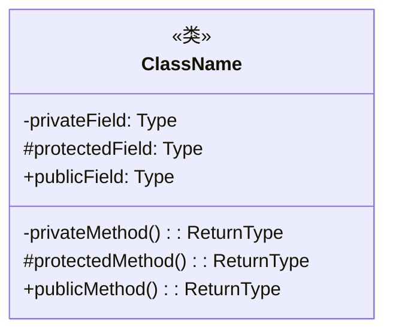
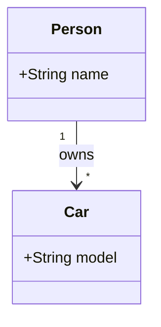
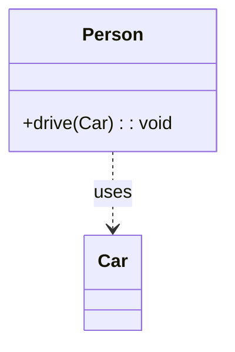
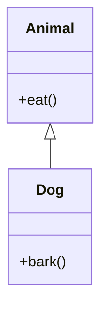
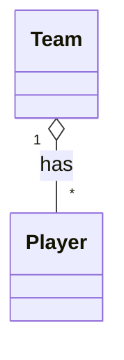
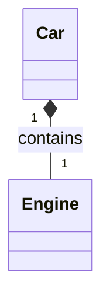
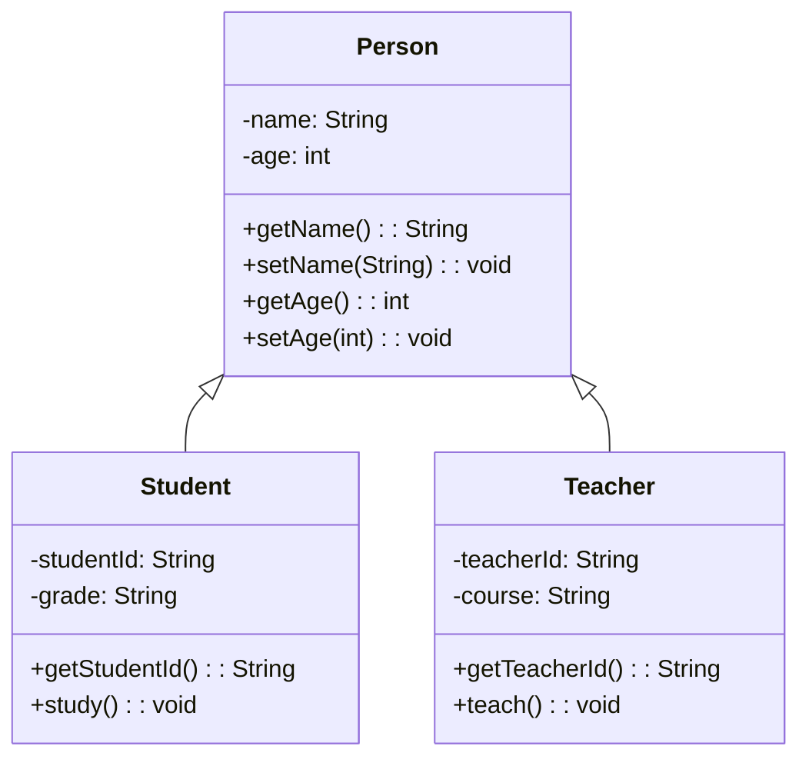

# 1.3 UML类图

> [!abstract] 定义
> UML（Unified Modeling Language）类图是面向对象设计中最常用的建模工具，用于描述类的结构、属性、方法以及类之间的关系。

## 1.3.1 类的表示

### 基本结构



### 组成部分

| 部分 | 说明 | 示例 |
|-----|------|------|
| **类名** | 位于顶层，粗体 | `Person` |
| **属性** | 中间层，格式：`可见性 名称: 类型` | `-name: String` |
| **方法** | 底层，格式：`可见性 名称(参数): 返回类型` | `+getName(): String` |

### 可见性符号

| 符号 | 可见性 | Java | C++ |
|-----|-------|------|-----|
| `+` | 公共 | `public` | `public` |
| `-` | 私有 | `private` | `private` |
| `#` | 保护 | `protected` | `protected` |
| `~` | 默认（包访问） | 无修饰符 | `private`（友元除外） |

## 1.3.2 类之间的关系

### 关联关系（Association）

表示类之间的静态连接，使用实线连接。



| 关系类型 | 说明 | 示例 |
|---------|------|------|
| **一对一** | `1..1` | 一个人只有一个身份证 |
| **一对多** | `1..*` | 一个老师教多个学生 |
| **多对多** | `*..*` | 学生选修多门课程 |

### 依赖关系（Dependency）

表示一个类使用另一个类，使用虚线箭头。



### 继承关系（Inheritance）

表示子类继承父类，使用空心三角箭头。



### 实现关系（Realization）

表示类实现接口，使用空心三角虚线箭头。

```mermaid
classDiagram
    interface Flyable {
        +fly()
    }
    class Bird {
        +fly()
    }
    Flyable <|.. Bird
```

### 聚合关系（Aggregation）

表示整体与部分的关系，部分可以独立存在。



### 组合关系（Composition）

表示强聚合，部分不能脱离整体存在。



## 1.3.3 关系对比

| 关系 | 符号 | 语义 | 独立性 |
|-----|------|------|-------|
| 关联 | `-->` | 一般连接 | 相互独立 |
| 依赖 | `..>` | 使用关系 | 临时依赖 |
| 继承 | `<|--` | is-a | 子类依赖父类 |
| 实现 | `<|..` | 实现接口 | 类依赖接口 |
| 聚合 | `o--` | has-a | 部分可独立 |
| 组合 | `*--` | contains-a | 部分不可独立 |

## 1.3.4 进阶符号

### 抽象类和接口

```mermaid
classDiagram
    class Shape {
        <<abstract>>
        +getArea(): double
    }
    interface Drawable {
        <<interface>>
        +draw(): void
    }
```

### 完整示例

