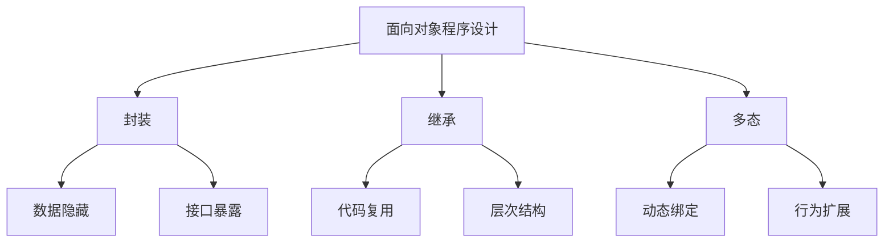

# 第1章-面向对象概述

> [!abstract] 本章定位
> 本章介绍面向对象程序设计的基本思想、发展历程以及核心特性，为后续章节奠定理论基础。

> [!info] 前后依赖
> - **前置**：无，本章是课程起点
> - **后续**：第2章 类与对象基础

## 知识点导航

- [[1.1 面向对象思想]]：面向对象与面向过程的对比
- [[1.2 三大特性]]：封装、继承、多态的概念
- [[1.3 UML类图]]：类图的基本符号和表示方法

## 本章重点

| 知识点 | 核心内容 | 掌握程度 |
|-------|---------|---------|
| 1.1 面向对象思想 | 面向对象与面向过程的区别 | 理解 |
| 1.2 三大特性 | 封装、继承、多态的定义 | 掌握 |
| 1.3 UML类图 | 类图的基本符号 | 熟悉 |

## 学习建议

1. 理解面向对象解决的核心问题：**数据与操作的耦合**
2. 对比面向过程和面向对象的思维差异
3. 掌握UML类图的基本表示方法，为后续章节的类设计打基础

## 核心概念关系

