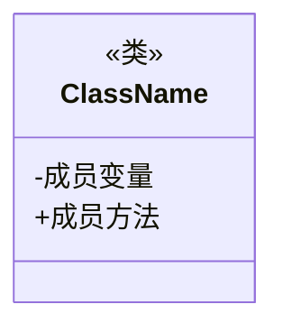

# 2.1 类的定义

> [!abstract] 定义
> 类（Class）是面向对象程序设计的基本构造单元，是创建对象的**模板**或**蓝图**，它定义了对象的属性（状态）和方法（行为）。

## 2.1.1 类的结构

### 基本组成



| 组成部分 | 说明 | 示例 |
|---------|------|------|
| **类名** | 标识符，首字母大写，驼峰命名 | `Person` |
| **成员变量** | 对象的属性/状态 | `name`, `age` |
| **成员方法** | 对象的行为/操作 | `getName()`, `setAge()` |

> [!example] 示例：Java类定义
> ```java
> public class Person {
>     private String name;
>     private int age;
>     
>     public String getName() { return name; }
>     public void setName(String name) { this.name = name; }
>     public void sayHello() {
>         System.out.println("Hello, my name is " + name);
>     }
> }
> ```

> [!example] 示例：C++类定义
> ```cpp
> class Person {
> private:
>     std::string name;
>     int age;
> public:
>     std::string getName() const { return name; }
>     void setName(std::string n) { name = n; }
>     void sayHello() const {
>         std::cout << "Hello, my name is " << name << std::endl;
>     }
> };
> ```

## 2.1.2 成员变量

### 定义

成员变量（Member Variable）是类的属性，用于存储对象的状态数据。

### 分类

| 分类 | 说明 | 示例 |
|-----|------|------|
| **实例变量** | 每个对象独立拥有一份 | `name`, `age` |
| **类变量** | 所有对象共享一份 | `static int count` |

### 初始化

| 初始化方式 | 说明 |
|-----------|------|
| **默认值** | 数值类型0，引用类型null |
| **显式初始化** | 声明时直接赋值 |
| **构造方法** | 创建对象时初始化 |

## 2.1.3 成员方法

### 组成

```
返回类型 方法名(参数列表) {
    // 方法体
}
```

| 组成部分 | 说明 | 示例 |
|---------|------|------|
| **返回类型** | 方法返回值的类型，void表示无返回值 | `String`, `void` |
| **方法名** | 标识符，首字母小写，驼峰命名 | `getName`, `setAge` |
| **参数列表** | 方法接收的参数，可选 | `(String name)` |
| **方法体** | 执行的代码块 | `{ return name; }` |

### 分类

| 分类 | 说明 | 示例 |
|-----|------|------|
| **访问器方法** | 获取属性值，以get开头 | `getName()` |
| **修改器方法** | 设置属性值，以set开头 | `setAge(int)` |
| **业务方法** | 执行特定业务逻辑 | `sayHello()` |
| **构造方法** | 创建对象时初始化 | `Person(String, int)` |

## 2.1.4 类的设计原则

- **单一职责原则**：一个类应该只有一个引起它变化的原因
- **信息隐藏原则**：类的内部实现细节应该隐藏
- **高内聚低耦合**：类内部紧密相关，类之间依赖关系少