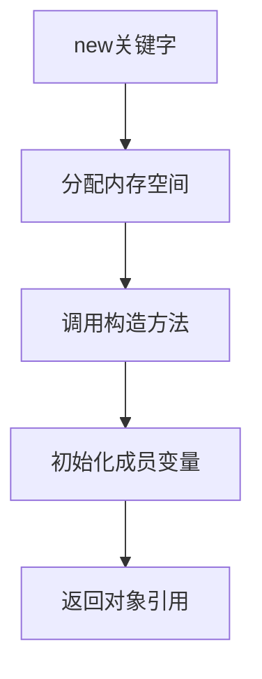
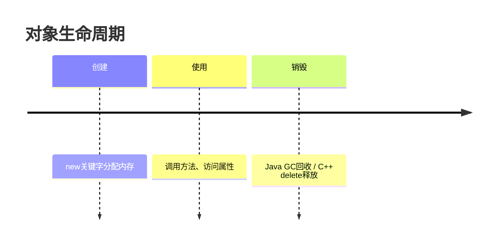

# 2.2 对象的创建与使用

> [!abstract] 定义
> 对象（Object）是类的**实例**，是根据类模板创建的具体实体，拥有类定义的属性和方法。

## 2.2.1 对象的创建

### 创建流程



### 使用new关键字

> [!example] 示例：Java创建对象
> ```java
> Person p1 = new Person();
> Person p2 = new Person("张三", 20);
> ```

> [!example] 示例：C++创建对象
> ```cpp
> Person p1;                    // 栈上创建
> Person* p2 = new Person();    // 堆上创建
> ```

## 2.2.2 构造方法

### 定义

构造方法（Constructor）是一种特殊的方法，用于在创建对象时初始化对象的状态。

### 特点

| 特点 | 说明 |
|-----|------|
| **方法名** | 与类名相同 |
| **返回类型** | 无返回类型（包括void） |
| **调用时机** | 创建对象时自动调用 |
| **默认构造** | 无参构造方法，编译器自动生成 |

> [!example] 示例：Java构造方法
> ```java
> public class Person {
>     private String name;
>     private int age;
>     
>     public Person() {
>         this.name = "未知";
>         this.age = 0;
>     }
>     
>     public Person(String name, int age) {
>         this.name = name;
>         this.age = age;
>     }
> }
> ```

> [!example] 示例：C++构造方法
> ```cpp
> class Person {
> private:
>     std::string name;
>     int age;
> public:
>     Person() : name("未知"), age(0) {}
>     Person(std::string n, int a) : name(n), age(a) {}
> };
> ```

### 构造方法重载

构造方法可以重载，提供多种初始化方式。

```java
public Person() { /* ... */ }
public Person(String name) { /* ... */ }
public Person(String name, int age) { /* ... */ }
```

## 2.2.3 对象的使用

### 访问属性

使用`.`操作符访问对象的属性（需有相应的访问权限）。

```java
Person p = new Person("张三", 20);
System.out.println(p.getName());  // 通过公共方法访问
```

### 调用方法

使用`.`操作符调用对象的方法。

```java
Person p = new Person("张三", 20);
p.sayHello();  // 调用方法
```

## 2.2.4 对象的生命周期



## 2.2.5 对象数组

> [!example] 示例：Java对象数组
> ```java
> Person[] people = new Person[3];
> people[0] = new Person("张三", 20);
> people[1] = new Person("李四", 21);
> ```