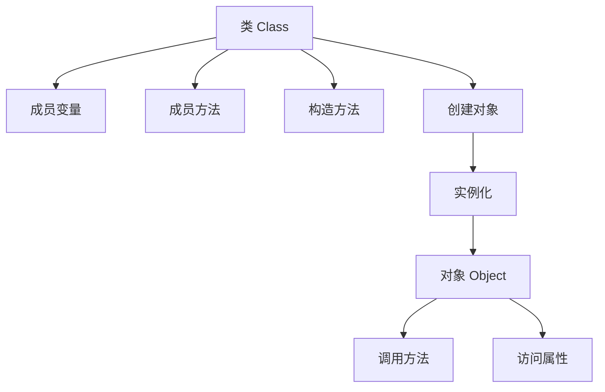

# 第2章-类与对象基础

> [!abstract] 本章定位
> 本章介绍类和对象的基本概念、定义方式以及使用方法，是面向对象编程的基础。

> [!info] 前后依赖
> - **前置**：第1章 面向对象概述
> - **后续**：第3章 封装与访问控制

## 知识点导航

- [[2.1 类的定义]]：类的结构、成员变量、成员方法
- [[2.2 对象的创建与使用]]：构造方法、new关键字
- [[2.3 方法重载]]：方法重载的定义和应用
- [[2.4 this关键字]]：this的用法和意义

## 本章重点

| 知识点 | 核心内容 | 掌握程度 |
|-------|---------|---------|
| 2.1 类的定义 | 类的结构、成员变量、成员方法 | 掌握 |
| 2.2 对象创建 | 构造方法、new关键字 | 掌握 |
| 2.3 方法重载 | 重载的规则和应用场景 | 掌握 |
| 2.4 this关键字 | this的四种用法 | 掌握 |

## 学习建议

1. 理解类和对象的关系：**类是模板，对象是实例**
2. 掌握构造方法的作用和特点
3. 理解方法重载的意义和应用场景
4. 熟练使用this关键字

## 核心概念关系

