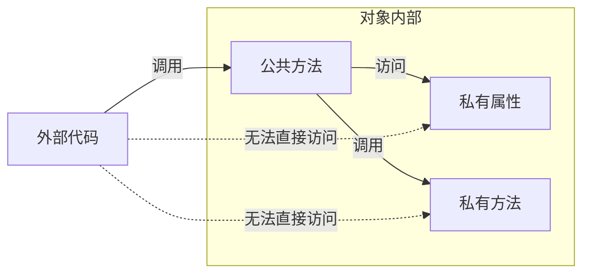
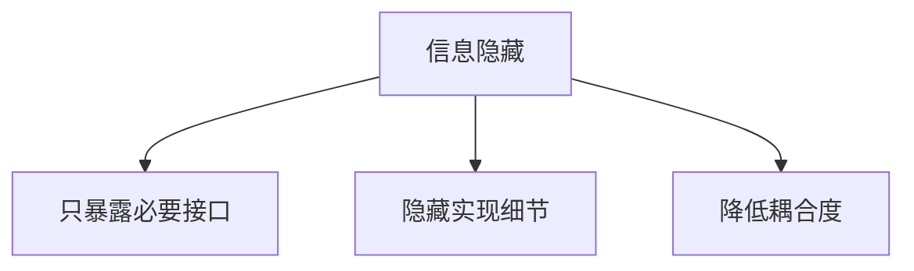

# 3.1 封装的概念

> [!abstract] 定义
> 封装（Encapsulation）是面向对象的三大特性之一，指将对象的**状态**（属性）和**行为**（方法）捆绑在一起，并对外隐藏对象的内部实现细节，只通过公开接口与外界交互。

## 封装的原理

### 核心思想



### 实现方式

| 方式 | 说明 |
|-----|------|
| **访问修饰符** | 使用private隐藏内部细节 |
| **公共方法** | 通过public方法提供访问接口 |
| **数据校验** | 在方法中对输入进行验证 |

## 封装的好处

| 好处 | 说明 | 示例 |
|-----|------|------|
| **数据保护** | 防止外部随意修改对象状态 | 年龄不能为负数 |
| **接口稳定** | 内部实现变化不影响外部调用 | 修改存储方式不影响调用方 |
| **模块化** | 每个对象是独立的功能单元 | 类的职责单一 |
| **可维护性** | 问题定位和修复更精确 | 只需修改类内部 |
| **代码复用** | 封装好的类可以被多次使用 | 工具类的复用 |

> [!example] 示例：Java封装
> ```java
> public class Person {
>     // 私有属性
>     private String name;
>     private int age;
>     
>     // 公共方法（接口）
>     public String getName() {
>         return name;
>     }
>     
>     public void setName(String name) {
>         if (name != null && !name.isEmpty()) {
>             this.name = name;
>         }
>     }
>     
>     public int getAge() {
>         return age;
>     }
>     
>     public void setAge(int age) {
>         if (age >= 0 && age <= 150) {
>             this.age = age;
>         }
>     }
> }
> ```

> [!example] 示例：C++封装
> ```cpp
> class Person {
> private:
>     std::string name;
>     int age;
> public:
>     std::string getName() const {
>         return name;
>     }
>     
>     void setName(std::string n) {
>         if (!n.empty()) {
>             name = n;
>         }
>     }
>     
>     int getAge() const {
>         return age;
>     }
>     
>     void setAge(int a) {
>         if (a >= 0 && a <= 150) {
>             age = a;
>         }
>     }
> };
> ```

## 封装的层次

### 类级封装

将数据和方法封装在类中，隐藏内部实现。

### 对象级封装

每个对象独立拥有自己的状态，互不干扰。

### 模块级封装

将相关的类封装在一个模块或包中，提供统一的对外接口。

## 封装与信息隐藏

### 信息隐藏原则



| 隐藏内容 | 说明 |
|---------|------|
| **实现细节** | 数据结构、算法实现 |
| **内部状态** | 对象的私有属性 |
| **辅助方法** | 非公开的工具方法 |

## 封装的设计原则

### 最小知识原则

一个对象应该尽可能少地了解其他对象的内部细节。

### 接口隔离原则

客户端不应该依赖它不需要的接口。

## 易错点

> [!warning] 常见误区
> 1. **误区**：封装就是把所有属性设为private
>    **纠正**：封装的核心是**控制访问**，合理选择访问级别
>
> 2. **误区**：public方法越多越好
>    **纠正**：只暴露必要的接口，减少对外依赖
>
> 3. **误区**：封装会降低效率
>    **纠正**：现代编译器会优化方法调用，性能影响可忽略

## 关键术语

| 术语 | 英文 | 定义 |
|-----|------|------|
| 封装 | Encapsulation | 数据与方法绑定，隐藏内部细节 |
| 信息隐藏 | Information Hiding | 只暴露必要接口 |
| 访问控制 | Access Control | 控制成员的访问权限 |
| 接口 | Interface | 对外提供服务的方法集合 |